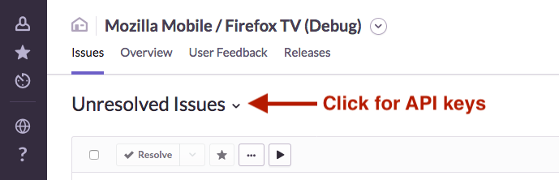

# Sentry: crash reporting
Each platform has its own documentation for how it uses Sentry:
- Android ([focus-android](https://github.com/mozilla-mobile/focus-android/wiki/Crash-Reporting-with-Sentry))
- iOS ([firefox-ios](https://github.com/mozilla-mobile/firefox-ios/wiki/Crash-Reporting-with-Sentry))

## Getting the DSN/API keys for a project
To download the DSN, open your project in the Sentry dashboard and click here:

