.. _services/remotesettings:

===============
Remote Settings
===============

The `remote-settings.js <https://searchfox.org/mozilla-central/source/services/settings/remote-settings.js>`_ module offers the ability to fetch remote settings that are kept in sync with Mozilla servers.

Usage
=====

The ``get()`` method returns the list of entries for a specific key. Each entry can have arbitrary attributes, and can only be modified on the server.

.. code-block:: js

    const { RemoteSettings } = ChromeUtils.import("resource://services-settings/remote-settings.js");

    const data = await RemoteSettings("a-key").get();

    /*
      data == [
        {label: "Yahoo",  enabled: true,  weight: 10, id: "d0782d8d", last_modified: 1522764475905},
        {label: "Google", enabled: true,  weight: 20, id: "8883955f", last_modified: 1521539068414},
        {label: "Ecosia", enabled: false, weight: 5,  id: "337c865d", last_modified: 1520527480321},
      ]
    */

    for (const entry of data) {
      // Do something with entry...
      // await InternalAPI.load(entry.id, entry.label, entry.weight);
    });

.. note::
    The ``id`` and ``last_modified`` (timestamp) attributes are assigned by the server.

Empty local database
--------------------

On new user profiles or for recently added use-cases, the local database will be empty until a synchronization with the server happens. Synchronizations are managed internally, and can sometimes be triggered minutes after browser starts.

By default, if ``.get()`` is called before the local database had the chance to be synchronized, and if no initial data was provided (:ref:`see below <services/initial-data>`), then the settings will be pulled from the server in order to avoid returning an empty list. In that case, the first call to ``.get()`` will thus take longer than the following ones.

This behaviour can be disabled using the ``syncIfEmpty`` option.

.. important::

    If the implicit synchronization fails (e.g network is not available) then errors are silent and **an empty list is returned**. :ref:`Uptake Telemetry <services/settings/uptake-telemetry>` status is sent though.

Options
-------

* ``filters``, ``order``: The list can optionally be filtered or ordered:

    .. code-block:: js

        const subset = await RemoteSettings("a-key").get({
          filters: {
            property: "value"
          },
          order: "-weight"
        });

* ``syncIfEmpty``: if ``true`` and no local data is present, then look for a packaged dump to load. If none, then pull records from network.
  Set it to ``false`` to skip loading of packaged dump and network activity. Use this only if your use-case can tolerate an empty list until the first synchronization happens (default: ``true``).

    .. code-block:: js

        await RemoteSettings("a-key").get({ syncIfEmpty: false });

* ``verifySignature``: verify the content signature of the local data (default: ``false``).
  An error is thrown if the local data was altered. This hurts performance, but can be used if your use case needs to be secure from local tampering.

* ``emptyListFallback``: return an empty list if obtaining the records fails (default: ``true``).
  If an error occurs during the reading of local data, or during synchronization, then an empty list is returned.

Events
------

The ``on()`` function registers handlers to be triggered when events occur.

The ``"sync"`` event allows to be notified when the remote settings are changed on the server side. Your handler is given an ``event`` object that contains a ``data`` attribute that has information about the changes:

- ``current``: current list of entries (after changes were applied);
- ``created``, ``updated``, ``deleted``: list of entries that were created/updated/deleted respectively.

.. code-block:: js

    RemoteSettings("a-key").on("sync", event => {
      const { data: { current } } = event;
      for (const entry of current) {
        // Do something with entry...
        // await InternalAPI.reload(entry.id, entry.label, entry.weight);
      }
    });

.. note::

    Currently, the synchronization of remote settings is triggered via push notifications, and also by its own timer every 24H (see the preference ``services.settings.poll_interval`` ).

File attachments
----------------

When an entry has a file attached to it, it has an ``attachment`` attribute, which contains the file related information (url, hash, size, mimetype, etc.).

Remote files are not downloaded automatically. In order to keep attachments in sync, the provided helper can be leveraged like this:

.. code-block:: js

    const client = RemoteSettings("a-key");

    client.on("sync", async ({ data: { created, updated, deleted } }) => {
      const toDelete = deleted.filter(d => d.attachment);
      const toDownload = created
        .concat(updated.map(u => u.new))
        .filter(d => d.attachment);

      // Remove local files of deleted records
      await Promise.all(
        toDelete.map(record => client.attachments.deleteDownloaded(record))
      );

      // Download new attachments
      const fileContents = await Promise.all(
        toDownload.map(async record => {
          const { buffer } = await client.attachments.download(record);
          return buffer;
        });
      );
    });

The provided helper will:
  - fetch the remote binary content
  - write the file in the local IndexedDB
  - check the file size
  - check the content SHA256 hash
  - do nothing if the attachment was already present and sound locally.

.. important::

    The following aspects are not taken care of (yet! help welcome):

    - check available disk space
    - preserve bandwidth
    - resume downloads of large files

.. note::

    The ``download()`` method supports the following options:

    - ``retries`` (default: ``3``): number of retries on network errors
    - ``fallbackToCache`` (default: ``false``): allows callers to fall back to the cached file and record, if the requested record's attachment fails to download.
      This enables callers to always have a valid pair of attachment and record,
      provided that the attachment has been retrieved at least once.
    - ``fallbackToDump`` (default: ``false``): activates a fallback to a dump that has been
      packaged with the client, when other ways to load the attachment have failed.
      See :ref:`services/packaging-attachments <services/packaging-attachments>` for more information.

.. note::

    A ``downloadAsBytes()`` method returning an ``ArrayBuffer`` is also available, if writing the attachment locally is not necessary.

    Some ``downloadToDisk()`` and ``deleteFromDisk()`` methods are also available but generally discouraged, since they are prone to leaving extraneous files
    in the profile directory (see `Bug 1634127 <https://bugzilla.mozilla.org/show_bug.cgi?id=1634127>`_).

.. _services/initial-data:

Initial data
------------

It is possible to package a dump of the server records that will be loaded into the local database when no synchronization has happened yet.

The JSON dump will serve as the default dataset for ``.get()``, instead of doing a round-trip to pull the latest data. It will also reduce the amount of data to be downloaded on the first synchronization.

#. Place the JSON dump of the server records in the ``services/settings/dumps/main/`` folder
#. Add the filename to the ``FINAL_TARGET_FILES`` list in ``services/settings/dumps/main/moz.build``
#. Add the filename to the ``[browser]`` section of ``mobile/android/installer/package-manifest.in`` IF the file should be bundled with Android.

Now, when ``RemoteSettings("some-key").get()`` is called from an empty profile, the ``some-key.json`` file is going to be loaded before the results are returned.

JSON dumps in the tree are periodically updated by ``taskcluster/docker/periodic-updates/scripts/periodic_file_updates.sh``.
If your collection's in-tree dump should not be kept up to date by this automation, place the JSON file in ``services/settings/static-dumps/`` instead.

.. note::

   The example above uses "main" because that's the default bucket name.
   If you have customized the bucket name, use the actual bucket name instead of "main".

.. _services/packaging-attachments:

Packaging attachments
~~~~~~~~~~~~~~~~~~~~~

Attachments are not included in the JSON dumps by default. You may choose to package the attachment
with the client, for example if it is important to have the data available at the first startup
without requiring network activity. Or if most users would download the attachment anyway.
Only package attachments if needed, since they increase the file size of the Firefox installer.

To package an attachment for consumers of the `download()` method:

#. Select the desired attachment record from the JSON dump of the server records, and place it at
   ``services/settings/dumps/<bucket name>/<collection name>/<attachment id>.meta.json``.
   The ``<attachment id>`` defaults to the ``id`` field of the record. If this ``id`` is not fixed,
   you must choose a custom ID that can be relied upon as a long-term attachment identifier. See
   the notes below for more details.
#. Download the attachment associated with the record, and place it at
   ``services/settings/dumps/<bucket name>/<collection name>/<attachment id>``.
#. Update ``taskcluster/docker/periodic-updates/scripts/periodic_file_updates.sh`` and add the attachment,
   by editing the ``compare_remote_settings_files`` function and describing the attachment.
   Unlike JSON dumps, attachments must explicitly be listed in that update script, because the
   attachment selection logic needs to be codified in a ``jq`` filter in the script.
   For an example, see `Bug 1636158 <https://bugzilla.mozilla.org/show_bug.cgi?id=1636158>`_.
#. Register the location of the ``<attachment id>.meta.json`` and ``<attachment id>`` in the
   ``moz.build`` file of the collection folder, and possibly ``package-manifest.in``,
   as described in `the previous section about registering JSON dumps <services/initial-data>`.

.. note::

   ``<attachment id>`` is used to derive the file names of the packaged attachment dump, and as the
   key for the (optional) cache where attachment updates from the network are saved. If the cache
   is enabled, the attachment identifier is expected to be fixed across client application updates.
   If that expectation cannot be met, the ``attachmentId`` option of the ``download`` method of the
   attachment downloader should be used to override the attachment ID with a custom (stable) value.

.. note::

   The contents of the ``.meta.json`` file is already contained within the records, but separated
   from the main set of records to ensure the availability of the original record with the data,
   independently of the packaged or downloaded records.
   This file may become optional in a future update, see `Bug 1640059 <https://bugzilla.mozilla.org/show_bug.cgi?id=1640059>`_.

Synchronization Process
=======================

The synchronization process consists in pulling the recent changes, merging them with the local data, and verifying the integrity of the result.

.. Source of diagram
.. https://mermaid-js.github.io/mermaid-live-editor/
.. When using this tool, please remove xlink prefix from attributes in the resulting SVG file.
.. See bug 1481470.
..
.. graph TD
..     0[Sync] --> pull;
..     pull[Pull changes] --> merge[Merge with local]
..     merge --> valid{Is signature valid?};
..     valid -->|Yes| Success;
..     valid -->|No| retried{Retried?};
..     retried --> |Yes| validchanges{Valid without changes?};
..     retried --> |No| valid2{Valid without changes?};
..     validchanges -->|Yes| restoredata[Restore previous data];
..     validchanges -->|No| clear[Clear local];
..     restore --> Failure;
..     valid2 --> |No| clear2[Clear local];
..     valid2 --> |Yes| Retry;
..     Retry --> |Retry| pull;
..     clear2 --> Retry;
..     clear --> restore[Restore packaged dump];
..     restoredata --> Failure;
..     style 0 fill:#00ff00;
..     style Success fill:#00ff00;
..     style Failure fill:#ff0000;

.. important::

    As shown above, we can end-up in situations where synchronization fails and will leave the local DB in an empty state.

Targets and A/B testing
=======================

In order to deliver settings to subsets of the population, you can set targets on entries (platform, language, channel, version range, preferences values, samples, etc.) when editing records on the server.

From the client API standpoint, this is completely transparent: the ``.get()`` method — as well as the event data — will always filter the entries on which the target matches.

.. note::

    The remote settings targets follow the same approach as the :ref:`Normandy recipe client <components/normandy>` (ie. JEXL filter expressions).

.. _services/settings/uptake-telemetry:

Uptake Telemetry
================

Some :ref:`uptake telemetry <telemetry/collection/uptake>` is collected in order to monitor how remote settings are propagated.

It is submitted to a single :ref:`keyed histogram <histogram-type-keyed>` whose id is ``UPTAKE_REMOTE_CONTENT_RESULT_1`` and the keys are prefixed with ``main/`` (eg. ``main/a-key`` in the above example).

Create new remote settings
==========================

Staff members can create new kinds of remote settings, following `this documentation <https://remote-settings.readthedocs.io/en/latest/getting-started.html>`_.

It basically consists in:

#. Choosing a key (eg. ``search-providers``)
#. Assigning collaborators to editors and reviewers groups
#. (*optional*) Define a JSONSchema to validate entries
#. (*optional*) Allow attachments on entries

And once done:

#. Create, modify or delete entries and let reviewers approve the changes
#. Wait for Firefox to pick-up the changes for your settings key

Global Notifications
====================

The polling for changes process sends two notifications that observers can register to:

* ``remote-settings:changes-poll-start``: Polling for changes is starting. triggered either by the scheduled timer or a push broadcast.
* ``remote-settings:changes-poll-end``: Polling for changes has ended
* ``remote-settings:sync-error``: A synchronization error occured. Notification subject provides information about the error and affected
  collection in the ``wrappedJSObject`` attribute.
* ``remote-settings:broken-sync-error``: Synchronization seems to be consistently failing. Profile is at risk.

.. code-block:: javascript

    const observer = {
      observe(aSubject, aTopic, aData) {
        Services.obs.removeObserver(this, "remote-settings:changes-poll-start");

        const { expectedTimestamp } = JSON.parse(aData);
        console.log("Polling started", expectedTimestamp ? "from push broadcast" : "by scheduled trigger");
      },
    };
    Services.obs.addObserver(observer, "remote-settings:changes-poll-start");

Advanced Options
================

``localFields``: records fields that remain local
-------------------------------------------------

During synchronization, the local database is compared with the server data. Any difference will be overwritten by the remote version.

In some use-cases it's necessary to store some state using extra attributes on records. The ``localFields`` options allows to specify which records field names should be preserved on records during synchronization.

.. code-block:: javascript

    const client = RemoteSettings("a-collection", {
      localFields: [ "userNotified", "userResponse" ],
    });

``filterFunc``: custom filtering function
-----------------------------------------

By default, the entries returned by ``.get()`` are filtered based on the JEXL expression result from the ``filter_expression`` field. The ``filterFunc`` option allows to execute a custom filter (async) function, that should return the record (modified or not) if kept or a falsy value if filtered out.

.. code-block:: javascript

    const client = RemoteSettings("a-collection", {
      filterFunc: (record, environment) => {
        const { enabled, ...entry } = record;
        return enabled ? entry : null;
      }
    });

Debugging and manual testing
============================

Logging
-------

In order to enable verbose logging, set the log level preference to ``debug``.

.. code-block:: javascript

    Services.prefs.setCharPref("services.settings.loglevel", "debug");

Remote Settings Dev Tools
-------------------------

The Remote Settings Dev Tools extension provides some tooling to inspect synchronization statuses, to change the remote server or to switch to *preview* mode in order to sign-off pending changes. `More information on the dedicated repository <https://github.com/mozilla/remote-settings-devtools>`_.

Preview Mode
------------

Enable the preview mode in order to preview changes to be reviewed on the server. This can be achieved using the *Remote Settings Dev Tools*, or programmatically with:

.. code-block:: javascript

    RemoteSettings.enablePreviewMode(true);

In order to pull preview data **on startup**, or in order to persist it across restarts, set ``services.settings.preview_enabled`` to ``true`` in the profile preferences (ie. ``user.js``).
For release and ESR, for security reasons, you would have to run the application with the ``MOZ_REMOTE_SETTINGS_DEVTOOLS=1`` environment variable for the preference to be taken into account. Note that toggling the preference won't have any effect until restart.

Trigger a synchronization manually
----------------------------------

The synchronization of every known remote settings clients can be triggered manually with ``pollChanges()``:

.. code-block:: js

    await RemoteSettings.pollChanges()

In order to ignore last synchronization status during polling for changes, set the ``full`` option:

.. code-block:: js

    await RemoteSettings.pollChanges({ full: true })

The synchronization of a single client can be forced with the ``.sync()`` method:

.. code-block:: js

    await RemoteSettings("a-key").sync();

.. important::

    The above methods are only relevant during development or debugging and should never be called in production code.

Inspect local data
------------------

The internal IndexedDB of Remote Settings can be accessed via the Storage Inspector in the `browser toolbox <https://developer.mozilla.org/en-US/docs/Tools/Browser_Toolbox>`_.

For example, the local data of the ``"key"`` collection can be accessed in the ``remote-settings`` database at *Browser Toolbox* > *Storage* > *IndexedDB* > *chrome*, in the ``records`` store.

Delete all local data
---------------------

All local data, of **every collection**, including downloaded attachments, can be deleted with:

.. code-block:: js

    await RemoteSettings.clearAll();

Unit Tests
==========

As a foreword, we would like to underline the fact that your tests should not test Remote Settings itself. Your tests should assume Remote Settings works, and should only run assertions on the integration part. For example, if you see yourself mocking the server responses, your tests may go over their responsibility.

If your code relies on the ``"sync"`` event, you are likely to be interested in faking this event and make sure your code runs as expected. If it relies on ``.get()``, you will probably want to insert some fake local data.

Simulate ``"sync"`` events
--------------------------

You can forge a ``payload`` that contains the events attributes as described above, and emit it :)

.. code-block:: js

    const payload = {
      current: [{ id: "abc", age: 43 }],
      created: [],
      updated: [{ old: { id: "abc", age: 42 }, new: { id: "abc", age: 43 }}],
      deleted: [],
    };

    await RemoteSettings("a-key").emit("sync", { data: payload });

Manipulate local data
---------------------

A handle on the underlying database can be obtained through the ``.db`` attribute.

.. code-block:: js

    const db = RemoteSettings("a-key").db;

And records can be created manually (as if they were synchronized from the server):

.. code-block:: js

    const record = await db.create({
      id: "a-custom-string-or-uuid",
      domain: "website.com",
      usernameSelector: "#login-account",
      passwordSelector: "#pass-signin",
    });

If no timestamp is set, any call to ``.get()`` will trigger the load of initial data (JSON dump) if any, or a synchronization will be triggered. To avoid that, store a fake timestamp. We use ``Date.now()`` instead of an arbitrary number, to make sure it's higher than the dump's, and thus prevent its load from the test.

.. code-block:: js

    await db.importChanges({}, Date.now());

In order to bypass the potential target filtering of ``RemoteSettings("key").get()``, the low-level listing of records can be obtained with ``collection.list()``:

.. code-block:: js

    const { data: subset } = await db.list({
      filters: {
        "property": "value"
      }
    });

The local data can be flushed with ``clear()``:

.. code-block:: js

    await db.clear()

Misc
====

We host more documentation on https://remote-settings.readthedocs.io/, on how to run a server locally, manage attachments, or use the REST API etc.

About blocklists
----------------

The security settings, as well as addons, plugins, and GFX blocklists were the first use-cases of remote settings, and thus have some specificities.

For example, they leverage advanced customization options (bucket, content-signature certificate, target filtering etc.). In order to get a reference to these clients, their initialization code must be executed first.

.. code-block:: js

    const {RemoteSecuritySettings} = ChromeUtils.import("resource://gre/modules/psm/RemoteSecuritySettings.jsm");

    RemoteSecuritySettings.init();

    const {BlocklistPrivate} = ChromeUtils.import("resource://gre/modules/Blocklist.jsm");

    BlocklistPrivate.ExtensionBlocklistRS._ensureInitialized();
    BlocklistPrivate.PluginBlocklistRS._ensureInitialized();
    BlocklistPrivate.GfxBlocklistRS._ensureInitialized();

Then, in order to access a specific client instance, the ``bucketName`` must be specified:

.. code-block:: js

    const client = RemoteSettings("onecrl", { bucketName: "security-state" });

And in the storage inspector, the IndexedDB internal store will be prefixed with ``security-state`` instead of ``main`` (eg. ``security-state/onecrl``).
