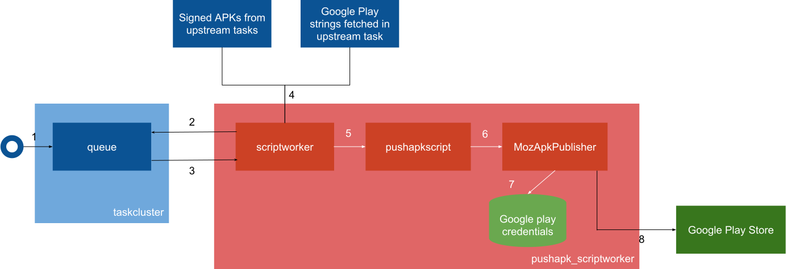

APK publication
===============

Overview
--------

The push-apk task is in charge of uploading and publishing Android APKs onto Google Play store. It also updates strings displayed on the store, which are fetched in an upstream task.

Fetch the new strings
---------------------

The google-play-strings downloads every string for every locale from the `l10n website`_. This happens at the very beginning of the promotion, in order to spot any potential issue (like infrastructure-related), early. This prevents holding the release at the last minute .

Push it all to Google Play
--------------------------

Before any request is made to Google Play, the push-apk task sanity checks the data passed over:

1. APKs are signed with the correct certificates. This may not sound extremely important because Google Play is vigilant about APK signatures and will refuse any APK for which the signature is not valid. However, it is safer to bail out before any outbound traffic is done to Google Play. Besides, with this check, Google acts as a second factor instead of being the only actor accountable for signatures.
2. All given APKs have matching data (version numbers, package names, etc.)
3. No required processor architecture is missing, in order to upload them all in the same request. We have to publish them at the same time because some Android devices support several architectures. We have already had one big crash on these devices because an x86 APK was overseeded by its “brother in ARM”.
4. APKs are multilocales

Then it uploads the APKs and the strings fetched in the previous task. Like said above, Google Play performs some additional checks on their end. For instance:
* they ensure the APK buildIds (called "version code") are higher than the last ones they have on file.
* they check whether the APKs are zipaligned (meaning, the APK archive has been optimized).
Google Play errors are reported back.

These checks and actions are done in several components. Here's how they interact:

1. The “decision task” creates a task for pushapk_scriptworker
2/3. Scriptworker polls for pending tasks and check their scopes.
4. It downloads APKs and Google Play strings via Chain of Trust. Scriptworker checks if the upstream tasks were altered.
5. Scriptworker defers valid tasks to pushapkscript. The latter validates APKs signatures, makes sure every APK architecture is present.
6. Pushapkscript calls MozApkPublisher with credentials and on-disk locations of APKs and strings
6/7. MozApkPublisher sanity checks the APKs.
8. MozApkPublisher opens the Google play credentials.
9. MozApkPublisher publishes APKs, listings and “what’s new”

For more information about the context, please see this `blog post`_.

..  _l10n website: https://l10n.mozilla-community.org/stores_l10n/
.. _pushapkscript: https://github.com/mozilla-releng/pushapkscript
.. _MozApkPublisher: https://github.com/mozilla-releng/mozapkpublisher
.. _blog post: https://johanlorenzo.github.io/blog/2017/06/07/part-2-how-mozilla-publishes-apks-onto-google-play-store-in-a-reasonably-secure-and-automated-way.html
