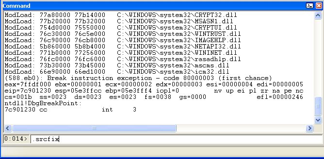
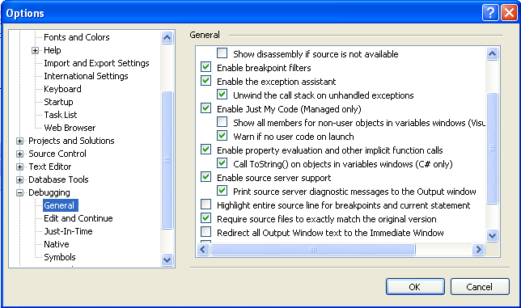

Using The Mozilla Source Server
===============================

Using the Mozilla source server is now even more feature-packed. The
nightly debug builds are now also Source Indexed so that by following a
couple of simple steps you can also have the source code served to you
for debugging without a local build.

What you'll need
----------------

- `WinDbg <https://docs.microsoft.com/en-us/windows-hardware/drivers/debugger/>`__ or Visual Studio (not Code)
- A nightly build; go to the
  `/pub/firefox/nightly/latest-mozilla-central/ <https://archive.mozilla.org/pub/firefox/nightly/latest-mozilla-central/>`__
  folder and grab the installer

Set up symbols
--------------

Follow the instructions for :ref:`Using the Mozilla symbol
server <Using The Mozilla Symbol Server>`. Once
the symbol path is set you must now enable Source Server.

Using the source server in WinDbg
---------------------------------

In the WinDbg command line, type ``.srcfix`` and hit enter. This enables
source server support.

Using the source server in Visual Studio
----------------------------------------

Enable source server support under Tools -> Options. Also, disable
(uncheck) the box that says "Require source files to exactly match the
original version".

