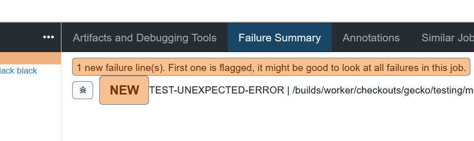
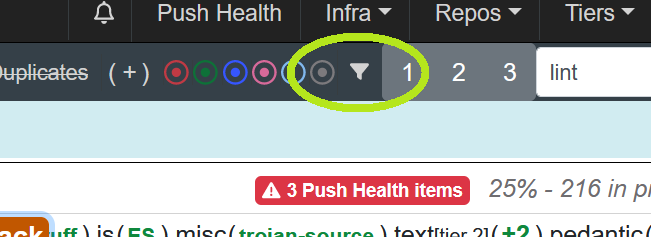
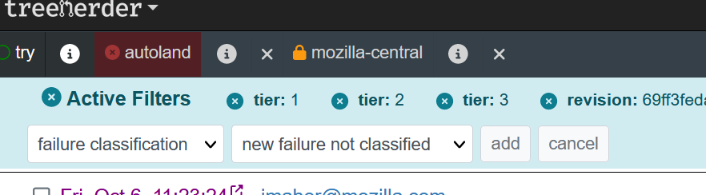
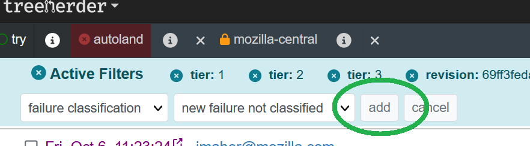
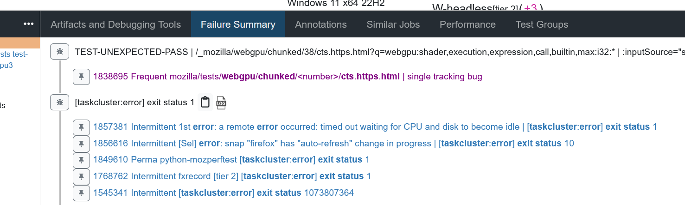
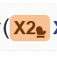

Understanding Treeherder Results
================================

`Treeherder <https://treeherder.mozilla.org/userguide>`__ serves as the primary dashboard for developers looking to view CI test results from their try pushes. The main purpose of the dashboard is to display all the tasks and their status along with tool to view logs, see failures, add jobs, cancel jobs, or connect to other tools.

When a test fails, it is important to figure out if this is a regression or an intermittent failure.  It is typically to see 3-10% of the jobs fail, although the majority of the failures are intermittent (infrastructure failed, timing is off, test is sort of flaky, etc.).  Sometimes a regression occurs but the failure is assumed intermittent.

There are a few tools to use when a test fails:
 * Confirm Failure (CF)
 * Retrigger (R)
 * NEW annotation (NEW)
 * MITTEN icon
 * Bug Suggestions

The quick answer is: use confirm failure for all failures and when all results are in, whichever tests are orange and do not have a mitten icon are what need further investigation.

It is best to understand how each of the tools work and use them in combination to be most efficient with your time and to find a regression.

Confirm Failure (CF)
--------------------
This tool will give a strong signal when it is applicable.  Confirm failure works by running the failing test path 10x in the same browser.  We have found that this is the strongest signal compared to other methods, but there are limitations:
 * This requires a test failure that is discoverable in the failure line.
 * This requires the failure to be in a supported test harness (web-platform-test, mochitest*, reftest, xpcshell).
 * Some exceptions exist around specific hardware (e.g. android reftests) or required machines.
 * Running this can result in infrastructure failure.
 * Some specific tests do not work well when run in this method.
 * This launches a CF task for every failure (up to 10) discovered in the failing task, so often you end up with >1 CF job.

When this runs, a new task is scheduled and typically only takes a few minutes to complete (a retrigger can take 15-90 minutes depending on the task).  If you run confirm failure on a failure and there is a lack of test path, unsupported harness or other well known limitations, a retrigger will automatically be scheduled.

To launch confirm failure you need to select the task

 .. image:: img/th_select_task.png
    :width: 300

then click the task action menu

 .. image:: img/th_task_action.png
    :width: 300

and finally select "Confirm Test Failures"

 .. image:: img/th_confirm_failures.png
    :width: 300

When the jobs are done, Treeherder will determine if the CF job passes and add a |MITTEN| icon to the original failure if it is intermittent.

In the future we are planning to run confirm failure automatically on NEW failures only.

Retrigger (R)
-------------
When a retrigger happens the entire task is rerun.  This sounds straightforward if a test fails once, rerun it and if it passes it is intermittent.  In reality that isn't the strongest signal, but sometimes it is the best signal.  Here are some limitations:
 * a retrigger has infrastructure failures
 * a retrigger has a different set of test failures (maybe not even running your test)
 * a retrigger runs other tests that could influence the state of the browser/machine causing uncertain results
 * a retrigger can take a long time (many tasks run >30 minutes)

Given these limitations, a retrigger is a useful tool for gathering more information, just be prepared to double check the logs and failures in more detail if the task doesn't succeed.

To launch a Retrigger, you can:
select a task:

 .. image:: img/th_select_task.png
    :width: 300

click the rotating arrow icon in the task action bar:

 .. image:: img/th_retrigger.png
    :width: 300

 OR type the 'r' key on your keyboard

If a task is retriggered and it is green, the original failing task will have a |MITTEN| icon.

NEW annotations (NEW)
---------------------
Treeherder keeps a cache of every failure line seen on Autoland and Mozilla-Central for the last 3 weeks.  When a new failure line shows up it is flagged in the task failure summary with a NEW tag.  The NEW tag is very successful at finding nearly all regressions, the downside is that many of the NEW tags are seen on intermittents (if an intermittent wasn't seen recently, or the failure line is slightly different).

NEW failures are for all tasks (build, lint, test, etc.) and for all failures (infra failures as well)

On Try server, the NEW annotations are shown, and can act as a way to quickly filter a large number of failing tasks down to a more manageable number.  It is best practice to run confirm failure or retrigger on the failing NEW task.  To view only failing tasks, you can:
 click on the filter icon for the entire page

select the field "failure classification" and select the value "new failure not classified"

then click "Add"

the above will add a `&failure_classification=6` to the url, you can add that manually if you wish.

MITTEN icon
-----------
Another feature in Treeherder is the |MITTEN| icon.  This is added to an orange job if the job had a retrigger or confirm failure and it is green.  This is a great visual shortcut to ignore job failures.

Bug Suggestions
---------------
Built into Treeherder originally is the feature when looking at the "Failure Summary" there will be bug suggestions showing you similar bugs that match the failure.

If there is a `Single Tracking Bug <../sheriffed-intermittents/index.html#single-tracking-bugs>`__, only that will be shown.

Some caveats to keep in mind:
 * It is easy to assume if there is a bug that the failure is an intermittent.
 * this doesn't tell you if you have made an intermittent a permanent failure.
 * the bug could be for a different configuration (look at failure history and compare platform, build type, test variant to make sure this failure isn't spreading)
 * the bug could be inactive for months.

