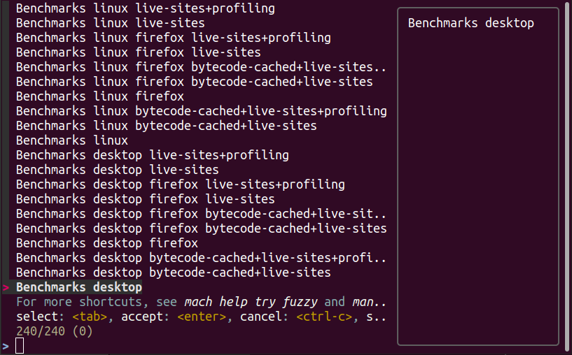

#############
Mach Try Perf
#############

.. contents::
   :depth: 2
   :local:

To make it easier for developers to find the tests they need to run we built a perf-specific try selector called `./mach try perf`. With this tool, you no longer need to remember the obfuscated platform and test names that you need to target for your tests. Instead, the new interface shows test categories along with a simplified name of the platform that they will run on.

When you trigger a try run from the perf selector, two try runs will be created. One with your changes, and one without. In your console, after you trigger the try runs, you'll find a PerfCompare link that will bring you directly to a comparison of the two pushes when they have completed.

The tool is built to be conservative about the number of tests to run, so if you are looking for something that is not listed, it's likely hidden behind a flag found in the `--help`.

Standard Usage
--------------

To use mach try perf simply call `./mach try perf`. This will open an interface for test selection like so:

.. image:: ./standard-try-perf.png
   :alt: Mach try perf with default options
   :scale: 75%
   :align: center

Select the categories you'd like to run, hit enter, and wait for the tool to finish the pushes. **Note that it can take some time to do both pushes, and you might not see logging for some time.**

Chrome and Android
------------------

Android and chrome tests are disabled by default as they are often unneeded and waste our limited resources. If you need either of these, you can add `--chrome` and/or `--android` to the command like so `./mach try perf --android --chrome`:

.. image:: ./android-chrome-try-perf.png
   :alt: Mach try perf with android, and chrome options
   :scale: 75%
   :align: center

Variants
--------

If you are looking for any variants (e.g. no-fission, bytecode-cached, live-sites), use the `--variants` options like so `./mach try perf --variants live-sites`. This will select all possible categories that could have live-sites tests.

Note that it is expected that the offered categories have extra variants (such as bytecode-cached) as we are showing all possible combinations that can include live-sites.

Platforms
---------

To target a particular platform you can use `--platforms` to only show categories with the given platforms.

Categories
----------

In the future, this section will be populated dynamically. If you are wondering what the categories you selected will run, you can use `--no-push` to print out a list of tasks that will run like so::

   $ ./mach try perf --no-push

   Artifact builds enabled, pass --no-artifact to disable
   Gathering tasks for Benchmarks desktop category
   Executing queries: 'browsertime 'benchmark, !android 'shippable !-32 !clang, !live, !profil, !chrom
   estimates: Runs 66 tasks (54 selected, 12 dependencies)
   estimates: Total task duration 8:45:58
   estimates: In the top 62% of durations
   estimates: Should take about 1:04:58 (Finished around 2022-11-22 15:08)
   Commit message:
   Perf selections=Benchmarks desktop (queries='browsertime 'benchmark&!android 'shippable !-32 !clang&!live&!profil&!chrom)
   Pushed via `mach try perf`
   Calculated try_task_config.json:
   {
       "env": {
           "TRY_SELECTOR": "fuzzy"
       },
       "tasks": [
           "test-linux1804-64-shippable-qr/opt-browsertime-benchmark-firefox-ares6",
           "test-linux1804-64-shippable-qr/opt-browsertime-benchmark-firefox-assorted-dom",
           "test-linux1804-64-shippable-qr/opt-browsertime-benchmark-firefox-jetstream2",
           "test-linux1804-64-shippable-qr/opt-browsertime-benchmark-firefox-matrix-react-bench",
           "test-linux1804-64-shippable-qr/opt-browsertime-benchmark-firefox-motionmark-animometer",
           "test-linux1804-64-shippable-qr/opt-browsertime-benchmark-firefox-motionmark-htmlsuite",
           "test-linux1804-64-shippable-qr/opt-browsertime-benchmark-firefox-speedometer",
           "test-linux1804-64-shippable-qr/opt-browsertime-benchmark-firefox-stylebench",
           "test-linux1804-64-shippable-qr/opt-browsertime-benchmark-firefox-sunspider",
           "test-linux1804-64-shippable-qr/opt-browsertime-benchmark-firefox-twitch-animation",
           "test-linux1804-64-shippable-qr/opt-browsertime-benchmark-firefox-unity-webgl",
           "test-linux1804-64-shippable-qr/opt-browsertime-benchmark-firefox-webaudio",
           "test-linux1804-64-shippable-qr/opt-browsertime-benchmark-wasm-firefox-wasm-godot",
           "test-linux1804-64-shippable-qr/opt-browsertime-benchmark-wasm-firefox-wasm-godot-baseline",
           "test-linux1804-64-shippable-qr/opt-browsertime-benchmark-wasm-firefox-wasm-godot-optimizing",
           "test-linux1804-64-shippable-qr/opt-browsertime-benchmark-wasm-firefox-wasm-misc",
           "test-linux1804-64-shippable-qr/opt-browsertime-benchmark-wasm-firefox-wasm-misc-baseline",
           "test-linux1804-64-shippable-qr/opt-browsertime-benchmark-wasm-firefox-wasm-misc-optimizing",
           "test-macosx1015-64-shippable-qr/opt-browsertime-benchmark-firefox-ares6",
           "test-macosx1015-64-shippable-qr/opt-browsertime-benchmark-firefox-assorted-dom",
           "test-macosx1015-64-shippable-qr/opt-browsertime-benchmark-firefox-jetstream2",
           "test-macosx1015-64-shippable-qr/opt-browsertime-benchmark-firefox-matrix-react-bench",
           "test-macosx1015-64-shippable-qr/opt-browsertime-benchmark-firefox-motionmark-animometer",
           "test-macosx1015-64-shippable-qr/opt-browsertime-benchmark-firefox-motionmark-htmlsuite",
           "test-macosx1015-64-shippable-qr/opt-browsertime-benchmark-firefox-speedometer",
           "test-macosx1015-64-shippable-qr/opt-browsertime-benchmark-firefox-stylebench",
           "test-macosx1015-64-shippable-qr/opt-browsertime-benchmark-firefox-sunspider",
           "test-macosx1015-64-shippable-qr/opt-browsertime-benchmark-firefox-twitch-animation",
           "test-macosx1015-64-shippable-qr/opt-browsertime-benchmark-firefox-unity-webgl",
           "test-macosx1015-64-shippable-qr/opt-browsertime-benchmark-firefox-webaudio",
           "test-macosx1015-64-shippable-qr/opt-browsertime-benchmark-wasm-firefox-wasm-godot",
           "test-macosx1015-64-shippable-qr/opt-browsertime-benchmark-wasm-firefox-wasm-godot-baseline",
           "test-macosx1015-64-shippable-qr/opt-browsertime-benchmark-wasm-firefox-wasm-godot-optimizing",
           "test-macosx1015-64-shippable-qr/opt-browsertime-benchmark-wasm-firefox-wasm-misc",
           "test-macosx1015-64-shippable-qr/opt-browsertime-benchmark-wasm-firefox-wasm-misc-baseline",
           "test-macosx1015-64-shippable-qr/opt-browsertime-benchmark-wasm-firefox-wasm-misc-optimizing",
           "test-windows10-64-shippable-qr/opt-browsertime-benchmark-firefox-ares6",
           "test-windows10-64-shippable-qr/opt-browsertime-benchmark-firefox-assorted-dom",
           "test-windows10-64-shippable-qr/opt-browsertime-benchmark-firefox-jetstream2",
           "test-windows10-64-shippable-qr/opt-browsertime-benchmark-firefox-matrix-react-bench",
           "test-windows10-64-shippable-qr/opt-browsertime-benchmark-firefox-motionmark-animometer",
           "test-windows10-64-shippable-qr/opt-browsertime-benchmark-firefox-motionmark-htmlsuite",
           "test-windows10-64-shippable-qr/opt-browsertime-benchmark-firefox-speedometer",
           "test-windows10-64-shippable-qr/opt-browsertime-benchmark-firefox-stylebench",
           "test-windows10-64-shippable-qr/opt-browsertime-benchmark-firefox-sunspider",
           "test-windows10-64-shippable-qr/opt-browsertime-benchmark-firefox-twitch-animation",
           "test-windows10-64-shippable-qr/opt-browsertime-benchmark-firefox-unity-webgl",
           "test-windows10-64-shippable-qr/opt-browsertime-benchmark-firefox-webaudio",
           "test-windows10-64-shippable-qr/opt-browsertime-benchmark-wasm-firefox-wasm-godot",
           "test-windows10-64-shippable-qr/opt-browsertime-benchmark-wasm-firefox-wasm-godot-baseline",
           "test-windows10-64-shippable-qr/opt-browsertime-benchmark-wasm-firefox-wasm-godot-optimizing",
           "test-windows10-64-shippable-qr/opt-browsertime-benchmark-wasm-firefox-wasm-misc",
           "test-windows10-64-shippable-qr/opt-browsertime-benchmark-wasm-firefox-wasm-misc-baseline",
           "test-windows10-64-shippable-qr/opt-browsertime-benchmark-wasm-firefox-wasm-misc-optimizing"
       ],
       "use-artifact-builds": true,
       "version": 1
   }

Adding a New Category
---------------------

It's very easy to add a new category if needed, and you can do so by modifying the `PerfParser categories attribute here <https://searchfox.org/mozilla-central/source/tools/tryselect/selectors/perf.py#179>`_. The following is an example of a complex category that gives a good idea of what you have available::

     "Resource Usage": {
         "query": {
             "talos": ["'talos 'xperf | 'tp5"],
             "raptor": ["'power 'osx"],
             "awsy": ["'awsy"],
         },
         "suites": ["talos", "raptor", "awsy"],
         "platform-restrictions": ["desktop"],
         "variant-restrictions": {
             "raptor": [],
             "talos": [],
         },
         "app-restrictions": {
             "raptor": ["firefox"],
             "talos": ["firefox"],
         },
         "tasks": [],
     },

The following fields are available:
     * **query**: Set the queries to use for each suite you need.
     * **suites**: The suites that are needed for this category.
     * **tasks**: A hard-coded list of tasks to select.
     * **platform-restrictions**: The platforms that it can run on.
     * **app-restrictions**: A list of apps that the category can run.
     * **variant-restrictions**: A list of variants available for each suite.

Note that setting the App/Variant-Restriction fields should be used to restrict the available apps and variants, not expand them as the suites, apps, and platforms combined already provide the largest coverage. The restrictions should be used when you know certain things definitely won't work, or will never be implemented for this category of tests. For instance, our `Resource Usage` tests only work on Firefox even though they may exist in Raptor which can run tests with Chrome.

Future Work
-----------

The future work for this tool can be `found in this bug <https://bugzilla.mozilla.org/show_bug.cgi?id=1799178>`_. Feel free to file improvments, and bugs against it.
