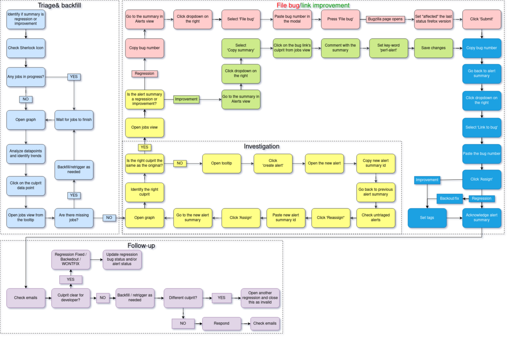
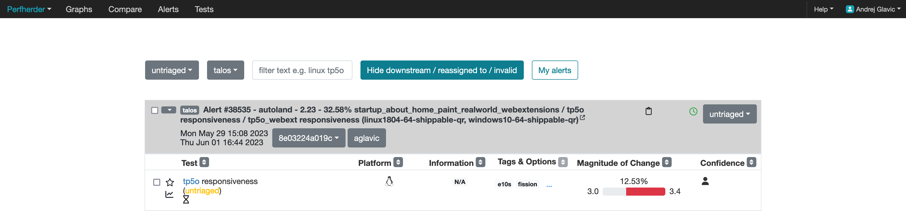
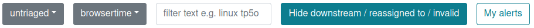

======================
Performance Sheriffing
======================

.. contents::
    :depth: 3

1 Overview
----------

Performance sheriffs are responsible to make sure that performance changes in Firefox are detected
and dealt with. They look at data and performance metrics produced by the performance testing frameworks
and find regression, determine the root cause and get bugs on file to track all issues. The workflow we
follow is shown below in our flowchart.

1.1 Flowchart
~~~~~~~~~~~~~

The workflow of a sheriff is backfilling jobs to get the data, investigating that data, filing
bugs/linking improvements based on the data, and following up with developers if needed.

1.2 Contacts and the Team
~~~~~~~~~~~~~~~~~~~~~~~~~
In the event that you have an urgent issue and need help what can you do?

If you have a question about a bug that was filed and assigned to you reach out to the sheriff who
filed the bug on matrix. If a performance sheriff is not responsive or you have a question about a bug
send a message to the `performance sheriffs matrix channel <https://chat.mozilla.org/#/room/#perfsheriffs:mozilla.org>`_
and tag the sheriff. If you still have no-one responding you can message any of the following people directly
on slack or matrix:

- `@afinder <https://people.mozilla.org/p/afinder>`_
- `@alexandrui <https://people.mozilla.org/p/alexandrui>`_
- `@andra <https://people.mozilla.org/p/andraesanu>`_
- `@andrej <https://people.mozilla.org/p/andrej>`_
- `@beatrice <https://people.mozilla.org/p/bacasandrei>`_
- `@sparky <https://people.mozilla.org/p/sparky>`_ (reach out to only if all others unreachable)

All of the team is in EET (Eastern European Time) except for @andrej and @sparky who are in EST (Eastern Standard Time).

1.3 Regression and improvement Definition
~~~~~~~~~~~~~~~~~~~~~~~~~~~~~~~~~~~~~~~~~
Whenever we get a performance change we classify it as one of two things, either a regression (worse performance) or
an improvement (better performance).

2 How to Investigate Alerts
---------------------------
In this section we will go over how performance sheriffs investigate alerts.

2.1 Filtering and Reading Alerts
~~~~~~~~~~~~~~~~~~~~~~~~~~~~~~~~
On the `Perfherder <https://treeherder.mozilla.org/perfherder/alerts>`_ page you should see something like below:

After accessing the Perfherder alerts page make sure the filter (located in the top middle of the screenshot below)
is set to show the correct alerts for sheriffing. The new alerts can be found when
the **untriaged** option from the left-most dropdown is selected. As shown in the screenshot below:

The rest of the dropdowns from left to right are as follows:

- **Testing harness**: altering this will take you to alerts generated on different harnesses
- **The filter input**, where you can type some text and press enter to narrow down the alerts view
- **"Hide downstream / reassigned to / invalid"**: enable this (recommended) to reduce clutter on the page
- **"My alerts"**: only shows alerts assigned to you.

Below is a screenshot of an alert:

.. image:: ./single_alert.png
  :alt: Alerts View Toolbar
  :align: center

You can tell an alert by looking at the bold text, it will say "Alert #XXXXX", in each alert you have groupings of
summaries of tests, and those tests:

- Can run on different platforms
- Can share suite name (like tp5o)
- Measure various metrics
- Share the same framework

Going from left to right of the columns inside the alerts starting with test, we have:

- A blue hyperlink that links to the test documentation (if available)
- The **platform** operating system
- **Information** about the historical data distribution of that
- Tags and options related to the test

2.2 Regressions vs Improvements
~~~~~~~~~~~~~~~~~~~~~~~~~~~~~~~
First thing to note about how we investigate alerts is that **we prioritize handling regressions**! Unlike the
**improvements** regressions ship bugs to users that if not addressed make our products worse and drive users away.
After acknowledging an alert:

- Regressions go through multiple status changes (TODO: link to sections with multiple status changes) until they are finally resolved
- An improvement has a single status of improvement

2.3 Framework Thresholds
~~~~~~~~~~~~~~~~~~~~~~~~
Different frameworks test different things and the threshold for which the alerts are triggered and considered
performance changes is different based on the harness:

- AWSY >= 0.25%
- Build metrics installer size >= 100kb
- Talos, Browsertime, Build Metrics >= 2%
