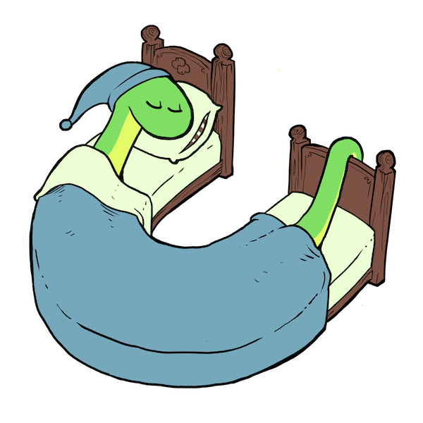

.. Licensed under the Apache License: http://www.apache.org/licenses/LICENSE-2.0
.. For details: https://github.com/nedbat/coveragepy/blob/master/NOTICE.txt

.. _sleepy:

============
Sleepy Snake
============

Coverage.py's mascot is Sleepy Snake, drawn by Ben Batchelder.  Ben's art can
be found on `Instagram`_ and at `artofbatch.com`_.  Some details of Sleepy's
creation are on `Ned's blog`__.

__ https://nedbatchelder.com/blog/201912/sleepy_snake.html

.. _Instagram: https://instagram.com/artofbatch
.. _artofbatch.com: https://artofbatch.com
