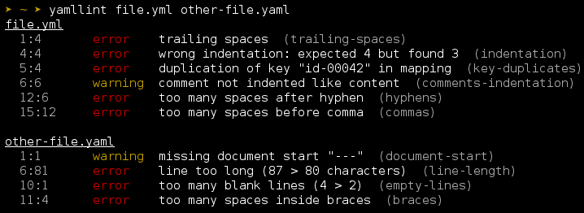

yamllint documentation
======================

.. automodule:: yamllint

Screenshot
----------

.. note::

   The default output format is inspired by `eslint <http://eslint.org/>`_, a
   great linting tool for Javascript.

Table of contents
-----------------

.. toctree::
   :maxdepth: 2

   quickstart
   configuration
   rules
   disable_with_comments
   development
   text_editors
   integration
