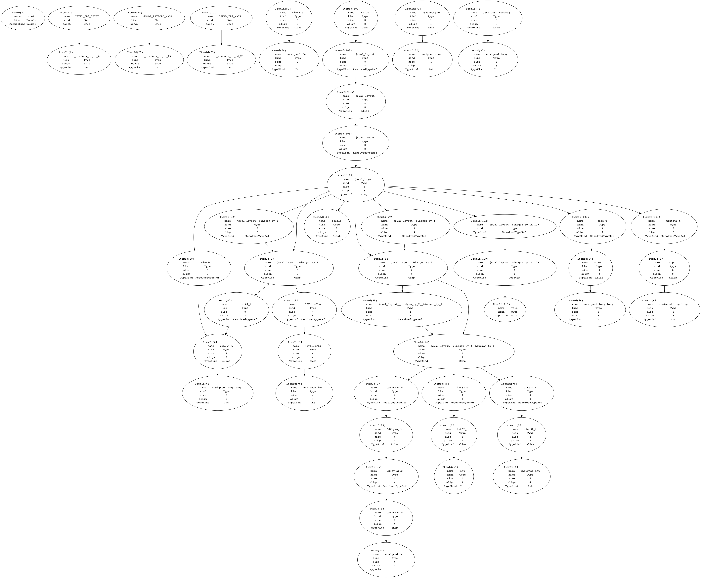

# Contributing to `bindgen`

Hi! We'd love to have your contributions! If you want help or mentorship, reach
out to us in a GitHub issue, or stop by
[#servo on irc.mozilla.org](irc://irc.mozilla.org#servo) and introduce yourself.

<!-- START doctoc generated TOC please keep comment here to allow auto update -->
<!-- DON'T EDIT THIS SECTION, INSTEAD RE-RUN doctoc TO UPDATE -->


- [Code of Conduct](#code-of-conduct)
- [Filing an Issue](#filing-an-issue)
- [Building](#building)
- [Testing](#testing)
  - [Overview](#overview)
  - [Running All Tests](#running-all-tests)
  - [Authoring New Tests](#authoring-new-tests)
- [Automatic code formatting](#automatic-code-formatting)
- [Generating Graphviz Dot Files](#generating-graphviz-dot-files)
- [Debug Logging](#debug-logging)
- [Using `creduce` to Minimize Test Cases](#using-creduce-to-minimize-test-cases)
  - [Isolating Your Test Case](#isolating-your-test-case)
  - [Writing a Predicate Script](#writing-a-predicate-script)

<!-- END doctoc generated TOC please keep comment here to allow auto update -->

## Code of Conduct

We abide by the [Rust Code of Conduct][coc] and ask that you do as well.

[coc]: https://www.rust-lang.org/en-US/conduct.html

## Filing an Issue

Think you've found a bug? File an issue! To help us understand and reproduce the
issue, provide us with:

* A (preferrably reduced) C/C++ header file that reproduces the issue
* The `bindgen` flags used to reproduce the issue with the header file
* The expected `bindgen` output
* The actual `bindgen` output
* The [debugging logs](#logs) generated when running `bindgen` on this testcase

## Building

To build the `bindgen` library and the `bindgen` executable:

```
$ cargo build
```

If you installed multiple versions of llvm, it may not be able to locate the
latest version of libclang. In that case, you may want to either uninstall other
versions of llvm, or specify the path of the desired libclang explicitly:

```
$ export LIBCLANG_PATH=path/to/clang-3.9/lib
```

On Linux and macOS, you may also need to add a path to `libclang.so` (usually
the same path as above) to library search path. This can be done as below:

```
$ export LD_LIBRARY_PATH=path/to/clang-3.9/lib # for Linux
$ export DYLD_LIBRARY_PATH=path/to/clang-3.9/lib # for macOS
```

Additionally, you may want to build and test with the `testing_only_docs`
feature to ensure that you aren't forgetting to document types and functions. CI
will catch it if you forget, but the turn around will be a lot slower ;)

```
$ cargo build --features testing_only_docs
```

## Testing

Code for binding generation and testing thereof is in the `bindgen` crate.
The following sections assume you are working in that subdirectory.

### Overview

Input C/C++ test headers reside in the `tests/headers` directory. Expected
output Rust bindings live in `tests/expectations/tests`.

For example, `tests/headers/my_header.h`'s expected generated Rust bindings
would be `tests/expectations/tests/my_header.rs`.

Run `cargo test` to compare generated Rust bindings to the expectations.

### Running All Tests

```
$ cargo test [--all-features]
```

### Running a Single Test

To generate bindings for a single test header, compile the bindings, and run the
layout assertion tests for those bindings, use the `tests/test-one.sh`
script. It supports fuzzy searching for test headers. For example, to test
`tests/headers/what_is_going_on.hpp`, execute this command:

```
$ ./tests/test-one.sh going
```

### Authoring New Tests

To add a new test header to the suite, simply put it in the `tests/headers`
directory. Next, run `bindgen` to generate the initial expected output Rust
bindings. Put those in `tests/expectations/tests`.

If your new test requires certain flags to be passed to `bindgen`, you can
specify them at the top of the test header, with a comment like this:

```c
// bindgen-flags: --enable-cxx-namespaces -- -std=c++14
```

Then verify the new Rust bindings compile and pass some basic tests:

```
$ cargo test -p tests_expectations
```

## Automatic code formatting

We use [`rustfmt`](https://github.com/rust-lang-nursery/rustfmt) to enforce a
consistent code style across the whole `bindgen` code base. This is enforced in
CI, and your pull requests will get automatically rejected if you don't
re-format with the latest `rustfmt` before pushing.

You can install the latest version of `rustfmt` with this command:

```
$ cargo install -f rustfmt
```

Ensure that `~/.cargo/bin` is on your path.

Once that is taken care of, you can (re)format all code by running this command:

```
$ cargo fmt
```

The code style is described in the `rustfmt.toml` file in top level of the repo.

## Generating Graphviz Dot Files

We can generate [Graphviz](http://graphviz.org/pdf/dotguide.pdf) dot files from
our internal representation of a C/C++ input header, and then you can create a
PNG or PDF from it with Graphviz's `dot` program. This is very useful when
debugging bindgen!

First, make sure you have Graphviz and `dot` installed:

```
$ brew install graphviz         # OS X
$ sudo dnf install graphviz     # Fedora
$ # Etc...
```

Then, use the `--emit-ir-graphviz` flag to generate a `dot` file from our IR:

```
$ cargo run -- example.hpp --emit-ir-graphviz output.dot
```

Finally, convert the `dot` file to an image:

```
$ dot -Tpng output.dot -o output.png
```

The final result will look something like this:

[](./example-graphviz-ir.png)

## Debug Logging

To help debug what `bindgen` is doing, you can define the environment variable
`RUST_LOG=bindgen` to get a bunch of debugging log spew.

```
$ RUST_LOG=bindgen ./target/debug/bindgen [flags...] ~/path/to/some/header.h
```

This logging can also be used when debugging failing tests:

```
$ RUST_LOG=bindgen cargo test
```

## Using `creduce` to Minimize Test Cases

If you are hacking on `bindgen` and find a test case that causes an unexpected
panic, results in bad Rust bindings, or some other incorrectness in `bindgen`,
then using `creduce` can help reduce the test case to a minimal one.

[Follow these instructions for building and/or installing `creduce`.](https://github.com/csmith-project/creduce/blob/master/INSTALL)

Running `creduce` requires two things:

1. Your isolated test case, and

2. A script to act as a predicate script describing whether the behavior you're
   trying to isolate occurred.

With those two things in hand, running `creduce` looks like this:

    $ creduce ./predicate.sh ./isolated_test_case.h

### Isolating Your Test Case

Use the `-save-temps` flag to make Clang spit out its intermediate
representations when compiling the test case into an object file.

    $ clang[++ -x c++ --std=c++14] -save-temps -c my_test_case.h

There should now be a `my_test_case.ii` file, which is the results after the C
pre-processor has processed all the `#include`s, `#define`s, and `#ifdef`s. This
is generally what we're looking for.

### Writing a Predicate Script

Writing a `predicate.sh` script for a `bindgen` test case is fairly
straightforward. One potential gotcha is that `creduce` can and will attempt to
reduce test cases into invalid C/C++ code. That might be useful for C/C++
compilers, but we generally only care about valid C/C++ input headers.

Here is a skeleton predicate script:

```bash
#!/usr/bin/env bash

# Exit the script with a nonzero exit code if:
# * any individual command finishes with a nonzero exit code, or
# * we access any undefined variable.
set -eu

# Print out Rust backtraces on panic. Useful for minimizing a particular panic.
export RUST_BACKTRACE=1

# If the `libclang.so` you're using for `bindgen` isn't the system
# `libclang.so`, let the linker find it.
export LD_LIBRARY_PATH=~/path/to/your/directory/containing/libclang

# Make sure that the reduced test case is valid C/C++ by compiling it. If it
# isn't valid C/C++, this command will exit with a nonzero exit code and cause
# the whole script to do the same.
clang[++ --std=c++14] -c ./pre_processed_header.hpp

# Run `bindgen` and `grep` for the thing your hunting down! Make sure to include
# `2>&1` to get at stderr if you're hunting down a panic.
~/src/rust-bindgen/target/debug/bindgen \
    ./pre_processed_header.hpp \
    [ <extra flags> ] \
    2>&1 \
    | grep "<pattern in generated bindings or a panic string or ...>"
```

When hunting down a panic, I `grep`ed like this:

    ... | grep "thread main panicked at '<panic error message here>'"

When hunting down bad codegen for a base member, I `grep`ed like this:

    ... | grep "pub _base: MyInvalidBaseTypeThatShouldntBeHere"

That's pretty much it! I want to impress upon you that `creduce` is *really*
helpful and has enabled me to reduce 30k lines of test case into 5 lines. And it
works pretty quickly too. Super valuable tool to have in your belt when hacking
on `bindgen`!

Happy bug hunting and test case reducing!

[More information on using `creduce`.](https://embed.cs.utah.edu/creduce/using/)
