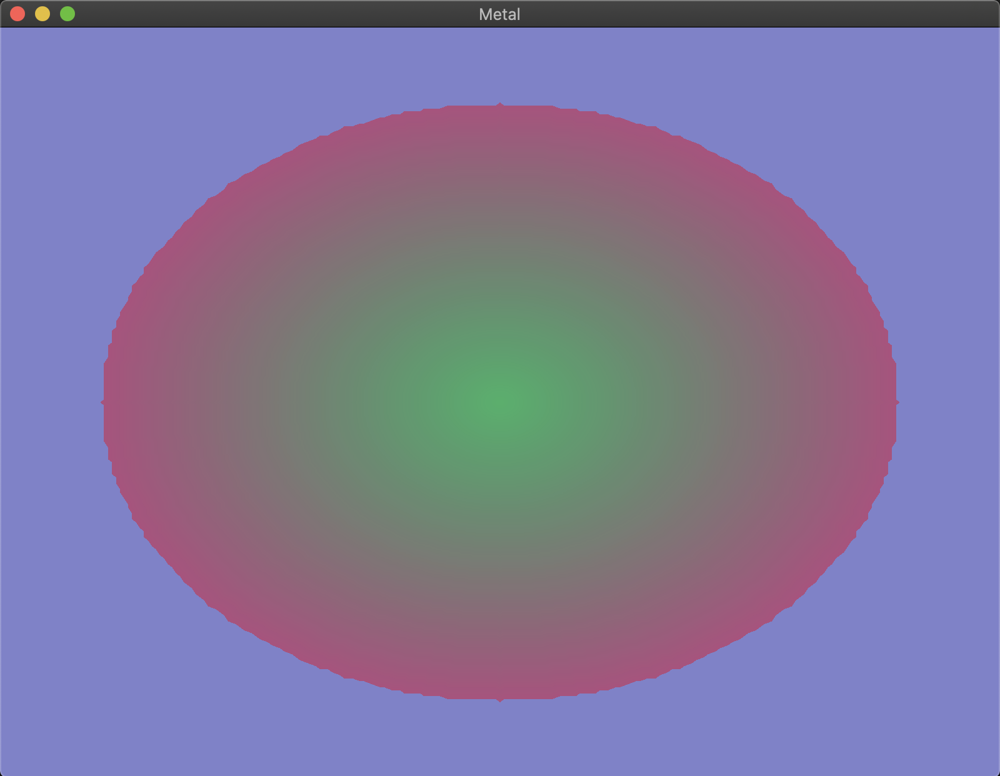

## circle

Renders a circle in a window. As metal primitive types are only limited to point, line and triangle shape, this example shows how we can form complex structures out of primitive types.



## To Run

```
cargo run --example circle
```
