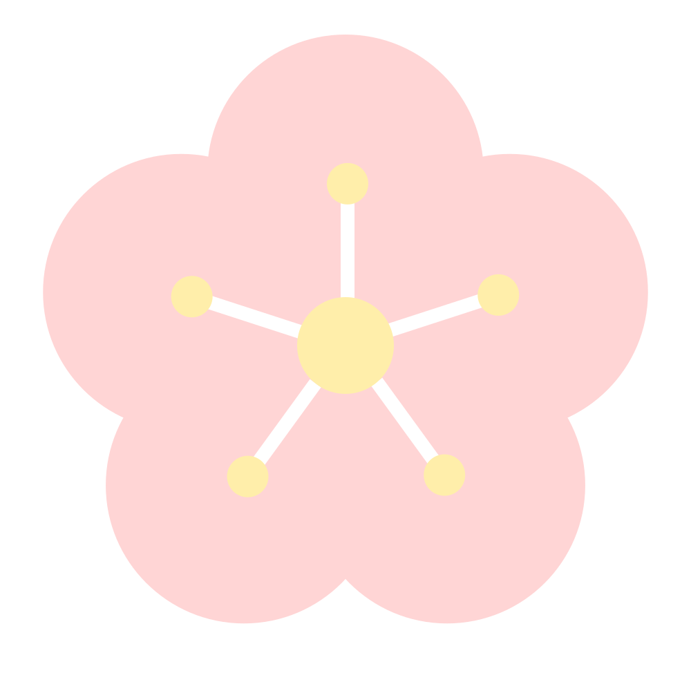

# AVIF Example files.


- All files do not contain Exif metadata.
- All files are tagged as MIAF compatible.
- All files are tagged as compatible with the AVIF Baseline or Advanced Profile if possible.
- All images have the "reduced_still_picture_header" and "still_picture" flags set to 1 in the AV1 Sequence Header.
- Most images are licensed under [CC-BY-SA 4.0](https://creativecommons.org/licenses/by-sa/4.0/deed.en), but some files are licensed different license. Please check.

[Makefile](Makefile) describes how they were created. To generate files yourself, you have to install [cavif](https://github.com/link-u/cavif) and [davif](https://github.com/link-u/davif)

## hato


 - size: 3082x2048
 - License: [CC-BY-SA 4.0](https://creativecommons.org/licenses/by-sa/4.0/deed.en)
   - Author: Kaede Fujisaki ([@ledyba](https://github.com/ledyba))
   - Retrieved from [her website](https://hexe.net/2017/11/27/12:27:02/).

### AVIF version

#### YUV 420

| profile | bit depth | Monochrome | file                                             |
|---------|-----------|------------|--------------------------------------------------|
| 0       | 8         |            | [here](hato.profile0.8bpc.yuv420.avif)           |
| 0       | 8         | YES        | [here](hato.profile0.8bpc.yuv420.monochromeavif) |
| 0       | 10        |            | [here](hato.profile0.10bpc.yuv420.avif)          |
| 0       | 10        | YES        | [here](hato.profile0.10bpc.yuv420.avif)          |

#### YUV422

| profile | bit depth | Monochrome | file                                              |
|---------|-----------|------------|---------------------------------------------------|
| 2       | 8         |            | [here](hato.profile2.8bpc.yuv422.avif)            |
| 2       | 8         | YES        | [here](hato.profile2.8bpc.yuv422.monochrome.avif) |
| 2       | 10        |            | [here](hato.profile2.10bpc.yuv422.avif)           |
| 2       | 10        | YES        | [here](hato.profile2.10bpc.yuv422.avif)           |
| 2       | 12        |            | [here](hato.profile2.12bpc.yuv422.avif)           |
| 2       | 12        | YES        | [here](hato.profile2.12bpc.yuv422.avif)           |

#### URLS

You can obtain this list with `make hato-url`.

```
https://raw.githubusercontent.com/link-u/avif-sample-images/master/hato.profile0.10bpc.yuv420.avif
https://raw.githubusercontent.com/link-u/avif-sample-images/master/hato.profile0.10bpc.yuv420.monochrome.avif
https://raw.githubusercontent.com/link-u/avif-sample-images/master/hato.profile0.8bpc.yuv420.avif
https://raw.githubusercontent.com/link-u/avif-sample-images/master/hato.profile0.8bpc.yuv420.monochrome.avif
https://raw.githubusercontent.com/link-u/avif-sample-images/master/hato.profile2.10bpc.yuv422.avif
https://raw.githubusercontent.com/link-u/avif-sample-images/master/hato.profile2.10bpc.yuv422.monochrome.avif
https://raw.githubusercontent.com/link-u/avif-sample-images/master/hato.profile2.12bpc.yuv422.avif
https://raw.githubusercontent.com/link-u/avif-sample-images/master/hato.profile2.12bpc.yuv422.monochrome.avif
https://raw.githubusercontent.com/link-u/avif-sample-images/master/hato.profile2.8bpc.yuv422.avif
https://raw.githubusercontent.com/link-u/avif-sample-images/master/hato.profile2.8bpc.yuv422.monochrome.avif
```

## Kimono - Transformation tests

[](kimono.jpg)

 - size: 722x1024
 - License: [CC-BY-SA 4.0](https://creativecommons.org/licenses/by-sa/4.0/deed.en)
   - Authors: Momiji Jinzamomi([@momiji-san](https://github.com/momiji-san)) and Kaede Fujisaki ([@ledyba](https://github.com/ledyba))
   - Retrieved from [their website](https://hexe.net/2018/12/24/18:59:01/).


Test images for rotation(`irot`), mirroring(`imir`), cropping(`clap`).

All AVIF images are encoded in these settings:

 - Profile 0
 - YUV420
 - 8 bits per component

### FYI: Transform operation order

[MIAF](https://www.iso.org/standard/74417.html) defines the transform operation order(p.16):

> These properties, if used, shall be indicated to be applied in the following order:  
>  clean aperture first, then rotation, then mirror.

### Identity

[kimono.avif](./kimono.avif)

No operation is applied.

### Rotation 90

[kimono.rotate90.avif](./kimono.rotate90.avif)

[Encoded image is rotated at 90 degree in counter-clockwise](kimono.rotate90.png), and marked to rotate it 270 degree in counter-clockwise when displaying. Thus, resulted image is as the same as the original.

### Rotation 270

[kimono.rotate270.avif](./kimono.rotate270.avif)

[Encoded image is rotated at 270 degree in counter-clockwise](kimono.rotate270.png), and marked to rotate it 90 degree in counter-clockwise when displaying. Thus, resulted image is as the same as the original.


### Mirroring horizontally

[kimono.mirror-horizontal.avif](./kimono.mirror-horizontal.avif)

[Encoded image is mirrored horizontally](kimono.mirror-horizontal.png), and marked to mirror it horizontally again when displaying. Thus, resulted image is as the same as the original.

### Mirroring vertically

[kimono.mirror-vertical.avif](./kimono.mirror-vertical.avif)

Vertical version. Same as above.

### Mirroring vertically + Rotating at 90 degrees.

[kimono.mirror-vertical.rotate270.avif](./kimono.mirror-vertical.rotate270.avif)

[Encoded image is mirrored vertically, then rorated at 90 degree in clockwise](kimono.mirror-vertical.rotate270.png), and marked to rotate it at 90 degree in counter-clockwise and then mirror it vertically when displaying.

Thus, resulted image is as the same as the original.

### Cropping

[kimono.crop.avif](kimono.crop.avif)

Displaying image will be cropped from the original image, using `CleanApertureBox`(See: ISO/IEC 14496-12:2015).

Cropped under these condition:

 - cleanApertureWidthN: 385
 - cleanApertureWidthD: 1
 - cleanApertureHeightN: 330
 - cleanApertureHeightD: 1
 - horizOffN: 103
 - horizOffD: 1
 - vertOffN: -308 (This can be negative, as mensioned in ISO/IEC 14496-12:2015).
 - vertOffD: 1

Resulted image should be:


### Cropping + Mirroring vertically + Rotating at 90 degrees.

[kimono.mirror-vertical.rotate270.crop.avif](kimono.mirror-vertical.rotate270.crop.avif)

[Encoded image is mirrored vertically, then rorated at 90 degree in clockwise](kimono.mirror-vertical.rotate270.png), and marked to crop it first, rotate it at 90 degree in counter-clockwise, and then mirror it vertically.

Cropping condition is:

- cleanApertureWidthN: 330
- cleanApertureWidthD: 1
- cleanApertureHeightN: 385
- cleanApertureHeightD: 1
- horizOffN: -308
- horizOffD: 1
- vertOffN: 103
- vertOffD: 1

Resulted image should be as the same as above.


### URLS

You can obtain this list with `make kimono-url`.

```
https://raw.githubusercontent.com/link-u/avif-sample-images/master/kimono.avif
https://raw.githubusercontent.com/link-u/avif-sample-images/master/kimono.crop.avif
https://raw.githubusercontent.com/link-u/avif-sample-images/master/kimono.mirror-horizontal.avif
https://raw.githubusercontent.com/link-u/avif-sample-images/master/kimono.mirror-vertical.avif
https://raw.githubusercontent.com/link-u/avif-sample-images/master/kimono.mirror-vertical.rotate270.avif
https://raw.githubusercontent.com/link-u/avif-sample-images/master/kimono.mirror-vertical.rotate270.crop.avif
https://raw.githubusercontent.com/link-u/avif-sample-images/master/kimono.rotate270.avif
https://raw.githubusercontent.com/link-u/avif-sample-images/master/kimono.rotate90.avif
```

## Fox Parade - Odd dimensions images

### Original

[](fox.jpg)

 - size: 1204 x 800
 - License: [CC-BY-SA 4.0](https://creativecommons.org/licenses/by-sa/4.0/deed.en)
   - Author: Kaede Fujisaki ([@ledyba](https://github.com/ledyba))
   - Retrieved from [her website](https://hexe.net/2017/12/02/16:33:53/).

#### Odd-Width

 - [fox.odd-width.png](fox.odd-width.png)
 - size: 1203 x 800

#### Odd-Height

  - [fox.odd-height.png](fox.odd-height.png)
  - size: 1204 x 799

#### Odd-Width x Odd-Height

  - [fox.odd-width.odd-height.png](fox.odd-width.odd-height.png)
  - size: 1203 x 799

### AVIF version

| profile | bit depth | pix fmt | Monochrome | odd width | odd height | file                                                                   |
|---------|-----------|---------|------------|-----------|------------|------------------------------------------------------------------------|
| 0       | 8         | YUV420  |            |           |            | [here](fox.profile0.8bpc.yuv420.avif)                                  |
| 0       | 8         | YUV420  |            | YES       |            | [here](fox.profile0.8bpc.yuv420.odd-width.avif)                        |
| 0       | 8         | YUV420  |            |           | YES        | [here](fox.profile0.8bpc.yuv420.odd-height.avif)                       |
| 0       | 8         | YUV420  |            | YES       | YES        | [here](fox.profile0.8bpc.yuv420.odd-width.odd-height.avif)             |
| 0       | 8         | YUV420  | YES        |           |            | [here](fox.profile0.8bpc.yuv420.monochrome.avif)                       |
| 0       | 8         | YUV420  | YES        | YES       |            | [here](fox.profile0.8bpc.yuv420.monochrome.odd-width.avif)             |
| 0       | 8         | YUV420  | YES        |           | YES        | [here](fox.profile0.8bpc.yuv420.monochrome.odd-height.avif)            |
| 0       | 8         | YUV420  | YES        | YES       | YES        | [here](fox.profile0.8bpc.yuv420.monochrome.odd-width.odd-height.avif)  |
| 0       | 10        | YUV420  |            |           |            | [here](fox.profile0.10bpc.yuv420.avif)                                 |
| 0       | 10        | YUV420  |            | YES       |            | [here](fox.profile0.10bpc.yuv420.odd-width.avif)                       |
| 0       | 10        | YUV420  |            |           | YES        | [here](fox.profile0.10bpc.yuv420.odd-height.avif)                      |
| 0       | 10        | YUV420  |            | YES       | YES        | [here](fox.profile0.10bpc.yuv420.odd-width.odd-height.avif)            |
| 0       | 10        | YUV420  | YES        |           |            | [here](fox.profile0.10bpc.yuv420.monochrome.avif)                      |
| 0       | 10        | YUV420  | YES        | YES       |            | [here](fox.profile0.10bpc.yuv420.monochrome.odd-width.avif)            |
| 0       | 10        | YUV420  | YES        |           | YES        | [here](fox.profile0.10bpc.yuv420.monochrome.odd-height.avif)           |
| 0       | 10        | YUV420  | YES        | YES       | YES        | [here](fox.profile0.10bpc.yuv420.monochrome.odd-width.odd-height.avif) |
| 2       | 12        | YUV420  |            |           |            | [here](fox.profile2.12bpc.yuv420.avif)                                 |
| 2       | 12        | YUV420  |            | YES       |            | [here](fox.profile2.12bpc.yuv420.odd-width.avif)                       |
| 2       | 12        | YUV420  |            |           | YES        | [here](fox.profile2.12bpc.yuv420.odd-height.avif)                      |
| 2       | 12        | YUV420  |            | YES       | YES        | [here](fox.profile2.12bpc.yuv420.odd-width.odd-height.avif)            |
| 2       | 12        | YUV420  | YES        |           |            | [here](fox.profile2.12bpc.yuv420.monochrome.avif)                      |
| 2       | 12        | YUV420  | YES        | YES       |            | [here](fox.profile2.12bpc.yuv420.monochrome.odd-width.avif)            |
| 2       | 12        | YUV420  | YES        |           | YES        | [here](fox.profile2.12bpc.yuv420.monochrome.odd-height.avif)           |
| 2       | 12        | YUV420  | YES        | YES       | YES        | [here](fox.profile2.12bpc.yuv420.monochrome.odd-width.odd-height.avif) |
| 2       | 8         | YUV422  |            |           |            | [here](fox.profile2.8bpc.yuv422.avif)                                  |
| 2       | 8         | YUV422  |            | YES       |            | [here](fox.profile2.8bpc.yuv422.odd-width.avif)                        |
| 2       | 8         | YUV422  |            |           | YES        | [here](fox.profile2.8bpc.yuv422.odd-height.avif)                       |
| 2       | 8         | YUV422  |            | YES       | YES        | [here](fox.profile2.8bpc.yuv422.odd-width.odd-height.avif)             |
| 2       | 8         | YUV422  | YES        |           |            | [here](fox.profile2.8bpc.yuv422.monochrome.avif)                       |
| 2       | 8         | YUV422  | YES        | YES       |            | [here](fox.profile2.8bpc.yuv422.monochrome.odd-width.avif)             |
| 2       | 8         | YUV422  | YES        |           | YES        | [here](fox.profile2.8bpc.yuv422.monochrome.odd-height.avif)            |
| 2       | 8         | YUV422  | YES        | YES       | YES        | [here](fox.profile2.8bpc.yuv422.monochrome.odd-width.odd-height.avif)  |
| 2       | 10        | YUV422  |            |           |            | [here](fox.profile2.10bpc.yuv422.avif)                                 |
| 2       | 10        | YUV422  |            | YES       |            | [here](fox.profile2.10bpc.yuv422.odd-width.avif)                       |
| 2       | 10        | YUV422  |            |           | YES        | [here](fox.profile2.10bpc.yuv422.odd-height.avif)                      |
| 2       | 10        | YUV422  |            | YES       | YES        | [here](fox.profile2.10bpc.yuv422.odd-width.odd-height.avif)            |
| 2       | 10        | YUV422  | YES        |           |            | [here](fox.profile2.10bpc.yuv422.monochrome.avif)                      |
| 2       | 10        | YUV422  | YES        | YES       |            | [here](fox.profile2.10bpc.yuv422.monochrome.odd-width.avif)            |
| 2       | 10        | YUV422  | YES        |           | YES        | [here](fox.profile2.10bpc.yuv422.monochrome.odd-height.avif)           |
| 2       | 10        | YUV422  | YES        | YES       | YES        | [here](fox.profile2.10bpc.yuv422.monochrome.odd-width.odd-height.avif) |
| 2       | 12        | YUV422  |            |           |            | [here](fox.profile2.12bpc.yuv422.avif)                                 |
| 2       | 12        | YUV422  |            | YES       |            | [here](fox.profile2.12bpc.yuv422.odd-width.avif)                       |
| 2       | 12        | YUV422  |            |           | YES        | [here](fox.profile2.12bpc.yuv422.odd-height.avif)                      |
| 2       | 12        | YUV422  |            | YES       | YES        | [here](fox.profile2.12bpc.yuv422.odd-width.odd-height.avif)            |
| 2       | 12        | YUV422  | YES        |           |            | [here](fox.profile2.12bpc.yuv422.monochrome.avif)                      |
| 2       | 12        | YUV422  | YES        | YES       |            | [here](fox.profile2.12bpc.yuv422.monochrome.odd-width.avif)            |
| 2       | 12        | YUV422  | YES        |           | YES        | [here](fox.profile2.12bpc.yuv422.monochrome.odd-height.avif)           |
| 2       | 12        | YUV422  | YES        | YES       | YES        | [here](fox.profile2.12bpc.yuv422.monochrome.odd-width.odd-height.avif) |
| 1       | 8         | YUV444  |            |           |            | [here](fox.profile1.8bpc.yuv444.avif)                                  |
| 1       | 8         | YUV444  |            | YES       |            | [here](fox.profile1.8bpc.yuv444.odd-width.avif)                        |
| 1       | 8         | YUV444  |            |           | YES        | [here](fox.profile1.8bpc.yuv444.odd-height.avif)                       |
| 1       | 8         | YUV444  |            | YES       | YES        | [here](fox.profile1.8bpc.yuv444.odd-width.odd-height.avif)             |
| 1       | 10        | YUV444  |            |           |            | [here](fox.profile1.10bpc.yuv444.avif)                                 |
| 1       | 10        | YUV444  |            | YES       |            | [here](fox.profile1.10bpc.yuv444.odd-width.avif)                       |
| 1       | 10        | YUV444  |            |           | YES        | [here](fox.profile1.10bpc.yuv444.odd-height.avif)                      |
| 1       | 10        | YUV444  |            | YES       | YES        | [here](fox.profile1.10bpc.yuv444.odd-width.odd-height.avif)            |
| 2       | 12        | YUV444  |            |           |            | [here](fox.profile2.12bpc.yuv444.avif)                                 |
| 2       | 12        | YUV444  |            | YES       |            | [here](fox.profile2.12bpc.yuv444.odd-width.avif)                       |
| 2       | 12        | YUV444  |            |           | YES        | [here](fox.profile2.12bpc.yuv444.odd-height.avif)                      |
| 2       | 12        | YUV444  |            | YES       | YES        | [here](fox.profile2.12bpc.yuv444.odd-width.odd-height.avif)            |
| 2       | 12        | YUV444  | YES        |           |            | [here](fox.profile2.12bpc.yuv444.monochrome.avif)                      |
| 2       | 12        | YUV444  | YES        | YES       |            | [here](fox.profile2.12bpc.yuv444.monochrome.odd-width.avif)            |
| 2       | 12        | YUV444  | YES        |           | YES        | [here](fox.profile2.12bpc.yuv444.monochrome.odd-height.avif)           |
| 2       | 12        | YUV444  | YES        | YES       | YES        | [here](fox.profile2.12bpc.yuv444.monochrome.odd-width.odd-height.avif) |

### URLs

You can obtain this list with `make fox-url`.

```
https://raw.githubusercontent.com/link-u/avif-sample-images/master/fox.profile0.10bpc.yuv420.avif
https://raw.githubusercontent.com/link-u/avif-sample-images/master/fox.profile0.10bpc.yuv420.monochrome.avif
https://raw.githubusercontent.com/link-u/avif-sample-images/master/fox.profile0.10bpc.yuv420.monochrome.odd-height.avif
https://raw.githubusercontent.com/link-u/avif-sample-images/master/fox.profile0.10bpc.yuv420.monochrome.odd-width.avif
https://raw.githubusercontent.com/link-u/avif-sample-images/master/fox.profile0.10bpc.yuv420.monochrome.odd-width.odd-height.avif
https://raw.githubusercontent.com/link-u/avif-sample-images/master/fox.profile0.10bpc.yuv420.odd-height.avif
https://raw.githubusercontent.com/link-u/avif-sample-images/master/fox.profile0.10bpc.yuv420.odd-width.avif
https://raw.githubusercontent.com/link-u/avif-sample-images/master/fox.profile0.10bpc.yuv420.odd-width.odd-height.avif
https://raw.githubusercontent.com/link-u/avif-sample-images/master/fox.profile0.8bpc.yuv420.avif
https://raw.githubusercontent.com/link-u/avif-sample-images/master/fox.profile0.8bpc.yuv420.monochrome.avif
https://raw.githubusercontent.com/link-u/avif-sample-images/master/fox.profile0.8bpc.yuv420.monochrome.odd-height.avif
https://raw.githubusercontent.com/link-u/avif-sample-images/master/fox.profile0.8bpc.yuv420.monochrome.odd-width.avif
https://raw.githubusercontent.com/link-u/avif-sample-images/master/fox.profile0.8bpc.yuv420.monochrome.odd-width.odd-height.avif
https://raw.githubusercontent.com/link-u/avif-sample-images/master/fox.profile0.8bpc.yuv420.odd-height.avif
https://raw.githubusercontent.com/link-u/avif-sample-images/master/fox.profile0.8bpc.yuv420.odd-width.avif
https://raw.githubusercontent.com/link-u/avif-sample-images/master/fox.profile0.8bpc.yuv420.odd-width.odd-height.avif
https://raw.githubusercontent.com/link-u/avif-sample-images/master/fox.profile1.10bpc.yuv444.avif
https://raw.githubusercontent.com/link-u/avif-sample-images/master/fox.profile1.10bpc.yuv444.odd-height.avif
https://raw.githubusercontent.com/link-u/avif-sample-images/master/fox.profile1.10bpc.yuv444.odd-width.avif
https://raw.githubusercontent.com/link-u/avif-sample-images/master/fox.profile1.10bpc.yuv444.odd-width.odd-height.avif
https://raw.githubusercontent.com/link-u/avif-sample-images/master/fox.profile1.8bpc.yuv444.avif
https://raw.githubusercontent.com/link-u/avif-sample-images/master/fox.profile1.8bpc.yuv444.odd-height.avif
https://raw.githubusercontent.com/link-u/avif-sample-images/master/fox.profile1.8bpc.yuv444.odd-width.avif
https://raw.githubusercontent.com/link-u/avif-sample-images/master/fox.profile1.8bpc.yuv444.odd-width.odd-height.avif
https://raw.githubusercontent.com/link-u/avif-sample-images/master/fox.profile2.10bpc.yuv422.avif
https://raw.githubusercontent.com/link-u/avif-sample-images/master/fox.profile2.10bpc.yuv422.monochrome.avif
https://raw.githubusercontent.com/link-u/avif-sample-images/master/fox.profile2.10bpc.yuv422.monochrome.odd-height.avif
https://raw.githubusercontent.com/link-u/avif-sample-images/master/fox.profile2.10bpc.yuv422.monochrome.odd-width.avif
https://raw.githubusercontent.com/link-u/avif-sample-images/master/fox.profile2.10bpc.yuv422.monochrome.odd-width.odd-height.avif
https://raw.githubusercontent.com/link-u/avif-sample-images/master/fox.profile2.10bpc.yuv422.odd-height.avif
https://raw.githubusercontent.com/link-u/avif-sample-images/master/fox.profile2.10bpc.yuv422.odd-width.avif
https://raw.githubusercontent.com/link-u/avif-sample-images/master/fox.profile2.10bpc.yuv422.odd-width.odd-height.avif
https://raw.githubusercontent.com/link-u/avif-sample-images/master/fox.profile2.12bpc.yuv420.avif
https://raw.githubusercontent.com/link-u/avif-sample-images/master/fox.profile2.12bpc.yuv420.monochrome.avif
https://raw.githubusercontent.com/link-u/avif-sample-images/master/fox.profile2.12bpc.yuv420.monochrome.odd-height.avif
https://raw.githubusercontent.com/link-u/avif-sample-images/master/fox.profile2.12bpc.yuv420.monochrome.odd-width.avif
https://raw.githubusercontent.com/link-u/avif-sample-images/master/fox.profile2.12bpc.yuv420.monochrome.odd-width.odd-height.avif
https://raw.githubusercontent.com/link-u/avif-sample-images/master/fox.profile2.12bpc.yuv420.odd-height.avif
https://raw.githubusercontent.com/link-u/avif-sample-images/master/fox.profile2.12bpc.yuv420.odd-width.avif
https://raw.githubusercontent.com/link-u/avif-sample-images/master/fox.profile2.12bpc.yuv420.odd-width.odd-height.avif
https://raw.githubusercontent.com/link-u/avif-sample-images/master/fox.profile2.12bpc.yuv422.avif
https://raw.githubusercontent.com/link-u/avif-sample-images/master/fox.profile2.12bpc.yuv422.monochrome.avif
https://raw.githubusercontent.com/link-u/avif-sample-images/master/fox.profile2.12bpc.yuv422.monochrome.odd-height.avif
https://raw.githubusercontent.com/link-u/avif-sample-images/master/fox.profile2.12bpc.yuv422.monochrome.odd-width.avif
https://raw.githubusercontent.com/link-u/avif-sample-images/master/fox.profile2.12bpc.yuv422.monochrome.odd-width.odd-height.avif
https://raw.githubusercontent.com/link-u/avif-sample-images/master/fox.profile2.12bpc.yuv422.odd-height.avif
https://raw.githubusercontent.com/link-u/avif-sample-images/master/fox.profile2.12bpc.yuv422.odd-width.avif
https://raw.githubusercontent.com/link-u/avif-sample-images/master/fox.profile2.12bpc.yuv422.odd-width.odd-height.avif
https://raw.githubusercontent.com/link-u/avif-sample-images/master/fox.profile2.12bpc.yuv444.avif
https://raw.githubusercontent.com/link-u/avif-sample-images/master/fox.profile2.12bpc.yuv444.monochrome.avif
https://raw.githubusercontent.com/link-u/avif-sample-images/master/fox.profile2.12bpc.yuv444.monochrome.odd-height.avif
https://raw.githubusercontent.com/link-u/avif-sample-images/master/fox.profile2.12bpc.yuv444.monochrome.odd-width.avif
https://raw.githubusercontent.com/link-u/avif-sample-images/master/fox.profile2.12bpc.yuv444.monochrome.odd-width.odd-height.avif
https://raw.githubusercontent.com/link-u/avif-sample-images/master/fox.profile2.12bpc.yuv444.odd-height.avif
https://raw.githubusercontent.com/link-u/avif-sample-images/master/fox.profile2.12bpc.yuv444.odd-width.avif
https://raw.githubusercontent.com/link-u/avif-sample-images/master/fox.profile2.12bpc.yuv444.odd-width.odd-height.avif
https://raw.githubusercontent.com/link-u/avif-sample-images/master/fox.profile2.8bpc.yuv422.avif
https://raw.githubusercontent.com/link-u/avif-sample-images/master/fox.profile2.8bpc.yuv422.monochrome.avif
https://raw.githubusercontent.com/link-u/avif-sample-images/master/fox.profile2.8bpc.yuv422.monochrome.odd-height.avif
https://raw.githubusercontent.com/link-u/avif-sample-images/master/fox.profile2.8bpc.yuv422.monochrome.odd-width.avif
https://raw.githubusercontent.com/link-u/avif-sample-images/master/fox.profile2.8bpc.yuv422.monochrome.odd-width.odd-height.avif
https://raw.githubusercontent.com/link-u/avif-sample-images/master/fox.profile2.8bpc.yuv422.odd-height.avif
https://raw.githubusercontent.com/link-u/avif-sample-images/master/fox.profile2.8bpc.yuv422.odd-width.avif
https://raw.githubusercontent.com/link-u/avif-sample-images/master/fox.profile2.8bpc.yuv422.odd-width.odd-height.avif
```
## Plum blossom - test images for alpha planes

### Original (SVG)

[](plum-blossom.svg)

 - License: [CC-BY](https://creativecommons.org/licenses/by/4.0/deed.en)
   - Author: Ryo Hirafuji ([@ledyba-z](https://github.com/ledyba-z))

#### Large Version (PNG)

 - [plum-blossom-large.png](plum-blossom-large.png)
 - size: 2048x2048

#### Small Version (PNG)

 - [plum-blossom-small.png](plum-blossom-small.png)
 - size: 128x128

### AVIF version (Large Version)

#### Limited-ranged alpha

| profile | bit depth | pix fmt | Monochrome | alpha   | file                                                                           |
|---------|-----------|---------|------------|-------- |--------------------------------------------------------------------------------|
| 0       | 8         | YUV420  |            | limited | [here](plum-blossom-large.profile0.8bpc.yuv420.alpha-limited.avif)             |
| 0       | 8         | YUV420  | YES        | limited | [here](plum-blossom-large.profile0.8bpc.yuv420.alpha-limited.monochrome.avif)  |
| 0       | 10        | YUV420  |            | limited | [here](plum-blossom-large.profile0.10bpc.yuv420.alpha-limited.avif)            |
| 0       | 10        | YUV420  | YES        | limited | [here](plum-blossom-large.profile0.10bpc.yuv420.alpha-limited.monochrome.avif) |
| 2       | 12        | YUV420  |            | limited | [here](plum-blossom-large.profile2.12bpc.yuv420.alpha-limited.avif)            |
| 2       | 12        | YUV420  | YES        | limited | [here](plum-blossom-large.profile2.12bpc.yuv420.alpha-limited.monochrome.avif) |
| 2       | 8         | YUV422  |            | limited | [here](plum-blossom-large.profile2.8bpc.yuv422.alpha-limited.avif)             |
| 2       | 8         | YUV422  | YES        | limited | [here](plum-blossom-large.profile2.8bpc.yuv422.alpha-limited.monochrome.avif)  |
| 2       | 10        | YUV422  |            | limited | [here](plum-blossom-large.profile2.10bpc.yuv422.alpha-limited.avif)            |
| 2       | 10        | YUV422  | YES        | limited | [here](plum-blossom-large.profile2.10bpc.yuv422.alpha-limited.monochrome.avif) |
| 2       | 12        | YUV422  |            | limited | [here](plum-blossom-large.profile2.12bpc.yuv422.alpha-limited.avif)            |
| 2       | 12        | YUV422  | YES        | limited | [here](plum-blossom-large.profile2.12bpc.yuv422.alpha-limited.monochrome.avif) |
| 1       | 8         | YUV444  |            | limited | [here](plum-blossom-large.profile1.8bpc.yuv444.alpha-limited.avif)             |
| 1       | 10        | YUV444  |            | limited | [here](plum-blossom-large.profile1.10bpc.yuv444.alpha-limited.avif)            |
| 2       | 12        | YUV444  |            | limited | [here](plum-blossom-large.profile2.12bpc.yuv444.alpha-limited.avif)            |
| 2       | 12        | YUV444  | YES        | limited | [here](plum-blossom-large.profile2.12bpc.yuv444.alpha-limited.monochrome.avif) |

#### Full-ranged alpha

| profile | bit depth | pix fmt | Monochrome | alpha   | file                                                                           |
|---------|-----------|---------|------------|-------- |--------------------------------------------------------------------------------|
| 0       | 8         | YUV420  |            | full    | [here](plum-blossom-large.profile0.8bpc.yuv420.alpha-full.avif)                |
| 0       | 8         | YUV420  | YES        | full    | [here](plum-blossom-large.profile0.8bpc.yuv420.alpha-full.monochrome.avif)     |
| 0       | 10        | YUV420  |            | full    | [here](plum-blossom-large.profile0.10bpc.yuv420.alpha-full.avif)               |
| 0       | 10        | YUV420  | YES        | full    | [here](plum-blossom-large.profile0.10bpc.yuv420.alpha-full.monochrome.avif)    |
| 2       | 12        | YUV420  |            | full    | [here](plum-blossom-large.profile2.12bpc.yuv420.alpha-full.avif)               |
| 2       | 12        | YUV420  | YES        | full    | [here](plum-blossom-large.profile2.12bpc.yuv420.alpha-full.monochrome.avif)    |
| 2       | 8         | YUV422  |            | full    | [here](plum-blossom-large.profile2.8bpc.yuv422.alpha-full.avif)                |
| 2       | 8         | YUV422  | YES        | full    | [here](plum-blossom-large.profile2.8bpc.yuv422.alpha-full.monochrome.avif)     |
| 2       | 10        | YUV422  |            | full    | [here](plum-blossom-large.profile2.10bpc.yuv422.alpha-full.avif)               |
| 2       | 10        | YUV422  | YES        | full    | [here](plum-blossom-large.profile2.10bpc.yuv422.alpha-full.monochrome.avif)    |
| 2       | 12        | YUV422  |            | full    | [here](plum-blossom-large.profile2.12bpc.yuv422.alpha-full.avif)               |
| 2       | 12        | YUV422  | YES        | full    | [here](plum-blossom-large.profile2.12bpc.yuv422.alpha-full.monochrome.avif)    |
| 1       | 8         | YUV444  |            | full    | [here](plum-blossom-large.profile1.8bpc.yuv444.alpha-full.avif)                |
| 1       | 10        | YUV444  |            | full    | [here](plum-blossom-large.profile1.10bpc.yuv444.alpha-full.avif)               |
| 2       | 12        | YUV444  |            | full    | [here](plum-blossom-large.profile2.12bpc.yuv444.alpha-full.avif)               |
| 2       | 12        | YUV444  | YES        | full    | [here](plum-blossom-large.profile2.12bpc.yuv444.alpha-full.monochrome.avif)    |

### AVIF version (Small Version)

#### Limited-ranged alpha

| profile | bit depth | pix fmt | Monochrome | alpha   | file                                                                           |
|---------|-----------|---------|------------|-------- |--------------------------------------------------------------------------------|
| 0       | 8         | YUV420  |            | limited | [here](plum-blossom-small.profile0.8bpc.yuv420.alpha-limited.avif)             |
| 0       | 8         | YUV420  | YES        | limited | [here](plum-blossom-small.profile0.8bpc.yuv420.alpha-limited.monochrome.avif)  |
| 0       | 10        | YUV420  |            | limited | [here](plum-blossom-small.profile0.10bpc.yuv420.alpha-limited.avif)            |
| 0       | 10        | YUV420  | YES        | limited | [here](plum-blossom-small.profile0.10bpc.yuv420.alpha-limited.monochrome.avif) |
| 2       | 12        | YUV420  |            | limited | [here](plum-blossom-small.profile2.12bpc.yuv420.alpha-limited.avif)            |
| 2       | 12        | YUV420  | YES        | limited | [here](plum-blossom-small.profile2.12bpc.yuv420.alpha-limited.monochrome.avif) |
| 2       | 8         | YUV422  |            | limited | [here](plum-blossom-small.profile2.8bpc.yuv422.alpha-limited.avif)             |
| 2       | 8         | YUV422  | YES        | limited | [here](plum-blossom-small.profile2.8bpc.yuv422.alpha-limited.monochrome.avif)  |
| 2       | 10        | YUV422  |            | limited | [here](plum-blossom-small.profile2.10bpc.yuv422.alpha-limited.avif)            |
| 2       | 10        | YUV422  | YES        | limited | [here](plum-blossom-small.profile2.10bpc.yuv422.alpha-limited.monochrome.avif) |
| 2       | 12        | YUV422  |            | limited | [here](plum-blossom-small.profile2.12bpc.yuv422.alpha-limited.avif)            |
| 2       | 12        | YUV422  | YES        | limited | [here](plum-blossom-small.profile2.12bpc.yuv422.alpha-limited.monochrome.avif) |
| 1       | 8         | YUV444  |            | limited | [here](plum-blossom-small.profile1.8bpc.yuv444.alpha-limited.avif)             |
| 1       | 10        | YUV444  |            | limited | [here](plum-blossom-small.profile1.10bpc.yuv444.alpha-limited.avif)            |
| 2       | 12        | YUV444  |            | limited | [here](plum-blossom-small.profile2.12bpc.yuv444.alpha-limited.avif)            |
| 2       | 12        | YUV444  | YES        | limited | [here](plum-blossom-small.profile2.12bpc.yuv444.alpha-limited.monochrome.avif) |

#### Full-ranged alpha

| profile | bit depth | pix fmt | Monochrome | alpha   | file                                                                           |
|---------|-----------|---------|------------|-------- |--------------------------------------------------------------------------------|
| 0       | 8         | YUV420  |            | full    | [here](plum-blossom-small.profile0.8bpc.yuv420.alpha-full.avif)                |
| 0       | 8         | YUV420  | YES        | full    | [here](plum-blossom-small.profile0.8bpc.yuv420.alpha-full.monochrome.avif)     |
| 0       | 10        | YUV420  |            | full    | [here](plum-blossom-small.profile0.10bpc.yuv420.alpha-full.avif)               |
| 0       | 10        | YUV420  | YES        | full    | [here](plum-blossom-small.profile0.10bpc.yuv420.alpha-full.monochrome.avif)    |
| 2       | 12        | YUV420  |            | full    | [here](plum-blossom-small.profile2.12bpc.yuv420.alpha-full.avif)               |
| 2       | 12        | YUV420  | YES        | full    | [here](plum-blossom-small.profile2.12bpc.yuv420.alpha-full.monochrome.avif)    |
| 2       | 8         | YUV422  |            | full    | [here](plum-blossom-small.profile2.8bpc.yuv422.alpha-full.avif)                |
| 2       | 8         | YUV422  | YES        | full    | [here](plum-blossom-small.profile2.8bpc.yuv422.alpha-full.monochrome.avif)     |
| 2       | 10        | YUV422  |            | full    | [here](plum-blossom-small.profile2.10bpc.yuv422.alpha-full.avif)               |
| 2       | 10        | YUV422  | YES        | full    | [here](plum-blossom-small.profile2.10bpc.yuv422.alpha-full.monochrome.avif)    |
| 2       | 12        | YUV422  |            | full    | [here](plum-blossom-small.profile2.12bpc.yuv422.alpha-full.avif)               |
| 2       | 12        | YUV422  | YES        | full    | [here](plum-blossom-small.profile2.12bpc.yuv422.alpha-full.monochrome.avif)    |
| 1       | 8         | YUV444  |            | full    | [here](plum-blossom-small.profile1.8bpc.yuv444.alpha-full.avif)                |
| 1       | 10        | YUV444  |            | full    | [here](plum-blossom-small.profile1.10bpc.yuv444.alpha-full.avif)               |
| 2       | 12        | YUV444  |            | full    | [here](plum-blossom-small.profile2.12bpc.yuv444.alpha-full.avif)               |
| 2       | 12        | YUV444  | YES        | full    | [here](plum-blossom-small.profile2.12bpc.yuv444.alpha-full.monochrome.avif)    |

### URLs

You can obtain this list with `make plum-url`.

```
https://raw.githubusercontent.com/link-u/avif-sample-images/master/plum-blossom-large.profile0.10bpc.yuv420.alpha-full.avif
https://raw.githubusercontent.com/link-u/avif-sample-images/master/plum-blossom-large.profile0.10bpc.yuv420.alpha-full.monochrome.avif
https://raw.githubusercontent.com/link-u/avif-sample-images/master/plum-blossom-large.profile0.10bpc.yuv420.alpha-limited.avif
https://raw.githubusercontent.com/link-u/avif-sample-images/master/plum-blossom-large.profile0.10bpc.yuv420.alpha-limited.monochrome.avif
https://raw.githubusercontent.com/link-u/avif-sample-images/master/plum-blossom-large.profile0.8bpc.yuv420.alpha-full.avif
https://raw.githubusercontent.com/link-u/avif-sample-images/master/plum-blossom-large.profile0.8bpc.yuv420.alpha-full.monochrome.avif
https://raw.githubusercontent.com/link-u/avif-sample-images/master/plum-blossom-large.profile0.8bpc.yuv420.alpha-limited.avif
https://raw.githubusercontent.com/link-u/avif-sample-images/master/plum-blossom-large.profile0.8bpc.yuv420.alpha-limited.monochrome.avif
https://raw.githubusercontent.com/link-u/avif-sample-images/master/plum-blossom-large.profile1.10bpc.yuv444.alpha-full.avif
https://raw.githubusercontent.com/link-u/avif-sample-images/master/plum-blossom-large.profile1.10bpc.yuv444.alpha-limited.avif
https://raw.githubusercontent.com/link-u/avif-sample-images/master/plum-blossom-large.profile1.8bpc.yuv444.alpha-full.avif
https://raw.githubusercontent.com/link-u/avif-sample-images/master/plum-blossom-large.profile1.8bpc.yuv444.alpha-limited.avif
https://raw.githubusercontent.com/link-u/avif-sample-images/master/plum-blossom-large.profile2.10bpc.yuv422.alpha-full.avif
https://raw.githubusercontent.com/link-u/avif-sample-images/master/plum-blossom-large.profile2.10bpc.yuv422.alpha-full.monochrome.avif
https://raw.githubusercontent.com/link-u/avif-sample-images/master/plum-blossom-large.profile2.10bpc.yuv422.alpha-limited.avif
https://raw.githubusercontent.com/link-u/avif-sample-images/master/plum-blossom-large.profile2.10bpc.yuv422.alpha-limited.monochrome.avif
https://raw.githubusercontent.com/link-u/avif-sample-images/master/plum-blossom-large.profile2.12bpc.yuv420.alpha-full.avif
https://raw.githubusercontent.com/link-u/avif-sample-images/master/plum-blossom-large.profile2.12bpc.yuv420.alpha-full.monochrome.avif
https://raw.githubusercontent.com/link-u/avif-sample-images/master/plum-blossom-large.profile2.12bpc.yuv420.alpha-limited.avif
https://raw.githubusercontent.com/link-u/avif-sample-images/master/plum-blossom-large.profile2.12bpc.yuv420.alpha-limited.monochrome.avif
https://raw.githubusercontent.com/link-u/avif-sample-images/master/plum-blossom-large.profile2.12bpc.yuv422.alpha-full.avif
https://raw.githubusercontent.com/link-u/avif-sample-images/master/plum-blossom-large.profile2.12bpc.yuv422.alpha-full.monochrome.avif
https://raw.githubusercontent.com/link-u/avif-sample-images/master/plum-blossom-large.profile2.12bpc.yuv422.alpha-limited.avif
https://raw.githubusercontent.com/link-u/avif-sample-images/master/plum-blossom-large.profile2.12bpc.yuv422.alpha-limited.monochrome.avif
https://raw.githubusercontent.com/link-u/avif-sample-images/master/plum-blossom-large.profile2.12bpc.yuv444.alpha-full.avif
https://raw.githubusercontent.com/link-u/avif-sample-images/master/plum-blossom-large.profile2.12bpc.yuv444.alpha-full.monochrome.avif
https://raw.githubusercontent.com/link-u/avif-sample-images/master/plum-blossom-large.profile2.12bpc.yuv444.alpha-limited.avif
https://raw.githubusercontent.com/link-u/avif-sample-images/master/plum-blossom-large.profile2.12bpc.yuv444.alpha-limited.monochrome.avif
https://raw.githubusercontent.com/link-u/avif-sample-images/master/plum-blossom-large.profile2.8bpc.yuv422.alpha-full.avif
https://raw.githubusercontent.com/link-u/avif-sample-images/master/plum-blossom-large.profile2.8bpc.yuv422.alpha-full.monochrome.avif
https://raw.githubusercontent.com/link-u/avif-sample-images/master/plum-blossom-large.profile2.8bpc.yuv422.alpha-limited.avif
https://raw.githubusercontent.com/link-u/avif-sample-images/master/plum-blossom-large.profile2.8bpc.yuv422.alpha-limited.monochrome.avif
https://raw.githubusercontent.com/link-u/avif-sample-images/master/plum-blossom-small.profile0.10bpc.yuv420.alpha-full.avif
https://raw.githubusercontent.com/link-u/avif-sample-images/master/plum-blossom-small.profile0.10bpc.yuv420.alpha-full.monochrome.avif
https://raw.githubusercontent.com/link-u/avif-sample-images/master/plum-blossom-small.profile0.10bpc.yuv420.alpha-limited.avif
https://raw.githubusercontent.com/link-u/avif-sample-images/master/plum-blossom-small.profile0.10bpc.yuv420.alpha-limited.monochrome.avif
https://raw.githubusercontent.com/link-u/avif-sample-images/master/plum-blossom-small.profile0.8bpc.yuv420.alpha-full.avif
https://raw.githubusercontent.com/link-u/avif-sample-images/master/plum-blossom-small.profile0.8bpc.yuv420.alpha-full.monochrome.avif
https://raw.githubusercontent.com/link-u/avif-sample-images/master/plum-blossom-small.profile0.8bpc.yuv420.alpha-limited.avif
https://raw.githubusercontent.com/link-u/avif-sample-images/master/plum-blossom-small.profile0.8bpc.yuv420.alpha-limited.monochrome.avif
https://raw.githubusercontent.com/link-u/avif-sample-images/master/plum-blossom-small.profile1.10bpc.yuv444.alpha-full.avif
https://raw.githubusercontent.com/link-u/avif-sample-images/master/plum-blossom-small.profile1.10bpc.yuv444.alpha-limited.avif
https://raw.githubusercontent.com/link-u/avif-sample-images/master/plum-blossom-small.profile1.8bpc.yuv444.alpha-full.avif
https://raw.githubusercontent.com/link-u/avif-sample-images/master/plum-blossom-small.profile1.8bpc.yuv444.alpha-limited.avif
https://raw.githubusercontent.com/link-u/avif-sample-images/master/plum-blossom-small.profile2.10bpc.yuv422.alpha-full.avif
https://raw.githubusercontent.com/link-u/avif-sample-images/master/plum-blossom-small.profile2.10bpc.yuv422.alpha-full.monochrome.avif
https://raw.githubusercontent.com/link-u/avif-sample-images/master/plum-blossom-small.profile2.10bpc.yuv422.alpha-limited.avif
https://raw.githubusercontent.com/link-u/avif-sample-images/master/plum-blossom-small.profile2.10bpc.yuv422.alpha-limited.monochrome.avif
https://raw.githubusercontent.com/link-u/avif-sample-images/master/plum-blossom-small.profile2.12bpc.yuv420.alpha-full.avif
https://raw.githubusercontent.com/link-u/avif-sample-images/master/plum-blossom-small.profile2.12bpc.yuv420.alpha-full.monochrome.avif
https://raw.githubusercontent.com/link-u/avif-sample-images/master/plum-blossom-small.profile2.12bpc.yuv420.alpha-limited.avif
https://raw.githubusercontent.com/link-u/avif-sample-images/master/plum-blossom-small.profile2.12bpc.yuv420.alpha-limited.monochrome.avif
https://raw.githubusercontent.com/link-u/avif-sample-images/master/plum-blossom-small.profile2.12bpc.yuv422.alpha-full.avif
https://raw.githubusercontent.com/link-u/avif-sample-images/master/plum-blossom-small.profile2.12bpc.yuv422.alpha-full.monochrome.avif
https://raw.githubusercontent.com/link-u/avif-sample-images/master/plum-blossom-small.profile2.12bpc.yuv422.alpha-limited.avif
https://raw.githubusercontent.com/link-u/avif-sample-images/master/plum-blossom-small.profile2.12bpc.yuv422.alpha-limited.monochrome.avif
https://raw.githubusercontent.com/link-u/avif-sample-images/master/plum-blossom-small.profile2.12bpc.yuv444.alpha-full.avif
https://raw.githubusercontent.com/link-u/avif-sample-images/master/plum-blossom-small.profile2.12bpc.yuv444.alpha-full.monochrome.avif
https://raw.githubusercontent.com/link-u/avif-sample-images/master/plum-blossom-small.profile2.12bpc.yuv444.alpha-limited.avif
https://raw.githubusercontent.com/link-u/avif-sample-images/master/plum-blossom-small.profile2.12bpc.yuv444.alpha-limited.monochrome.avif
https://raw.githubusercontent.com/link-u/avif-sample-images/master/plum-blossom-small.profile2.8bpc.yuv422.alpha-full.avif
https://raw.githubusercontent.com/link-u/avif-sample-images/master/plum-blossom-small.profile2.8bpc.yuv422.alpha-full.monochrome.avif
https://raw.githubusercontent.com/link-u/avif-sample-images/master/plum-blossom-small.profile2.8bpc.yuv422.alpha-limited.avif
https://raw.githubusercontent.com/link-u/avif-sample-images/master/plum-blossom-small.profile2.8bpc.yuv422.alpha-limited.monochrome.avif
```

## Red at 12 o'clock with color profile - ICC Profile tests


 - License: GNU LGPL v2.1 or 2 claused BSD License
   - Author: Tony Payne <tpayne@chromium.org>
   - [commit](https://chromium.googlesource.com/chromium/src/+/e89ab1941644ff34b262cac05f23e82b7e249377)

### AVIF version

 - [red-at-12-oclock-with-color-profile-lossy.avif](red-at-12-oclock-with-color-profile-lossy.avif)
 - [red-at-12-oclock-with-color-profile-8bpc.avif](red-at-12-oclock-with-color-profile-8bpc.avif)
 - [red-at-12-oclock-with-color-profile-10bpc.avif](red-at-12-oclock-with-color-profile-10bpc.avif)
 - [red-at-12-oclock-with-color-profile-12bpc.avif](red-at-12-oclock-with-color-profile-12bpc.avif)

## Twinkle Star - Image Sequence Test

[](star.gif)

 - [AV1 mp4 version](star.mp4)

### Original (SVG)

[](star.svg)

 - License: [CC-BY](https://creativecommons.org/licenses/by/4.0/deed.en)
   - Author: Ryo Hirafuji ([@ledyba-z](https://github.com/ledyba-z))
 - Special Thanks: [Shigatake's Pixel Art Lesson](http://shigatake.sakura.ne.jp/gallery/dot/dot_1.html)

### AVIFS version

#### Normal

- [star-8bpc.avifs](star-8bpc.avifs)
   - YUV420
   - full-ranged color
- [star-10bpc.avifs](star-10bpc.avifs)
   - YUV422
   - full-ranged color
- [star-12bpc.avifs](star-12bpc.avifs)
   - YUV444
   - full-ranged color

- [star-8bpc-with-alpha.avifs](star-8bpc-with-alpha.avifs)
   - YUV420
   - 8bit
   - limited-ranged color
   - limited-ranged alpha
- [star-8bpc-with-alpha.avifs](star-10bpc-with-alpha.avifs)
   - YUV422
   - 10bit
   - limited-ranged color
   - limited-ranged alpha
- [star-8bpc-with-alpha.avifs](star-12bpc-with-alpha.avifs)
   - YUV444
   - 12bit
   - limited-ranged color
   - limited-ranged alpha
