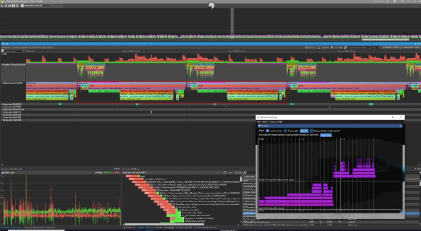
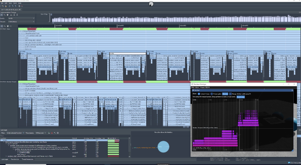
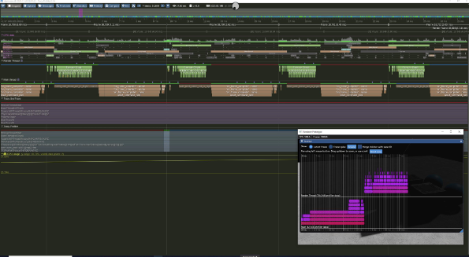

# profiling

Provides a very thin abstraction over instrumented profiling crates like `puffin`, `optick`, `tracy`, and `superluminal-perf`.

Mark up your code like this:

```rust
#[profiling::function]
fn some_function() {
    burn_time(5);

    for i in 0..5 {
        profiling::scope!("Looped Operation");
    }
}
```

See below for resulting visualization and more details on the exposed API.

**Friendly Warning:** Some profiler backends implicitly listen on network ports immediately when the host app is
launched. If this is a concern, please review the enabled profiler(s) documentation for details!

## Puffin

* https://github.com/EmbarkStudios/puffin
* Cross-platform
* Unlike the other backends, `puffin` relies on your app providing an imgui window to draw the UI in-process. The
below screenshots have a profiled application open with the puffin imgui window visible.

## Optick

* https://optick.dev
* The upstream crate only provides binaries for windows. However it could probably be made to work by building
optick capture code and linking against it manually. The UI is windows only.

[](screenshots/optick.jpeg)

## Superluminal

* https://superluminal.eu
* Windows only

[](screenshots/superluminal.jpeg)

## Tracing

* https://crates.io/crates/tracing
* Cross-platform  
* The tracing backend injects tracing `span!()` macros that match the lifetime of the profiling macros.
Tracing uses callbacks rather than inlining specific pre-determined code,
so it is more flexible than profiling
(at the cost of more lines of code and potentially higher overhead).
This allows existing and new tracing-compatible handlers to work with profiling.


## Tracy

* https://github.com/wolfpld/tracy
* Cross-platform, but currently unstable on macOS. It could probably be fixed.
(See https://github.com/wolfpld/tracy/issues/117)

[](screenshots/tracy.jpeg)

## Usage

Currently, there's just four macros:
 * `profiling::scope!(name: &str, [tag: &str])`
     * name: scopes will appear in the profiler under this name
     * tag: optional extra data
 * `#[profiling::function]`
     * procmacro placed on a function to quickly wrap it in a scope using the function name
 * `profiling::register_thread!([name: &str])`
     * name: optional, defaults to `std::thread::current().name`, or `.id` if it's unnamed
 * `profiling::finish_frame!()`
     * Many profilers have the concept of a "frame" as a unit of work. Use this to indicate where one frame ends and the
       next one begins.

Support for individual profilers can be turned on/off with feature flags. By default, they're all off, resulting in
no dependencies or runtime code.

## Who is this for?
 * Authors of binaries that want to have multiple options for profiling their code, but don't want to duplicate their
   instrumentation once per each profiler's individual API.
 * Authors of libraries that would like to instrument their crate for their end-users.
 
This crate is intended to be **TINY**. It won't support every possible usage, just the basics. I'm open to adding
more things but I plan to be very selective to maintain a slim size.

## Alternatives

**tracing**: `tracing` is more flexible than `profiling` but is significantly larger and has
some potential runtime cost. `profiling` is only useful for instrumented profiling. Instrumentation is inserted directly
into your code inline via macros as if you were using the profiler's crate directly. This results in smaller code with
no additional overhead.

Using profiling crates (i.e. puffin/optick/etc.) directly:
 * For authors of binaries, you may still need to use APIs on those crates to get started. But when instrumenting your
   code, `profiling::scope!("Scope Name")` inside a function or `#[profiling::function]` on a function will instrument 
   it for all the supported profiler-specific crates. You can still use those crates directly if you want to take 
   advantage of custom APIs they provide to surface additional data.
 * For authors of upstream libraries, this crate lets you implement simple instrumentation once. Hopefully this will
   allow the community to benefit from instrumented profiling, even if a significant amount of a codebase is made
   of upstream crates.

## Using from a Binary

It's up to you to initialize the profiling crate of your choice (although some do not need explicit initialization
and will immediately work). The examples demonstrate this for all the supported crates, but it's worth looking
at the docs for the profiler you're interested in using! `profiling` re-exports the profiler crates if they are
enabled, simplifying the modifications you would need to make to your Cargo.toml.

Once initialized, you can mix/match the macros provided by your profiler of choice and the generic ones in this 
crate. For example:

```rust
// This may map to something like:
// - puffin::profile_scope!("Scope Name")
// - optick::event!("Scope Name")
// - tracing::span!(tracing::Level::INFO, "Scope Name")
// - superluminal_perf::begin_event("Scope Name")
profiling::scope!("Scope Name");

// This may map to something like:
// - puffin::profile_scope_data!("Scope Name", "extra data")
// - optick::event!("Scope Name"); optick::tag!("tag", "extra data");
// - tracing::span!(tracing::Level::INFO, "Scope Name", tag = "extra data")
// - superluminal_perf::begin_event_with_data("Scope Name", "extra data", 0)
profiling::scope!("Scope Name", "extra data");
```

There is also a proc macro to decorate functions:

```rust
#[profiling::function]
fn my_function() {

}
```

Take a look at the code for the helpful macros `register_thread!()` and `finish_frame!()`. 

If you want to enable profiling in upstream crates, you'll need to enable the appropriate features in them. This also
lets you turn them on/off per crate:

```toml
[dependencies]
profiling = "0.1"
some_upstream_crate = "0.1"

[features]
profile-with-puffin = ["profiling/profile-with-puffin", "some_upstream_crate/profile-with-puffin"]
profile-with-optick = ["profiling/profile-with-optick", "some_upstream_crate/profile-with-optick"]
profile-with-superluminal = ["profiling/profile-with-superluminal", "some_upstream_crate/profile-with-superluminal"]
profile-with-tracing = ["profiling/profile-with-tracing", "some_upstream_crate/profile-with-tracing"]
profile-with-tracy = ["profiling/profile-with-tracing", "some_upstream_crate/profile-with-tracy"]
```

 * You can use the default feature to quickly/temporarily turn something on: `default = ["profile-with-optick"]`
 * `cargo run --features=profile-with-optick` works too!

## Using from a Library

Add the profiling crate to Cargo.toml Add the following features but don't enable them. Those features should only be
enabled by the binary. If the end-user of your library doesn't use profiling, the macros in this crate will emit no code
at all.

```toml
[dependencies]
profiling = "0.1"

[features]
profile-with-puffin = ["profiling/profile-with-puffin"]
profile-with-optick = ["profiling/profile-with-optick"]
profile-with-superluminal = ["profiling/profile-with-superluminal"]
profile-with-tracing = ["profiling/profile-with-tracing"]
profile-with-tracy = ["profiling/profile-with-tracy"]
```

Now you can instrument your library using the API exposed via the `profiling` crate and support each profiler.

The downstream binary can now turn these features on per crate by enabling the appropriate features within the crate as
described above.

## Feature Flags

 * profile-with-puffin: Enable the `puffin` crate
 * profile-with-optick: Enable the `optick` crate
 * profile-with-superluminal: Enable the `superluminal-perf` crate
 * profile-with-tracing: Enable the `tracing` crate. (This is just an abstraction layer - you'd want to hook it to do something!)
 * profile-with-tracy: Enable the `tracy-client` crate.

## Examples

 * simple: Shows a bare minimum requirements to do some simple instrumented profiling. Once it's running, you
   can connect to the process using optick/tracy/superluminal. Some of these are windows only!

```
run --example simple --features="profile-with-optick,profile-with-tracy,profile-with-puffin,profile-with-superluminal" 
```

 * puffin: Launches a basic app with imgui integration showing the puffin UI. This one should run everywhere
   that supports imgui.
 
```
cargo run --example puffin --features="profile-with-puffin"
```

## License

Licensed under either of

* Apache License, Version 2.0, ([LICENSE-APACHE](LICENSE-APACHE) or http://www.apache.org/licenses/LICENSE-2.0)
* MIT license ([LICENSE-MIT](LICENSE-MIT) or http://opensource.org/licenses/MIT)

at your option.

The examples directory contains [`NotoSans-Medium.ttf`](https://www.google.com/get/noto/), available under SIL Open Font
License (OFL).

### Contribution

Unless you explicitly state otherwise, any contribution intentionally
submitted for inclusion in the work by you, as defined in the Apache-2.0
license, shall be dual licensed as above, without any additional terms or
conditions.

See [LICENSE-APACHE](LICENSE-APACHE) and [LICENSE-MIT](LICENSE-MIT).
