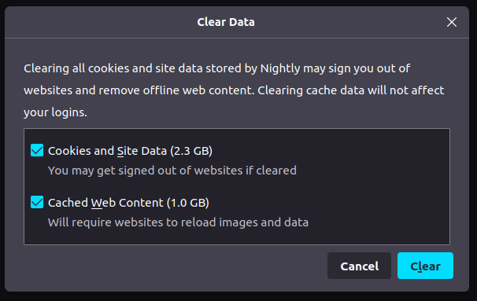
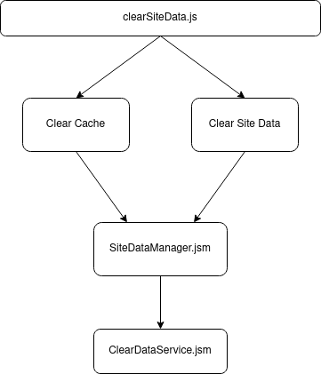
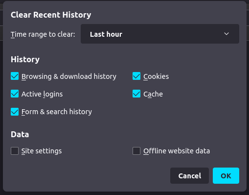
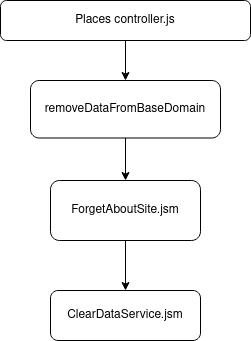
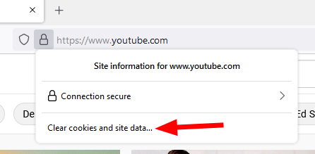
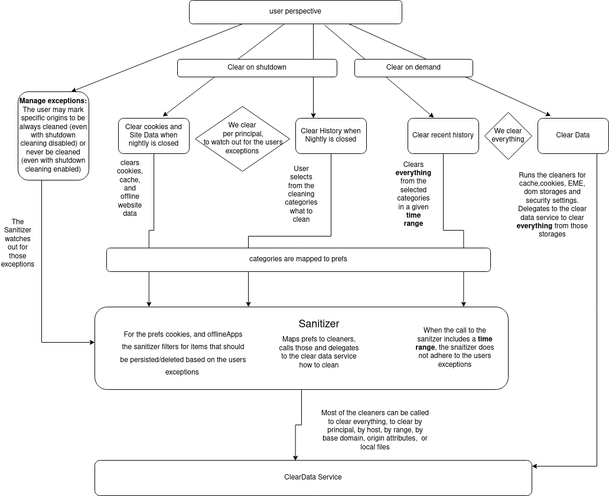

# Data Sanitization

<!-- TODO: This doesn't strictly talk only about toolkit code. Consider splitting the article up and moving to relevant components -->

Firefox has several Data Sanitization features. They allow users to
clear preferences and website data. Clearing data is an essential
feature for user privacy. There are two major privacy issues data
clearing helps mitigate:

1.  Websites tracking the user via web-exposed APIs and storages. This
    can be traditional storages, e.g. localStorage, or cookies.
    However, sites can also use Supercookies, e.g. caches, to persist
    storage in the browser.

2.  Attackers who have control over a computer can exfiltrate data from
    Firefox, such as history, passwords, etc.

## Protection Background

### What similar protections do other browsers have?

All major browsers implement data clearing features
([Chrome](https://support.google.com/chrome/answer/2392709?hl=en&co=GENIE.Platform%3DDesktop&oco=0#zippy=),
[Edge](https://support.microsoft.com/en-us/microsoft-edge/view-and-delete-browser-history-in-microsoft-edge-00cf7943-a9e1-975a-a33d-ac10ce454ca4),
[Safari](https://support.apple.com/guide/safari/clear-your-browsing-history-sfri47acf5d6/mac),
[Brave](https://support.brave.com/hc/en-us/articles/360054509991-How-do-I-clear-Cookies-and-Site-data-in-Brave-on-Android-)).
They usually include a way for users to clear site data within a
configurable time-span along with a list of data categories to be
cleared.

Chrome, Edge and Brave all share Chromium’s data clearing dialog with
smaller adjustments. Notably, Brave extends it with a clear-on-shutdown
mechanism similar to Firefox, while Chrome only supports clearing
specifically site data on shutdown.

Safari’s history clearing feature only allows users to specify a time
span. It does not allow filtering by categories, but clears all website
related data.

All browsers allow fine grained control over website cookies and
storages via the developer tools.

### Is it standardized?

This is a browser UX feature and is therefore not standardized. It is
not part of the web platform.

There is a standardized HTTP header sites can send to clear associated
browser cache, cookies and storage:
[Clear-Site-Data](https://developer.mozilla.org/en-US/docs/Web/HTTP/Headers/Clear-Site-Data).
However, Firefox no longer allows sites to clear caches via the header
since [Bug
1671182](https://bugzilla.mozilla.org/show_bug.cgi?id=1671182).

### How does it fit into our vision of “Zero Privacy Leaks?”

Clearing site data protects users against various tracking techniques
that rely on browser state to (re-)identify users. While Total Cookie
Protection covers many cross-site tracking scenarios, clearing site data
can additionally protect against first-party tracking and other tracking
methods that bypass TCP such as [navigational
tracking](https://privacycg.github.io/nav-tracking-mitigations/#intro).

## Firefox Status

### What is the ship state of this protection in Firefox?

This long standing set of features is shipped in Release in default ETP
mode. In Firefox 91 we introduced [Enhanced Cookie
Clearing](https://blog.mozilla.org/security/2021/08/10/firefox-91-introduces-enhanced-cookie-clearing/)
which makes use of TCP’s cookie jars. This feature only benefits users
who have TCP enabled - in ETP strict mode or Private Browsing Mode.

### Is there outstanding work?

Since [Bug
1422365](https://bugzilla.mozilla.org/show_bug.cgi?id=1422365) the
ClearDataService provides a common interface to clear data of various
storage implementations. However, we don’t have full coverage of all
browser state yet. There are several smaller blind spots, most of which
are listed in this [meta
bug](https://bugzilla.mozilla.org/show_bug.cgi?id=1102808). There is
also a long backlog of data sanitization bugs
[here](https://bugzilla.mozilla.org/show_bug.cgi?id=1550317).

From a user perspective it’s difficult to understand what kind of data
is cleared from which UI. The category selection in the “Clear recent
history” dialog is especially confusing.

Data clearing can take a long time on bigger Firefox profiles. Since
these operations mostly run on the main thread, this can lock up the UI
making the browser unresponsive until the operation has completed.

Generally it would be worth revisiting cleaner implementations in the
ClearDataService and beyond to see where we can improve clearing
performance.

Slow data clearing is especially problematic on shutdown. If the
sanitize-on-shutdown feature takes too long to clear storage, the parent
process will be terminated, resulting in a shutdown crash. [Bug
1756724](https://bugzilla.mozilla.org/show_bug.cgi?id=1756724)
proposes a solution to this: We could show a progress dialog when
clearing data. This way we can allow a longer shutdown phase, since the
user is aware that we’re clearing data.

Important outstanding bugs:

-   [Bug 1550317 - \[meta\] Broken data
    sanitization](https://bugzilla.mozilla.org/show_bug.cgi?id=1550317)

-   [Bug 1102808 - \[meta\] Clear Recent History / Forget button
    blind
    spots](https://bugzilla.mozilla.org/show_bug.cgi?id=1102808)

-   [Bug 1756724 - Show a data clearing progress dialog when
    sanitizing data at shutdown due to "delete cookies and site data
    when Firefox is
    closed"](https://bugzilla.mozilla.org/show_bug.cgi?id=1756724)

### Existing Documentation
<!-- TODO: link existing documentation, if any -->

\-

## Technical Information

### Feature Prefs

| Pref | Description |
| ---- | ----------- |
| places.forgetThisSite.clearByBaseDomain | Switches “Forget about this site” to clear for the whole base domain rather than just the host. |
| privacy.sanitize.sanitizeOnShutdown | Whether to clear data on Firefox shutdown. |
| privacy.clearOnShutdown.* | Categories of data to be cleared on shutdown. True = clear category. Data is only cleared if privacy.sanitize.sanitizeOnShutdown is enabled.|

### How does it work?

The following section lists user facing data sanitization features in
Firefox, along with a brief description and a diagram how they tie into
the main clearing logic in `nsIClearDataService`.

#### Clear Data

-   Accessible via `about:preferences#privacy`

-   Clears site data and caches depending on user selection

-   Clears

    -   Cookies

    -   DOM storages

    -   HSTS

    -   EME

    -   Caches: CSS, Preflight, HSTS

-   Source

    -   [clearSiteData.xhtml](https://searchfox.org/mozilla-central/source/browser/components/preferences/dialogs/clearSiteData.xhtml)

    -   [clearSiteData.js](https://searchfox.org/mozilla-central/source/browser/components/preferences/dialogs/clearSiteData.js)

    -   [clearSiteData.css](https://searchfox.org/mozilla-central/source/browser/components/preferences/dialogs/clearSiteData.css)

#### Clear Recent History

-   Accessible via hamburger menu =&gt; History =&gt; Clear Recent
    history or `about:preferences#privacy` =&gt; History =&gt; Clear
    History

-   Clears a configurable list of categories as [defined in
    Sanitizer.jsm](https://searchfox.org/mozilla-central/rev/fbb1e8462ad82b0e76b5c13dd0d6280cfb69e68d/browser/modules/Sanitizer.jsm#356)

-   Can clear everything or a specific time range

-   Source

    -   [sanitize.xhtml](https://searchfox.org/mozilla-central/source/browser/base/content/sanitize.xhtml)

    -   [sanitizeDialog.js](https://searchfox.org/mozilla-central/source/browser/base/content/sanitizeDialog.js)

#### Forget About this Site

-   Accessible via hamburger menu =&gt; History =&gt; Contextmenu of an
    item =&gt; Forget About This Site

-   Clears all data associated with the base domain of the selected site

-   \[With TCP\] Also clears data of any third-party sites embedded
    under the top level base domain

-   The goal is to remove all traces of the associated site from Firefox

-   Clears
    \[[flags](https://searchfox.org/mozilla-central/rev/fbb1e8462ad82b0e76b5c13dd0d6280cfb69e68d/toolkit/components/cleardata/nsIClearDataService.idl#302-307)\]

    -   History, session history, download history

    -   All caches

    -   Site data (cookies, dom storages)

    -   Encrypted Media Extensions (EME)

    -   Passwords (See [Bug
        702925](https://bugzilla.mozilla.org/show_bug.cgi?id=702925))

    -   Permissions

    -   Content preferences (e.g. page zoom level)

    -   Predictor network data

    -   Reports (Reporting API)

    -   Client-Auth-Remember flag, Certificate exceptions

    -   Does **not** clear bookmarks

-   Source

    -   [ForgetAboutSite.sys.mjs](https://searchfox.org/mozilla-central/source/toolkit/components/forgetaboutsite/ForgetAboutSite.sys.mjs)

    -   [nsIClearDataService flags
        used](https://searchfox.org/mozilla-central/rev/fbb1e8462ad82b0e76b5c13dd0d6280cfb69e68d/toolkit/components/cleardata/nsIClearDataService.idl#302-307)

#### Sanitize on Shutdown

-   Can be enabled via `about:preferences#privacy` =&gt; History: Firefox
    will: Use custom settings for history =&gt; Check “Clear history
    when Firefox closes”

    -   After [Bug
        1681493](https://bugzilla.mozilla.org/show_bug.cgi?id=1681493)
        it can also be controlled via the checkbox “Delete cookies and
        site data when Firefox is closed”

-   On shutdown of Firefox, will clear all data for the selected
    categories. The list of categories is defined in
    [Sanitizer.jsm](https://searchfox.org/mozilla-central/rev/fbb1e8462ad82b0e76b5c13dd0d6280cfb69e68d/browser/modules/Sanitizer.jsm#356)

-   Categories are the same as for the “Clear recent history” dialog

-   Exceptions

    -   Sites which have a “cookie” permission, set to
        [ACCESS\_SESSION](https://searchfox.org/mozilla-central/rev/fbb1e8462ad82b0e76b5c13dd0d6280cfb69e68d/netwerk/cookie/nsICookiePermission.idl#28)
        always get cleared, even if sanitize-on-shutdown is disabled

    -   Sites which have a “cookie” permission set to
        [ACCESS\_ALLOW](https://searchfox.org/mozilla-central/rev/fbb1e8462ad82b0e76b5c13dd0d6280cfb69e68d/netwerk/cookie/nsICookiePermission.idl#19)
        are exempt from data clearing

    -   Caveat: When “site settings” is selected in the categories to be
        cleared, the Sanitizer will remove exception permissions too.
        This results in the above exceptions being cleared.

-   Uses PrincipalsCollector to obtain a list of principals which have
    site data associated with them

    -   [getAllPrincipals](https://searchfox.org/mozilla-central/rev/fbb1e8462ad82b0e76b5c13dd0d6280cfb69e68d/toolkit/components/cleardata/PrincipalsCollector.jsm#72)
        queries the QuotaManager, the cookie service and the service
        worker manager for principals

-   The list of principals obtained is checked for permission
    exceptions. Principals which set a cookie
    [ACCESS\_ALLOW](https://searchfox.org/mozilla-central/rev/fbb1e8462ad82b0e76b5c13dd0d6280cfb69e68d/netwerk/cookie/nsICookiePermission.idl#19)
    permission are removed from the list.

-   Sanitizer.jsm [calls the
    ClearDataService](https://searchfox.org/mozilla-central/rev/fbb1e8462ad82b0e76b5c13dd0d6280cfb69e68d/browser/modules/Sanitizer.jsm#1022,1027-1032)
    to clear data for every principal from the filtered list

-   Source

    -   Most of the sanitize-on-shutdown logic is implemented in
        [Sanitizer.jsm](https://searchfox.org/mozilla-central/rev/fbb1e8462ad82b0e76b5c13dd0d6280cfb69e68d/browser/modules/Sanitizer.jsm)

    -   The main entry point is
        [sanitizeOnShutdown](https://searchfox.org/mozilla-central/rev/fbb1e8462ad82b0e76b5c13dd0d6280cfb69e68d/browser/modules/Sanitizer.jsm#790)

    -   [Parts of
        sanitize-on-shutdown](https://searchfox.org/mozilla-central/rev/fbb1e8462ad82b0e76b5c13dd0d6280cfb69e68d/browser/modules/Sanitizer.jsm#904-911)
        always have to run, even if the rest of the feature is
        disabled, to support clearing storage of sites which have
        “cookie” set to
        [ACCESS\_SESSION](https://searchfox.org/mozilla-central/rev/fbb1e8462ad82b0e76b5c13dd0d6280cfb69e68d/netwerk/cookie/nsICookiePermission.idl#28)
        (see exceptions above)

#### Manage Cookies and Site Data

-   Accessible via `about:preferences#privacy` =&gt; Cookies and Site Data
    =&gt; Manage Data

-   Clears
    \[[flags](https://searchfox.org/mozilla-central/rev/fbb1e8462ad82b0e76b5c13dd0d6280cfb69e68d/browser/modules/SiteDataManager.jsm#499,510-514)\]

    -   Cookies

    -   DOM storages

    -   EME

    -   Caches: CSS, Preflight, HSTS

-   Lists site cookies and storage grouped by base domain.

-   Clearing data on a more granular (host or origin) level is not
    possible. This is a deliberate decision to make this UI more
    thorough in cleaning and easier to understand. If users need very
    granular data management capabilities, they can install an addon
    or use the devtools.

-   Allows users to clear storage for specific sites, or all sites

-   \[With TCP\] Also clears data of any third-party sites embedded
    under the top level base domain

-   Collects list of sites via
    [SiteDataManager.getSites](https://searchfox.org/mozilla-central/rev/fbb1e8462ad82b0e76b5c13dd0d6280cfb69e68d/browser/modules/SiteDataManager.jsm#366)

-   Before removal, prompts via SiteDataManger.promptSiteDataRemoval

-   On removal calls SiteDataManager.removeAll() if all sites have been
    selected or SiteDataManager.remove() passing a list of sites to be
    removed.

-   Source

    -   [siteDataSettings.xhtml](https://searchfox.org/mozilla-central/rev/fbb1e8462ad82b0e76b5c13dd0d6280cfb69e68d/browser/components/preferences/dialogs/siteDataSettings.xhtml)

    -   [siteDataSettings.js](https://searchfox.org/mozilla-central/rev/fbb1e8462ad82b0e76b5c13dd0d6280cfb69e68d/browser/components/preferences/dialogs/siteDataSettings.js)

#### Clear Cookies and Site Data

-   Accessible via the identity panel (click on lock icon in the URL
    bar)

-   Clears
    \[[flags](https://searchfox.org/mozilla-central/rev/fbb1e8462ad82b0e76b5c13dd0d6280cfb69e68d/browser/modules/SiteDataManager.jsm#499,510-514)\]

    -   Cookies

    -   DOM storages

    -   EME

    -   Caches: CSS, Preflight, HSTS

-   Button handler method:
    [clearSiteData](https://searchfox.org/mozilla-central/rev/fbb1e8462ad82b0e76b5c13dd0d6280cfb69e68d/browser/base/content/browser-siteIdentity.js#364-385)

-   Calls SiteDataManager.remove() with the base domain of the currently
    selected tab

-   The button is only shown if a site has any cookies or quota storage.
    This is checked
    [here](https://searchfox.org/mozilla-central/rev/3269d4c928ef0d8310c2f57634e9b6057aa636e9/browser/base/content/browser-siteIdentity.js#923).

-   Source

    -   [identityPanel.inc.xhtml](https://searchfox.org/mozilla-central/rev/3269d4c928ef0d8310c2f57634e9b6057aa636e9/browser/components/controlcenter/content/identityPanel.inc.xhtml#97)

    -   [browser-siteIdentity.js](https://searchfox.org/mozilla-central/rev/3269d4c928ef0d8310c2f57634e9b6057aa636e9/browser/base/content/browser-siteIdentity.js#364)

A broad overview of the different data clearing features accessible via
about:preferences#privacy.

The user can clear data on demand or choose to clear data on shutdown.
For the latter the user may make exceptions for specific origins not to
be cleared or to be always cleared on shutdown.

#### ClearDataService

This service serves as a unified module to hold all data clearing logic
in Firefox / Gecko. Callers can use the
[nsIClearDataService](https://searchfox.org/mozilla-central/rev/cf77e656ef36453e154bd45a38eea08b13d6a53e/toolkit/components/cleardata/nsIClearDataService.idl)
interface to clear data. From JS the service is accessible via
Services.clearData.

To specify which state to clear pass a combination of
[flags](https://searchfox.org/mozilla-central/rev/cf77e656ef36453e154bd45a38eea08b13d6a53e/toolkit/components/cleardata/nsIClearDataService.idl#161-308)
into aFlags.

Every category of browser state should have its own cleaner
implementation which exposes the following methods to the
ClearDataService:

-   **deleteAll**: Deletes all data owned by the cleaner

-   **deleteByPrincipal**: Deletes data associated with a specific
    principal.

-   **deleteByBaseDomain**: Deletes all entries which are associated
    with the given base domain. This includes data partitioned by
    Total Cookie Protection.

-   **deleteByHost**: Clears data associated with a host. Does not clear
    partitioned data.

-   **deleteByRange**: Clear data which matches a given time-range.

-   **deleteByLocalFiles**: Delete data held for local files and other
    hostless origins.

-   **deleteByOriginAttributes**: Clear entries which match an
    [OriginAttributesPattern](https://searchfox.org/mozilla-central/rev/cf77e656ef36453e154bd45a38eea08b13d6a53e/caps/OriginAttributes.h#153).

Some of these methods are optional. See [comment
here](https://searchfox.org/mozilla-central/rev/cf77e656ef36453e154bd45a38eea08b13d6a53e/toolkit/components/cleardata/ClearDataService.jsm#85-105).
If a cleaner does not support a specific method, we will usually try to
fall back to deleteAll. For privacy reasons we try to over-clear storage
rather than under-clear it or not clear it at all because we can’t
target individual entries.

Overview of the most important cleaning methods of the ClearDataService
called by other Firefox / Gecko components. deleteDataFromPrincipal is
called programmatically, while user exposed data clearing features clear
by base domain, host or all data.

<!--
TODO: For firefox-source-docs, import JSdoc for relevant modules
[like
so](https://searchfox.org/mozilla-central/rev/fbb1e8462ad82b0e76b5c13dd0d6280cfb69e68d/toolkit/components/prompts/docs/nsIPromptService-reference.rst#9)
-->
