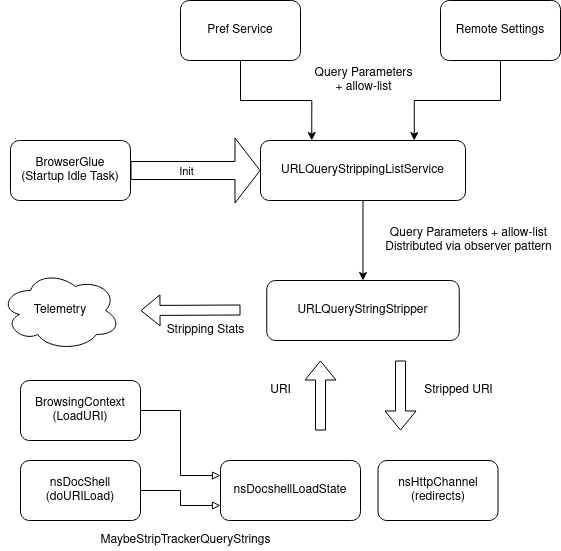

# Query Parameter Stripping

To combat [Navigational
Tracking](https://privacycg.github.io/nav-tracking-mitigations/#navigational-tracking)
through [link
decoration](https://privacycg.github.io/nav-tracking-mitigations/#link-decoration),
Firefox can strip known tracking query parameters from URLs before the
user navigates to them.

## Protection Background

### What similar protections do other browsers have?

Brave also has a list-based query parameter stripping mechanism. A list
of query parameters stripped can be found
[here](https://github.com/brave/brave-core/blob/5fcad3e35bac6fea795941fd8189a59d79d488bc/browser/net/brave_site_hacks_network_delegate_helper.cc#L29-L67).
Brave also has a strip-on-copy feature which allows users to copy a
stripped version of the current URL.

### Is it standardized?

At this time there are no standardized navigational tracking
protections. The PrivacyCG has a [work item for Navigation-based
Tracking
Mitigations](https://privacycg.github.io/nav-tracking-mitigations/).
Also see Apple’s proposal
[here](https://github.com/privacycg/proposals/issues/6).

### How does it fit into our vision of “Zero Privacy Leaks?”

Existing tracking protections mechanisms in Firefox, such as ETP and TCP
focus mostly on third-party trackers. Redirect tracking can circumvent
these mechanisms by passing identifiers through link decoration and
first-party storage. Query parameter stripping contributes to the “Zero
Privacy Leaks” vision by mitigating this cross-site tracking vector.

## Firefox Status

Metabug: [Bug 1706602 - \[meta\] Implement URL query string stripping
prototype](https://bugzilla.mozilla.org/show_bug.cgi?id=1706602)

### What is the ship state of this protection in Firefox?

Query stripping is enabled in release in ETP strict with an initial list
of query params:

-   mc\_eid

-   oly\_anon\_id

-   oly\_enc\_id

-   \_\_s

-   vero\_id

-   \_hsenc

-   mkt\_tok

-   fbclid

It is enabled in Nightly by default in all modes with an extended
strip-list. You can find the current list of parameters that are
stripped
[here](https://firefox.settings.services.mozilla.com/v1/buckets/main/collections/query-stripping/records).
Note that some records have a *filter\_expression* that limits where
they apply.

### Is there outstanding work?

After our initial release on ETP strict, we are considering to ship the
feature to Private Browsing Mode and possibly also to enable it by default
in release in the future.

Other possible improvements:

-   Extend the list of query parameters stripped, in accordance with our policy.

-   Extend the protection to cover different kinds of link decoration, beyond just query parameters.

-   Ability to identify and strip hashed link decoration fields

-   Strip query params for urls shared / copied out from the browser

Outstanding bugs:

-   See dependencies of [Bug 1706602 - \[meta\] Implement URL query
    string stripping
    prototype](https://bugzilla.mozilla.org/show_bug.cgi?id=1706602)

### Existing Documentation

-   [Anti-Tracking Policy: Navigational cross-site
     tracking](https://wiki.mozilla.org/Security/Anti_tracking_policy#2._Navigational_cross-site_tracking)

## Technical Information

### Feature Prefs

| Pref | Description |
| ---- | ----------- |
| privacy.query_stripping.enabled | Enable / disable the feature in normal browsing. |
| privacy.query_stripping.enabled.pbmode | Enable / disable the feature in private browsing. |
| privacy.query_stripping.allow_list | Comma separated list of sites (without scheme) which should not have their query parameters stripped. |
| privacy.query_stripping.redirect | Whether to perform stripping for redirects. |
| privacy.query_stripping.strip_list | List of space delimited query parameters to be stripped. |

### How does it work?

[**UrlQueryStrippingListService**](https://searchfox.org/mozilla-central/rev/3269d4c928ef0d8310c2f57634e9b6057aa636e9/toolkit/components/antitracking/URLQueryStrippingListService.jsm)

-   Collects list of query parameters to be stripped and allow-list from
    the *privacy.query\_stripping.strip\_list/allow\_list* preference
    and the *query-stripping* Remote Settings collection

-   Lists from the two sources are
    [concatenated](https://searchfox.org/mozilla-central/rev/3269d4c928ef0d8310c2f57634e9b6057aa636e9/toolkit/components/antitracking/URLQueryStrippingListService.jsm#150-151)

-   Lists are distributed via [observer
    notification](https://searchfox.org/mozilla-central/rev/3269d4c928ef0d8310c2f57634e9b6057aa636e9/toolkit/components/antitracking/URLQueryStrippingListService.jsm#158-161)
    via the
    [nsIUrlQueryStrippingListService](https://searchfox.org/mozilla-central/rev/3269d4c928ef0d8310c2f57634e9b6057aa636e9/toolkit/components/antitracking/nsIURLQueryStrippingListService.idl#25).
    [onQueryStrippingListUpdate](https://searchfox.org/mozilla-central/rev/3269d4c928ef0d8310c2f57634e9b6057aa636e9/toolkit/components/antitracking/nsIURLQueryStrippingListService.idl#25)
    is called initially on registration and whenever the preferences
    or the Remote Settings collection updates.

[**URLQueryStringStripper**](https://searchfox.org/mozilla-central/rev/3269d4c928ef0d8310c2f57634e9b6057aa636e9/toolkit/components/antitracking/URLQueryStringStripper.h)

-   Only subscriber of the
    [UrlQueryStrippingListService](https://searchfox.org/mozilla-central/rev/3269d4c928ef0d8310c2f57634e9b6057aa636e9/toolkit/components/antitracking/URLQueryStrippingListService.jsm)

-   Holds [hash set
    representations](https://searchfox.org/mozilla-central/rev/3269d4c928ef0d8310c2f57634e9b6057aa636e9/toolkit/components/antitracking/URLQueryStringStripper.h#56-57)
    of the strip- and allow-list.

-   [URLQueryStringStripper::Strip](https://searchfox.org/mozilla-central/rev/3269d4c928ef0d8310c2f57634e9b6057aa636e9/toolkit/components/antitracking/URLQueryStringStripper.cpp#45):
    takes a nsIURI as input and strips any query parameters that are
    on the strip-list. If the given URI matches a site on the
    allow-list no query parameters are stripped.

**Consumers**

-   [nsDocShell::DoURILoad](https://searchfox.org/mozilla-central/rev/3269d4c928ef0d8310c2f57634e9b6057aa636e9/docshell/base/nsDocShell.cpp#10569):
    Strips in the content, before creating the channel.

-   [BrowsingContext::LoadURI](https://searchfox.org/mozilla-central/rev/3269d4c928ef0d8310c2f57634e9b6057aa636e9/docshell/base/BrowsingContext.cpp#2019):
    Strips before loading the URI in the parent.

-   [nsHttpChannel::AsyncProcessRedirection](https://searchfox.org/mozilla-central/rev/3269d4c928ef0d8310c2f57634e9b6057aa636e9/netwerk/protocol/http/nsHttpChannel.cpp#5154):
    Strips query parameters for HTTP redirects (e.g. 301).
