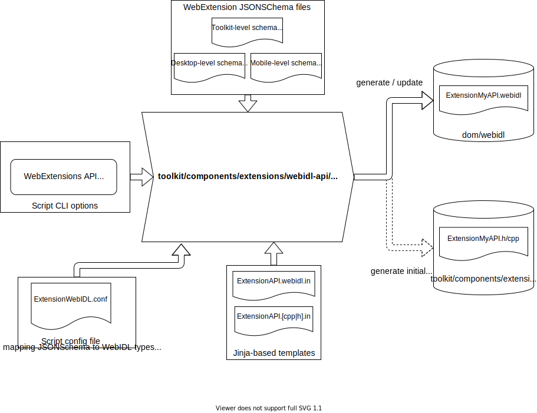

Generating WebIDL definitions from WebExtensions API JSONSchema
===============================================================

In ``toolkit/components/extensions/webidl-api``, a python script named ``GenerateWebIDLBindings.py``
helps to generation of the WebIDL definitions for the WebExtensions API namespaces based on the existing
JSONSchema data.

..
   This svg diagram has been created using https://app.diagrams.net,
   the svg file also includes the source in the drawio format and so
   it can be edited more easily by loading it back into app.diagrams.net
   and then re-export from there (and include the updated drawio format
   content into the exported svg file).

Example: how to execute GenerateWebIDLBindings.py
-------------------------------------------------

As an example, the following shell command generates (or regenerates if one exists) the webidl bindings
for the `runtime` API namespace:

.. code-block:: bash

    $ export SCRIPT_DIR="toolkit/components/extensions/webidl-api"
    $ mach python $SCRIPT_DIR/GenerateWebIDLBindings.py -- runtime

this command will generates a `.webdil` file named `dom/webidl/ExtensionRuntime.webidl`.

.. warning::
    This python script uses some python libraries part of mozilla-central ``mach`` command
    and so it has to be executed using ``mach python`` and any command line options that has
    to the passed to the ``GenerateWebIDLBindings.py`` script should be passed after the ``--``
    one that ends ``mach python`` own command line options.

* If a webidl file with the same name already exist, the python script will ask confirmation and
  offer to print a diff of the changes (or just continue without changing the existing webidl file
  if the content is exactly the same):

.. code-block:: console

    $ mach python $SCRIPT_DIR/GenerateWebIDLBindings.py -- runtime

    Generating webidl definition for 'runtime' => dom/webidl/ExtensionRuntime.webidl
    Found existing dom/webidl/ExtensionRuntime.webidl.

    (Run again with --overwrite-existing to allow overwriting it automatically)

    Overwrite dom/webidl/ExtensionRuntime.webidl? (Yes/No/Diff)
    D
    --- ExtensionRuntime.webidl--existing
    +++ ExtensionRuntime.webidl--updated
    @@ -24,6 +24,9 @@
     [Exposed=(ServiceWorker), LegacyNoInterfaceObject]
     interface ExtensionRuntime {
       // API methods.
    +
    +  [Throws, WebExtensionStub="Async"]
    +  any myNewMethod(boolean aBoolParam, optional Function callback);

       [Throws, WebExtensionStub="Async"]
       any openOptionsPage(optional Function callback);

    Overwrite dom/webidl/ExtensionRuntime.webidl? (Yes/No/Diff)

* By convention each WebExtensions API WebIDL binding is expected to be paired with C++ files
  named ``ExtensionMyNamespace.h`` and ``ExtensionMyNamespace.cpp`` and located in
  ``toolkit/components/extensions/webidl-api``:

  * if no files with the expected names is found the python script will generate an initial
    boilerplate files and will store them in the expected mozilla-central directory.
  * The Firefox developers are responsible to fill this initial boilerplate as needed and
    to apply the necessary changes (if any) when the webidl definitions are updated because
    of changes to the WebExtensions APIs JSONSchema.

``ExtensionWebIDL.conf`` config file
------------------------------------

TODO:

* mention the role of the "webidl generation" script config file in handling
  special cases (e.g. mapping types and method stubs)

* notes on desktop-only APIs and API namespaces only partially available on Android

``WebExtensionStub`` WebIDL extended attribute
----------------------------------------------

TODO:

* mention the special webidl extended attribute used in the WebIDL definitions
