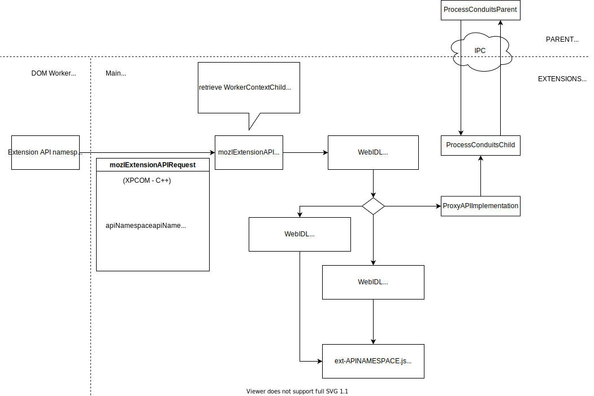

WebIDL WebExtensions API Bindings
=================================

While on ``manifest_version: 2`` all the extension globals (extension pages and content scripts)
that lives on the main thread and the WebExtensions API bindings can be injected into the extension
global from the JS privileged code part of the WebExtensions internals (`See Schemas.inject defined in
Schemas.jsm <https://searchfox.org/mozilla-central/search?q=symbol:Schemas%23inject&redirect=false>`_),
in ``manifest_version: 3`` the extension will be able to declare a background service worker
instead of a background page, and the existing WebExtensions API bindings can't be injected into this
new extension global, because it lives off of the main thread.

To expose WebExtensions API bindings to the WebExtensions ``background.service_worker`` global
we are in the process of generating new WebIDL bindings for the WebExtensions API.

.. warning::

   For more general in depth details about WebIDL in Gecko:

   - :doc:`/dom/bindings/webidl/index`
   - :doc:`/dom/webIdlBindings/index`

Review process on changes to webidl definitions
-----------------------------------------------

.. note::

   When new webidl definitions are being introduced for a WebExtensions API, or
   existing ones need to be updated to stay in sync with changes applied to the
   JSONSchema definitions of the same WebExtensions API, the resulting patch
   will include a **new or changed WebIDL located at dom/webidl** and that part of the
   patch **will require a mandatory review and sign-off from a peer part of the**
   webidl_ **phabricator review group**.

This section includes a brief description about the special setup of the
webidl files related to WebExtensions and other notes useful to the
WebIDL peers that will be reviewing and signing off these webidl files.

.. _webidl: https://phabricator.services.mozilla.com/tag/webidl/

How/Where are these webidl interfaces restricted to the extensions background service workers?
^^^^^^^^^^^^^^^^^^^^^^^^^^^^^^^^^^^^^^^^^^^^^^^^^^^^^^^^^^^^^^^^^^^^^^^^^^^^^^^^^^^^^^^^^^^^^^

All the webidl interfaces related to the extensions API are only visible in
specific extension globals: the WebExtensions background service worker
(a service worker declared in the extension ``manifest.json`` file, through
the ``background.service_worker`` manifest field).

All webidl interfaces related to the WebExtensions API interfaces are exposed
through the ``ExtensionBrowser`` interface, which gets exposed into the
``ServiceWorkerGlobalScope`` through the ``ExtensionGlobalsMixin`` interface and
restricted to the WebExtensions background service worker through the
``mozilla::extensions::ExtensionAPIAllowed`` helper function.

See ``ExtensionBrowser`` and ``ExtensionGlobalsMixin`` interfaces defined from
ExtensionBrowser.webidl_ and ``mozilla::extensions::ExtensionAPIAllowed`` defined in
ExtensionBrowser.cpp_.

.. _ExtensionBrowser.webidl: https://searchfox.org/mozilla-central/source/dom/webidl/ExtensionBrowser.webidl
.. _ExtensionBrowser.cpp: https://searchfox.org/mozilla-central/source/toolkit/components/extensions/webidl-api/ExtensionBrowser.cpp

Why do all the webidl interfaces for WebExtensions API use LegacyNoInterfaceObject?
^^^^^^^^^^^^^^^^^^^^^^^^^^^^^^^^^^^^^^^^^^^^^^^^^^^^^^^^^^^^^^^^^^^^^^^^^^^^^^^^^^^

The existing WebExtensions API bindings are not exposing any constructor in the
globals where they are available (e.g. the webidl bindings for the ``browser.alarms``
API namespace is defined by the ``ExtensionAlarms`` webidl interface, but there
shouldn't be any ``ExtensionAlarms`` constructor available as a global to extension
code running in the background service worker).

A previous attempt to create W3C specs for the WebExtensions APIs described in WebIDL
syntaxes (https://browserext.github.io/browserext) was also using the same
``NoInterfaceObject`` WebIDL attribute on the definitions of the API namespace
with the same motivations (eg. see ``BrowserExtBrowserRuntime`` as defined here:
https://browserext.github.io/browserext/#webidl-definition-4).

Bug 1713877_ is tracking a followup to determine a long term replacement for the
``LegacyNoInterfaceObject`` attribute currently being used.

.. _1713877: https://bugzilla.mozilla.org/1713877

Background Service Workers API Request Handling
-----------------------------------------------

..
   This svg diagram has been created using https://app.diagrams.net,
   the svg file also includes the source in the drawio format and so
   it can be edited more easily by loading it back into app.diagrams.net
   and then re-export from there (and include the updated drawio format
   content into the exported svg file).

Generating WebIDL definitions from WebExtensions API JSONSchema
---------------------------------------------------------------

WebIDL definitions for the extension APIs are being generated based on the WebExtensions API JSONSchema
data (the same metadata used to generate the "privilged JS"-based API bindings).

Most of the API methods in generated WebIDL are meant to be implemented using stub methods shared
between all WebExtensions API classes, a ``WebExtensionStub`` webidl extended attribute specify
which shared stub method should be used when the related API method is called.

For more in depth details about how to generate or update webidl definition for an Extension API
given its API namespace:

.. toctree::
   :maxdepth: 2

   generate_webidl_from_jsonschema

Wiring up new WebExtensions WebIDL files into mozilla-central
-------------------------------------------------------------

After a new WebIDL definition has been generated, there are a few more steps to ensure that
the new WebIDL binding is wired up into mozilla-central build system and to be able to
complete successfully a full Gecko build that include the new bindings.

For more in depth details about these next steps:

.. toctree::
   :maxdepth: 2

   wiring_up_new_webidl_bindings

Testing WebExtensions WebIDL bindings
-------------------------------------

Once the WebIDL definition for an WebExtensions API namespace has been
implemented and wired up, the following testing strategies are available to
cover them as part of the WebExtensions testing suites:

``toolkit/components/extensions/test/xpcshell/webidl-api``
^^^^^^^^^^^^^^^^^^^^^^^^^^^^^^^^^^^^^^^^^^^^^^^^^^^^^^^^^^

The xpcshell tests added to this group of xpcshell tests are meant to provide testing coverage
related to lower level components and behaviors (e.g. when making changes to the shared C++
helpers defined in ``toolkit/components/extensions/webidl-api``, or adding new ones).

These tests will often mock part of the internals and use a ``browser.mockExtensionAPI``
API namespace which is only available in tests and not mapped to any actual API implementation
(instead it is being mocked in the test cases to recreate the scenario that the test case is meant
to cover).

And so **they are not meant to provide any guarantees in terms of consistency of the behavior
of the two different bindings implementations** (the new WebIDL bindings vs. the current implemented
bindings), instead the other test suites listed in the sections below should be used for that purpose.

All tests in this directory are skipped in builds where the WebExtensions WebIDL API bindings
are being disabled at build time (e.g. beta and release builds, where otherwise
the test would permafail while riding the train once got on those builds).

``toolkit/components/extensions/test/xpcshell/xpcshell-serviceworker.ini``
^^^^^^^^^^^^^^^^^^^^^^^^^^^^^^^^^^^^^^^^^^^^^^^^^^^^^^^^^^^^^^^^^^^^^^^^^^

When a new or existing xpcshell tests added to this xpcshell-test manifest, all test extensions
will be generated with a background service worker instead of a background page.

.. warning::
   **Unless the background page or scripts are declared as part of the test extension manifest**,
   the test file added to this manifest should be explicitly reviewed to make sure all tests
   are going to provide the expected test coverage in all modes.

.. note::
   In a background script that runs in both a background page and a background
   service worker it may be necessary to run different code for part of the
   test, ``self !== self.window`` is a simple check that can be used to detect if
   the script is being executed as a background service worker.

Test tasks that should be skipped when running in "background service worker mode", but temporarily
until a followup fixes the underlying issue can use the ``ExtensionTestUtils.isInBackgroundServiceWorkerTests()`` in the optional
``add_task``'s ``skip_if`` parameter:

.. code-block:: js

   add_task(
     {
       // TODO(Bug TBF): remove this once ...
       skip_if: () => ExtensionTestUtils.isInBackgroundServiceWorkerTests(),
     },
     async function test_someapi_under_scenario() {
      ...
     }
   );

On the contrary if the test tasks is covering a scenario that is specific to a background page,
and it would need to be permanently skipped while the background script is running as a service worker,
it may be more appropriate to split out those tests in a separate test file not included in this
manifest.

.. warning::
   Make sure that all tests running in multiple modes (in-process,
   remote, and "background service worker mode") do not assume that the WebIDL
   bindings and Background Service Worker are enabled and to skip them when appropriate,
   otherwise the test will become a permafailure once it gets to a channel
   where the "Extensions WebIDL API bindings" are disabled by default at build
   time (currently on **beta** and **release**).

While running the test files locally they will be executed once for each manifest file
where they are included, to restrict the run to just the "background service
workers mode" specify the ``sw-webextensions`` tag:

.. code-block:: bash

   mach xpcshell-test --tag sw-webextensions path/to/test/file.js

``toolkit/components/extensions/test/mochitest/mochitest-serviceworker.ini``
^^^^^^^^^^^^^^^^^^^^^^^^^^^^^^^^^^^^^^^^^^^^^^^^^^^^^^^^^^^^^^^^^^^^^^^^^^^^

Same as the xpcshell-serviceworker.ini manifest but for the mochitest-plain tests.

.. warning::
   The same warnings described in the xpcshell-serviceworker.ini subsection do
   also apply to this manifest file.

Test tasks that should be skipped when not running in "background service worker
mode" can be split into separate test file or skipped inside the ``add_task``
body, but mochitests' ``add_task`` does not support a ``skip_if`` option and so
that needs to be done manually (and it may be good to also log a message to make
it visible when a test is skipped):

.. code-block:: js

   add_task(async function test_someapi_in_background_service_worker() {
     if (!ExtensionTestUtils.isInBackgroundServiceWorkerTests()) {
       is(
         ExtensionTestUtils.getBackgroundServiceWorkerEnabled(),
         false,
         "This test should only be skipped with background service worker disabled"
       )
       info("Test intentionally skipped on 'extensions.backgroundServiceWorker.enabled=false'");
       return;
     }

     ...
   });

While executing the test files locally they will run once for each manifest file
where they are included, to restrict the run to just the "background service
workers mode" specify the ``sw-webextensions`` tag:

.. code-block:: bash

   mach mochitest --tag sw-webextensions path/to/test/file.js
