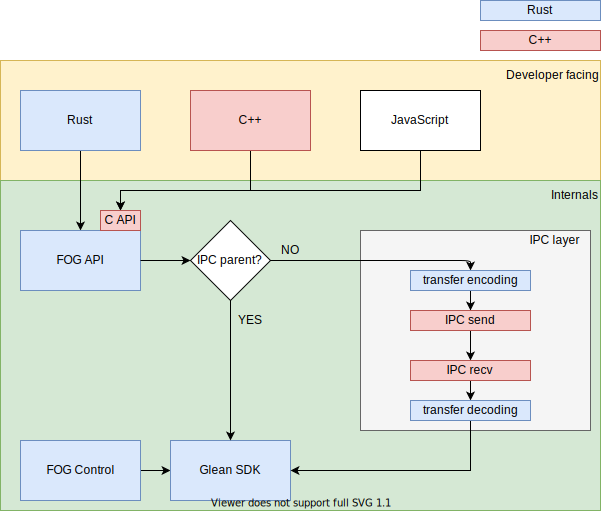

# FOG code organization

```eval_rst
.. notnote::

    Project FOG is currently being designed and implemented.
    This documentation is incomplete and may change significantly before FOG is usable inside mozilla-central.
```



The diagram shows the different modules of Project FOG.

## FOG control

This module is the glue between Firefox and Glean.

* The code lives in `toolkit/components/glean/src`.
* It is written in Rust.
* The crate is named `fog`.
* It is not published to crates.io.
* It is not consumed by other Rust crates inside mozilla-central.

This module is responsible for

* collecting and assembling the [client information](https://mozilla.github.io/glean/book/user/pings/index.html#the-client_info-section)
* configuring Glean
* watching the Firefox Telemetry data upload preference (`datareporting.healthreport.uploadEnabled`)
* scheduling builtin pings
* controling ping upload workers

It calls into `glean_core` to:

* configure and initialize Glean
* toggle `upload_enabled`
* get upload tasks

## FOG API

This module provides the user-facing API for Glean inside mozilla-central.

* The code lives in `toolkit/components/glean/api`.
* It is written in Rust.
* The crate is named `glean`.
* It is not published to crates.io.
* It can be consumed by other Rust crates inside mozilla-central for their Glean usage.
* It will provide a build task for `glean_parser` integration.

This module is responsible for

* exposing a specific metric API in Rust
* wrapping metric implementations for handling IPC
* exposing FFI functionality to implement other language APIs on top

It calls into `glean_core` for:

* metric types (including pings)
* querying `upload_enabled` status.
