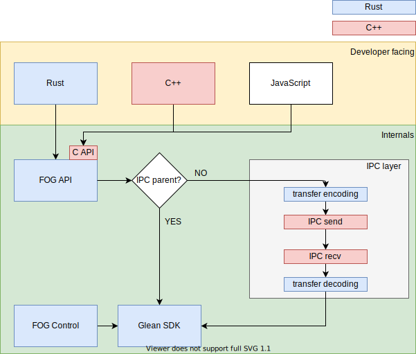

# FOG code organization

The diagram shows the different modules of Project FOG.

## FOG control

This module is the glue between Firefox and Glean.

* The code lives in `toolkit/components/glean/src`.
* It is written in Rust.
* The crate is named `fog_control`.
* It is not published to crates.io.
* It is not consumed by other Rust crates inside mozilla-central.

This module is responsible for

* collecting and assembling the [client information](https://mozilla.github.io/glean/book/user/pings/index.html#the-client_info-section)
* configuring the Glean SDK via the Rust Language Binding
* watching the Firefox Telemetry data upload preference (`datareporting.healthreport.uploadEnabled`)
* scheduling builtin pings
* controling ping upload workers
* passing IPC buffers

It calls into `glean` (the Glean SDK Rust Language Binding) to:

* configure and initialize Glean
* toggle `upload_enabled`
* get upload tasks

It calls into `fog` to:

* pass IPC buffers
* record to its own metrics

## FOG API

This module provides the user-facing API for Glean inside mozilla-central.

* The code lives in `toolkit/components/glean/api`.
* It is written in Rust.
* The crate is named `fog`.
* It is not published to crates.io.
* It can be consumed by other Rust crates inside mozilla-central for their Glean usage.

This module is responsible for

* exposing a specific metric API in Rust
* wrapping metric implementations for handling IPC
* exposing FFI functionality to implement other language APIs on top.
  See also [Adding a New Metric Type](new_metric_types.md).

It calls into `glean` (the Glean SDK Rust Language Binding) for:

* metric types (including pings)
