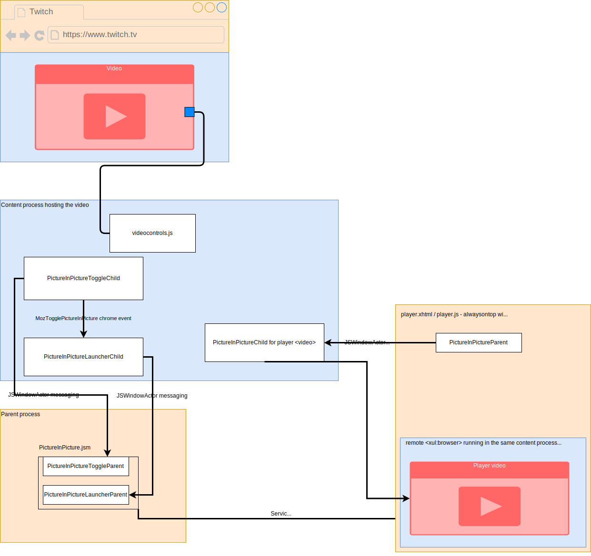

.. _components/pictureinpicture:

==================
Picture-in-Picture
==================

This component makes it possible for a ``<video>`` element on a web page to be played within
an always-on-top video player.

This documentation covers the architecture and inner workings of both the mechanism that
displays the ``<video>`` in the always-on-top video player, as well as the mechanism that
displays the Picture-in-Picture toggle that overlays ``<video>`` elements, which is the primary
method for launching the feature.

High-level overview
===================

The following diagram tries to illustrate the subcomponents, and how they interact with one another.

Let's suppose that the user has loaded a document with a ``<video>`` in it, and they decide to open
it in a Picture-in-Picture window. What happens?

First the ``PictureInPictureToggleChild`` component notices when ``<video>`` elements are added to the
DOM, and monitors the mouse as it moves around the document. Once the mouse intersects a ``<video>``,
``PictureInPictureToggleChild`` causes the Picture-in-Picture toggle to appear on that element.

If the user clicks on that toggle, then the ``PictureInPictureToggleChild`` dispatches a chrome-only
``MozTogglePictureInPicture`` event on the video, which is handled by the ``PictureInPictureLauncherChild`` actor
for that document. The reason for the indirection via the event is that the media context menu can also
trigger Picture-in-Picture by dispatching the same event on the video. Upon handling the event, the
``PictureInPictureLauncherChild`` actor then sends a ``PictureInPicture:Request`` message to the parent process.
The parent process opens up the always-on-top player window, with a remote ``<xul:browser>`` that runs in
the same content process as the original ``<video>``. The parent then sends a message to the player
window's remote ``<xul:browser>`` loaded in the player window. A ``PictureInPictureChild`` actor
is instantiated for the empty document loaded inside of the player window browser. This
``PictureInPictureChild`` actor constructs its own ``<video>`` element, and then tells Gecko to clone the
frames from the original ``<video>`` to the newly created ``<video>``.

At this point, the video is displaying in the Picture-in-Picture player window.

Next, we'll discuss the individual subcomponents, and how they operate at a more detailed level.

The Picture-in-Picture toggle
=============================

One of the primary challenges faced when developing this feature was the fact that, in practice, mouse
events tend not to reach ``<video>`` elements. This is usually because the ``<video>`` element is
contained within a hierarchy of other DOM elements that are capturing and handling any events that
come down. This often occurs on sites that construct their own video controls. This is why we cannot
simply use a ``mouseover`` event handler on the ``<video>`` UAWidget - on sites that do the event
capturing, we'll never receive those events and the toggle will not be accessible.

Other times, the problem is that the video is overlaid with a semi or fully transparent element
which captures any mouse events that would normally be dispatched to the underlying ``<video>``.
This can occur, for example, on sites that want to display an overlay when the video is paused.

To work around this problem, the `PictureInPictureToggleChild` actor class samples the latest
``mousemove`` event every ``MOUSEMOVE_PROCESSING_DELAY_MS`` milliseconds, and then calls
``nsIDOMWindowUtils.nodesFromRect`` with the ``aOnlyVisible`` argument to get the full
list of visible nodes that exist underneath a 1x1 rect positioned at the mouse cursor.

If a ``<video>`` is in that list, then we reach into its shadow root, and update some
attributes to tell it to maybe show the toggle.

The underlying ``UAWidget`` for the video is defined in ``videocontrols.js``, and ultimately
chooses whether or not to display the toggle based on the following heuristics:

1. Is the video less than 45 seconds?
2. Is either the width or the height of the video less than 160px?
3. Is the video silent?

If any of the above is true, the underlying ``UAWidget`` will hide the toggle, since it's
unlikely that the user will want to pop the video out into an always-on-top player window.

Video registration
==================

Sampling the latest ``mousemove`` event every ``MOUSEMOVE_PROCESSING_DELAY_MS`` is not free,
computationally speaking, so we only do this if there are one or more ``<video>`` elements
visible on the page. We use an ``IntersectionObserver`` to notice when there is a ``<video>``
within the viewport, and if there are 1 or more ``<video>`` elements visible, then we start
sampling the ``mousemove`` event.

Videos are added to the ``IntersectionObserver`` when they are added to the DOM by listening
for the ``UAWidgetSetupOrChange`` event. This is considered being "registered".

``docState``
============

``PictureInPictureChild.sys.mjs`` contains a ``WeakMap`` mapping ``document``'s to various information
that ``PictureInPictureToggleChild`` wants to retain for the lifetime of that ``document``. For
example, whether or not we're in the midst of handling the user clicking down on their pointer
device. Any state that needs to be remembered should be added to the ``docState`` ``WeakMap``.

Clicking on the toggle
======================

If the user clicks on the Picture-in-Picture toggle, we don't want the underlying webpage to
know that this happened, since this could result in unexpected behaviour, like a page
navigation (for example, if the ``<video>`` is a long-running advertisement that navigates
upon click).

To accomplish this, we listen for all events fired on a mouse click on the root window during
the capturing phase. This allows us to handle the events before they are dispatched to content.

The first event that is fired, ``pointerdown``, is captured, and we check the ``docState`` to see
whether or not we're showing a toggle on any videos. If so, we check the coordinates of that
toggle against the coordinates of the ``pointerdown`` event to determine if the user is clicking
on the toggle. If so, we set a flag in the ``docState`` so that any subsequent events from the
click (like ``mousedown``, ``mouseup``, ``pointerup``, ``click``) are captured and suppressed.
If the ``pointerdown`` event didn't occur within a toggle, we let the events pass through as
normal.

If we determine that the click has occurred on the toggle, a ``MozTogglePictureInPicture`` event
is dispatched on the underlying ``<video>``. This event is handled by the separate
``PictureInPictureLauncherChild`` class.

PictureInPictureLauncherChild
=============================

A small actor class whose only responsibility is to tell the parent process to open an always-on-top-window by sending a ``PictureInPicture:Request`` message to its parent actor.

Currently, this only occurs when a chrome-only ``MozTogglePictureInPicture`` event is dispatched by the ``PictureInPictureToggleChild`` when the user clicks the Picture-in-Picture toggle button
or uses the context-menu.

PictureInPictureChild
=====================

The ``PictureInPictureChild`` actor class will run in a content process containing a video, and is instantiated when the player window's `player.js` script runs its initialization. A ``PictureInPictureChild`` maps an individual ``<video>``
to a player window instance. It creates an always-on-top window, and sets up a new ``<video>`` inside of this window to clone frames from another ``<video>``
(which will be in the same process, and have its own ``PictureInPictureChild``). Creating this window also causes the new ``PictureInPictureChild`` to be created.
This instance will monitor the originating ``<video>`` for changes, and to receive commands from the player window if the user wants to control the ``<video>``.

PictureInPicture.sys.mjs
========================

This module runs in the parent process, and is also the scope where all ``PictureInPictureParent`` instances reside. ``PictureInPicture.sys.mjs``'s job is to send and receive messages from ``PictureInPictureChild`` instances, and to react appropriately.

Critically, ``PictureInPicture.sys.mjs`` is responsible for opening up the always-on-top player window, and passing the relevant information about the ``<video>`` to be displayed to it.

The Picture-in-Picture player window
====================================

The Picture-in-Picture player window is a chrome-privileged window that loads an XHTML document. That document contains a remote ``<browser>`` element which is repurposed during window initialization to load in the same content process as the originating ``<video>``.

The player window is where the player controls are defined, like "Play" and "Pause". When the user interacts with the player controls, a message is sent down to the appropriate ``PictureInPictureChild`` to call the appropriate method on the underlying ``<video>`` element in the originating tab.

Cloning the video frames
========================

While it appears as if the video is moving from the original ``<video>`` element to the player window, what's actually occurring is that the video frames are being *cloned* to the player window ``<video>`` element. This cloning is done at the platform level using a privileged method on the ``<video>`` element: ``cloneElementVisually``.

``cloneElementVisually``
------------------------

.. code-block:: js

    Promise<void> video.cloneElementVisually(otherVideo);

This will clone the frames being decoded for ``video`` and display them on the ``otherVideo`` element as well. The returned Promise resolves once the cloning has successfully started.

``stopCloningElementVisually``
------------------------------

.. code-block:: js

    void video.stopCloningElementVisually();

If ``video`` is being cloned visually to another element, calling this method will stop the cloning.

``isCloningElementVisually``
----------------------------

.. code-block:: js

    boolean video.isCloningElementVisually;

A read-only value that returns ``true`` if ``video`` is being cloned visually.

Site-specific video wrappers
============================

A site-specific video wrapper allows for the creation of custom scripts that the Picture-in-Picture component can utilize when videos are loaded in specific domains. Currently, some uses of video wrappers include:

* Integration of captions and subtitles support on certain video streaming sites
* Fixing inconsistent video behaviour when using Picture-in-Picture controls
* Hiding the Picture-in-Picture toggle for videos on particular areas of a page, given a URL (rather than hiding the toggle for all videos on a page)

``PictureInPictureChildVideoWrapper`` and ``videoWrapperScriptPath``
--------------------------------------------------------------------
``PictureInPictureChildVideoWrapper`` is a special class that represents a video wrapper. It is defined in ``PictureInPictureChild.sys.mjs`` and maps to a ``videoWrapperScriptPath``, which is the path of the custom wrapper script to use.
``videoWrapperScriptPath`` is defined in `browser/extensions/pictureinpicture/data/picture_in_picture_overrides.js <https://searchfox.org/mozilla-central/source/browser/extensions/pictureinpicture/data/picture_in_picture_overrides.js>`_ for a domain,
and custom wrapper scripts are defined in `browser/extensions/pictureinpicture/video-wrappers <https://searchfox.org/mozilla-central/source/browser/extensions/pictureinpicture/video-wrappers>`_.

If a ``videoWrapperScriptPath`` is detected while initializing the Picture-in-Picture toggle or window, we immediately create a new instance of ``PictureInPictureChildVideoWrapper`` based on the given path, allowing us to run our custom scripts.

API
^^^
See the full list of methods at `API References <#toolkit-actors-pictureinpicturechild-jsm>`_.

Sandbox
^^^^^^^
Performing video control operations on the originating video requires executing code in the browser content. For security reasons, we utilize a *sandbox* to isolate these operations and prevent direct access to ``PictureInPictureChild``. In other words, we run content code within the sandbox itself.
However, it is necessary to waive :ref:`xray vision <Waiving_Xray_vision>` so that we can execute the video control operations. This is done by reading the wrapper’s ``.wrappedJSObject`` property.

Adding a new site-specific video wrapper
----------------------------------------
Creating a new wrapper script file
^^^^^^^^^^^^^^^^^^^^^^^^^^^^^^^^^^
Add a new JS file for the new video wrapper in `browser/extensions/pictureinpicture/video-wrappers <https://searchfox.org/mozilla-central/source/browser/extensions/pictureinpicture/video-wrappers>`_.
The file must meet several requirements to get the wrapper working.

**Script file requirements**:

* Defined class ``PictureInPictureVideoWrapper``
* Assigned ``this.PictureInPictureVideoWrapper = PictureInPictureVideoWrapper``

**PictureInPictureVideoWrapper class requirements**:

* Implementation of at least one overridable method (see :ref:`picture_in_picture_child_video_wrapper_api`)

**Overriden method requirements**:

* Return value with a type that corresponds to ``validateRetVal`` in ``PictureInPictureChildVideoWrapper.#callWrapperMethod()``

Below is an example of a script file ``mock-wrapper.js`` that overrides an existing method ``setMuted()`` in ``PictureInPictureChildVideoWrapper``:

.. code-block:: js

   // sample file `mock-wrapper.js`
   class PictureInPictureVideoWrapper {
      setMuted(video, shouldMute) {
         if (video.muted !== shouldMute) {
            let muteButton = document.querySelector("#player .mute-button");
            if (muteButton) {
               muteButton.click();
            } else {
               video.muted = shouldMute;
            }
         }
      }
   }

   this.PictureInPictureVideoWrapper = PictureInPictureVideoWrapper

.. note::
    If a new ``PictureInPictureChildVideoWrapper`` video control method is needed, see `Adding a new video control method`_.

Declaring ``videoWrapperScriptPath``
^^^^^^^^^^^^^^^^^^^^^^^^^^^^^^^^^^^^
Declare a property ``videoWrapperScriptPath`` for the site at `browser/extensions/pictureinpicture/data/picture_in_picture_overrides.js <https://searchfox.org/mozilla-central/source/browser/extensions/pictureinpicture/data/picture_in_picture_overrides.js>`_:

.. code-block:: js

   someWebsite: {
     "https://*.somewebsite.com/*": {
       videoWrapperScriptPath: "video-wrappers/mock-wrapper.js",
     },
   }

In this example, the URL pattern ``https://*.somewebsite.com/*`` is provided for a site named  ``someWebsite``.
Picture-in-Picture checks for any overrides upon initialization, and it will load scripts specified by ``videoWrapperScriptPath``.
The scripts located at ``video-wrappers/mock-wrapper.js`` will therefore run whenever we view a video from a URL matching ``somewebsite.com``.

Registering the new wrapper in ``moz.build``
^^^^^^^^^^^^^^^^^^^^^^^^^^^^^^^^^^^^^^^^^^^^
We should update `browser/extensions/pictureinpicture/moz.build <https://searchfox.org/mozilla-central/source/browser/extensions/pictureinpicture/moz.build>`_ by adding the path of the newly created wrapper:

.. code-block:: js

    FINAL_TARGET_FILES.features["pictureinpicture@mozilla.org"]["video-wrappers"] += [
        "video-wrappers/mock-wrapper.js",
        "video-wrappers/netflix.js",
        "video-wrappers/youtube.js",
    ]

As expected for any ``moz.build`` file, order matters. Registered paths should be listed in alphabetical order. Otherwise, the build will fail.

Adding a new video control method
---------------------------------
If none of the existing overridable methods in ``PictureInPictureChildVideoWrapper`` are applicable for a bug fix or feature enhancement,
we can create a new one by calling ``#callWrapperMethod()``. Below is an example of how we would define a new overridable method ``setMuted()``:

.. code-block:: js

    // class PictureInPictureChildVideoWrapper in PictureInPictureChild.sys.mjs
    setMuted(video, shouldMute) {
        return this.#callWrapperMethod({
            name: "setMuted",
            args: [video, shouldMute],
            fallback: () => {
                video.muted = shouldMute;
            },
            validateRetVal: retVal => retVal == null,
        });
    }

The new method passes to ``#callWrapperMethod()``:

#. The method name
#. The expected arguments that a wrapper script may use
#. A fallback function
#. A conditional expression that validates the return value

The fallback function only executes if a wrapper script fails or if the method is not overriden.
``validateRetVal`` checks the type of the return value and ensures it matches the expected type. If there is no return value, simply validate if type is ``null``.

.. note::
    Generic method names are preferred so that they can be used for any video wrapper.
    For example: instead of naming a method ``updateCaptionsContainerForSiteA()``, use ``updateCaptionsContainer()``.

Using the new video control method
^^^^^^^^^^^^^^^^^^^^^^^^^^^^^^^^^^
Once the new method is defined, it can be used throughout ``PictureInPictureChild.sys.mjs``. In the current example, we call
``PictureInPictureChildVideoWrapper.setMuted()`` to mute or unmute a video. ``this.videoWrapper`` is an instance of
``PictureInPictureChildVideoWrapper``:

.. code-block:: js

    // class PictureInPictureChild in PictureInPictureChild.sys.mjs
    mute() {
        let video = this.getWeakVideo();
        if (video && this.videoWrapper) {
            this.videoWrapper.setMuted(video, true);
        }
    }

    unmute() {
        let video = this.getWeakVideo();
        if (video && this.videoWrapper) {
            this.videoWrapper.setMuted(video, false);
        }
    }

Testing site-specific video wrappers
------------------------------------
Automated Tests
^^^^^^^^^^^^^^^
Automated tests for site specific wrappers are currently limited. New tests can be made in `browser/extensions/pictureinpicture/tests/browser <https://searchfox.org/mozilla-central/source/browser/extensions/pictureinpicture/tests/browser>`_ to ensure
general functionality, but these are restricted to Firefox Nightly and do not test functionality on specific sites.

Some challenges with writing tests include:

* Accessing DRM content
* Log-in credentials if a site requires a user account
* Detecting modifications to a web page or video player that render a wrapper script obsolete

Manual Tests
^^^^^^^^^^^^
The go-to approach right now is to test video wrappers manually, in tandem with reviews provided by the phabricator group `#pip-reviewers <https://phabricator.services.mozilla.com/project/profile/163/>`_. Below are some questions that reviewers will consider:

* Does Picture-in-Picture crash or freeze?
* Does the wrapper work on Windows, MacOS, and Linux?
* Do Picture-in-Picture features work as expected? (Picture-in-Picture toggle, text tracks, video controls, etc.)
* Do existing automated tests work as they should?

.. warning::
    DRM content may not load for all local Firefox builds. One possible solution is to test the video wrapper in a try build (ex. Linux).
    Depending on the changes made, we may also require the script to run under a temporary pref such as ``media.videocontrols.picture-in-picture.WIP.someWebsiteWrapper`` for the purpose of testing changes in Firefox Nightly.

API References
==============
``toolkit/components/pictureinpicture``
---------------------------------------
.. toctree::
   :maxdepth: 1

   picture-in-picture-api
   player-api

``toolkit/actors/PictureInPictureChild.sys.mjs``
------------------------------------------------
* :ref:`picture_in_picture_child_video_wrapper_api`
