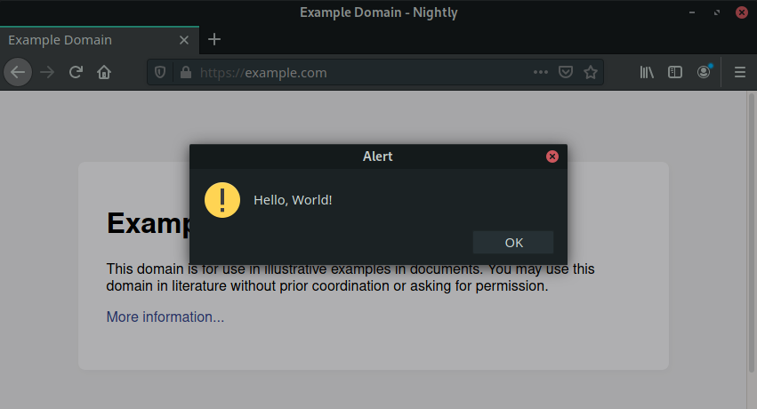
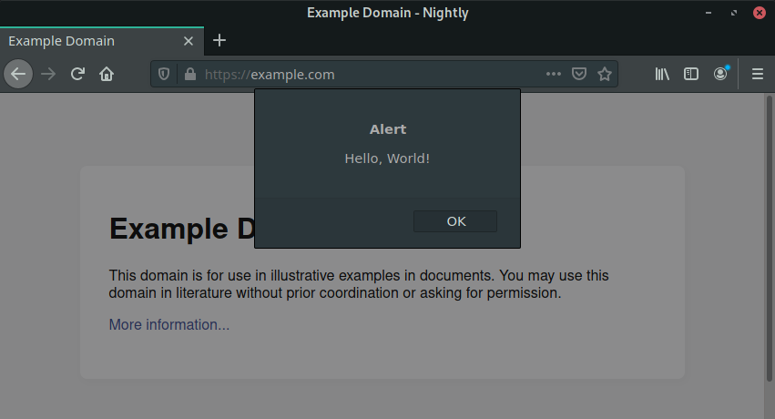
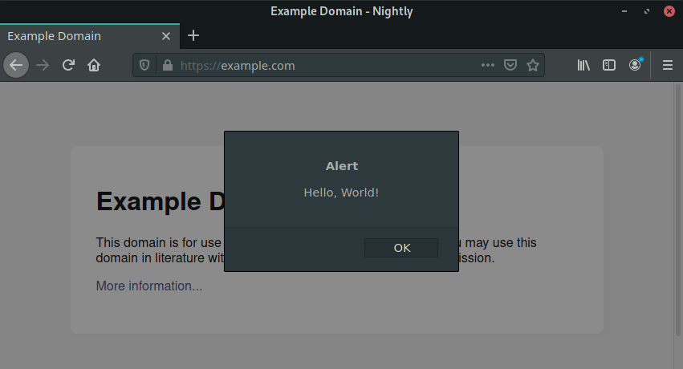

==================
Prompt Modal Types
==================

Window Prompts
--------------

Window prompts are system prompts. They are clearly distinguishable from website
content and can be opened with or without a parent window.
While a window prompt is open, the parent window cannot be interacted with.
That means the user can not close the window or switch tabs.
Providing a parent window is optional, but highly encouraged. If you do not
pass a parent the implementation will try to find one or fallback to aborted
standalone window.

**When to use**: This should be reserved for important browser-wide messages
with the intent to block any further user interaction until the message has been
read.

**Flag**: `MODAL_TYPE_WINDOW`

.. caution::

  When using window prompts, make sure they can not be spawned by web content.
  We've seen `cases <https://bugzilla.mozilla.org/show_bug.cgi?id=1571003>`_
  of DoS attacks in the wild where websites spammed window prompts to lock up
  the browser.
  This prompt type should only be used when necessary and with proper rate
  limiting. Most of the time, a tab prompt can be be used.

   Window alert prompt

Tab Prompts
-----------

Tab prompts are system prompts like window prompts. As opposed to window
prompts, they are tab modal and don't steal focus from the parent window.
Multiple tab prompts cannot be shown at the same time. When opening additional
prompts, they are FIFO queued.

When the user closes the tab or navigates to a different URI, prompts associated
with the given tab are closed.
In this case an exception will be thrown:

.. code-block::

    /*
    Exception: prompt aborted by user
    undefined:425
    */

**When to use**: This prompt should be used for dialogs that were caused by web
content and thus should be bound to the scope and lifetime of a specific tab,
but should still look like secure browser UI. Examples are HTTP Auth prompt or
the dialog to add a new search provider for the current website.

**Flag**: `MODAL_TYPE_TAB`

   Tab alert prompt

Content Prompts
---------------

Content prompts are like tab prompts, but they belong to the web content. Thus,
they are positioned in the center of the selected browser.

**When to use**: The prompt is triggered by or as a result of an action of web
content and is **not** intended to look like secure browser UI.

**Flag**: `MODAL_TYPE_CONTENT`

   Content alert prompt

Disabling tab/content modal prompts
-----------------------------------
You can disable tab and content modal prompts and get back window-modal prompts
by setting the `prompts.tab_modal.enabled` preference to `false`.
This pref might be removed in the future.