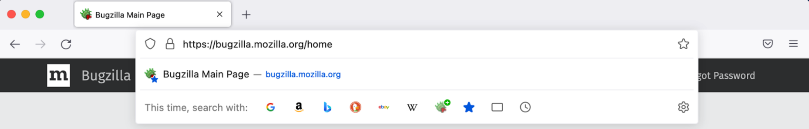
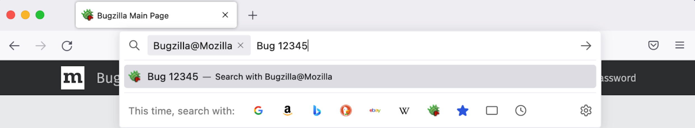

==============
Search Engines
==============
This document describes the three main ways Firefox serves search engines to the
user, enabling users to search the internet with different search providers.
The three main ways Firefox serves search engines to the users is through:

- Add-on Search Engines
- OpenSearch Engines
- Enterprise Policy Engines

An example of a search provider is Google, which is one of the Add-on Search
Engines described in the first section below. Another example of a search
provider is Bugzilla, which is an OpenSearch Engine described in the second
section below.  Lastly, there are Enterprise Policy Search Engines,
which will be the third section described in this documentation.

Add-on Search Engines
=====================
Add-ons are additional functionality that third-party developers provide for
users to install into Firefox. The add-on mechanism is also used by Firefox to
ship the search engines provided by the application. To define Add-on Search
Engines, developers use the `WebExtensions API`_. Since the WebExtensions API
technology is used, developers interchangeably used the term WebExtension Search
Engines when referring to Add-ons Search Engines.

.. _WebExtensions API:
   https://developer.mozilla.org/en-US/docs/Mozilla/Add-ons/WebExtensions

The list of Add-on Search Engines provided by Firefox and their extension files
can be found in `mozilla-central/browser/components/search/extensions
<https://searchfox.org/mozilla-central/source/browser/components/search/extensions>`__.
Within each Add-on Search Engine folder, there is a manifest.json file. One of the
keys in that manifest.json file is `chrome_settings_overrides`, whose value is an object
that describes how to construct the url, images, strings, icon, etc. Here’s an example of
how the search provider is set within `chrome_settings_overrides`:

.. code-block:: js

    "chrome_settings_overrides": {
      "search_provider": {
      "name": "Discogs",
      "search_url": "https://www.discogs.com/search/?q={searchTerms}",
      "keyword": "disc",
      "favicon_url": "https://www.discogs.com/favicon.ico"
      }
    }

To see more details on the syntax and properties, visit the `chrome settings
overrides MDN documentation.
<https://developer.mozilla.org/en-US/docs/Mozilla/Add-ons/WebExtensions/
manifest.json/chrome_settings_overrides>`__

In Practice
-----------
All versions of Firefox support add-ons. Firefox switched over from OpenSearch
to Add-on Search Engines internally in Firefox version 78. Add-on Search engines
allows Firefox developers to have more flexibility and control in the
modification of formatting search engines as we support different search
providers.

We maintain these Add-on Search Engines through a search configuration file that
is bundled and configured via Remote Settings. As of this writing, June 2022, we
use Remote Settings for managing search engines only for Firefox Desktop but not
outside of Firefox Desktop.

OpenSearch Engines
===================
OpenSearch is a plugin, software installed on Firefox to enhance capabilities
for searching. OpenSearch has a collection of formats that describe how to
construct the url, images, strings, icon, etc. These formats provided by
OpenSearch allow Firefox to make a search over the internet with a specific
search provider that is not an application provided search engine on Firefox.
The purpose of OpenSearch is to provide more convenient ways of searching and
different ways of searching.

OpenSearch allows users to search with a vast variety of search providers which
do not come installed with Firefox out of the box. The main benefit of OpenSearch
is it allows site owners to easily provide users with a way to search a site.

History
-------
Prior to OpenSearch, search plugins were first created by the `Mycroft Project
<https://mycroftproject.com/>`__ and based off of `Sherlock
<https://en.wikipedia.org/wiki/Sherlock_(software)>`__, a file and web search
tool created by Apple.

The OpenSearch Protocol was created and launched by A9.com in 2005. OpenSearch
was added to Firefox version 2 in the year 2006. As of today in 2022, OpenSearch
is a collection of formats for sharing of search results. The code is stable but
unchanged for many years.

See the `OpenSearch Documentation <https://github.com/dewitt/opensearch>`__ for
more information on the OpenSearch formats.

Autodiscovery
-------------
Autodiscovery is a feature on Firefox which automatically notifies the user when
the webpage they visited has a search plugin.

Here is an example of Autodiscovery from Bugzilla. You can visit
https://bugzilla.mozilla.org and Firefox will automatically detect that the
website has a provided search plugin. In the results dropdown, you can look at
the search engine shortcuts section at the bottom and it will show a green plus
sign over the Bugzilla search icon. The green plus sign indicates that the user
can add Bugzilla as an OpenSearch Engine. After the user adds Bugzilla as an
OpenSearch Engine, the green plus icon disappears. The user can now click the
Bugzilla icon to make a search directly on bugzilla.mozilla.org.

See the `Autodiscovery MDN Documentation <https://developer.mozilla.org/en-US/
docs/Web/OpenSearch#autodiscovery_of_search_plugins>`__ for more information on
Autodiscovery.

Enterprise Policy Engines
=========================
Enterprise Policies are customizable configurations for the Firefox browser set
by enterprises or companies who want to distribute configuration for their
users. The idea of Enterprise Policies is to allow companies to customize Firefox
and how their users can or cannot change the usage of Firefox based on predefined
configuration that was set in place.

Enterprise Policy Engines are search engines that a company has added as search
engines on Firefox for their users by setting the Enterprise Policy. In this
`Enterprise Policy Documentation
<https://github.com/mozilla/policy-templates/blob/master/README.md#searchengines
-this-policy-is-only-available-on-the-esr>`__,
it outlines the different options that are available for enterprises using
Firefox ESR (Extended Support Release) and what’s available in terms of adding,
updating, or removing search engines. The company can use the policy to define
which search engines are available on their Firefox ESR.

See the `policy-templates
<https://github.com/mozilla/policy-templates/blob/master/README.md>`__ for more
information on Enterprise Policy templates and the different configuration rules
available.

Configuration
-------------
In practice, there are different ways for a company to specify their policy,
depending on which operating system their machines are on. The admin can
configure the policy on a server and when the user logs in, those configurations
are automatically pushed to the user’s Firefox.

For Windows, the `GPO (Group Policy Object)
<https://github.com/mozilla/policy-templates/tree/master/windows>`__ or `Intune
(Microsoft Endpoint Manager) <https://support.mozilla.org/en-US/kb/managing-firefox-intune>`__ is
used to set the policy. For macOS, `configuration profiles
<https://github.com/mozilla/policy-templates/tree/master/mac>`__ are created.
For the generic case, there is a JSON file to describe the policy.

When these configurations are set, Firefox takes the configuration as inputs and
turns them into settings that Firefox can consume.

A Hypothetical Use of Enterprise Policy
---------------------------------------
A company that is in the banking industry and requires tighter security over
their users may not want their users to do something on Firefox without the
company's knowledge. It may make sense for the company to disable private
browsing for Firefox.

Within a specific company, the employees of the finance department could use the
Firefox ESR version. In this situation, we think of the finance department as
the Firefox user rather than the individual employees as Firefox users. The
department makes choices for the individuals that use the Firefox browser
through the Enterprise Policy.

Features On Enterprise Policy
-----------------------------
All Firefox versions have to honor the Enterprise Policy, but the Enterprise
Policy may not have effect on an individual who is not using Firefox ESR at a
company. There are features that are enterprise specific that are only available
in ESR. These features allow search engines to be configured, allowing for
unsigned extensions, installing search engines, and setting a default search
engine.

How To Set Up and Use an Enterprise Policy for Firefox
------------------------------------------------------
Install the ESR version of Firefox since Enterprise Policies are not supported on
rapid release. Then, create the JSON file that is located in the README.md within
https://github.com/mozilla/policy-templates. There are instructions there on how
to configure and use the policy. Once the JSON is created with the appropriate
settings, drop the JSON file in the directory outlined by the README.md and
Firefox will find it and Firefox will open and run with the policy.

Common formatting mistakes are often made when creating the JSON file. The JSON
file can be validated using a JSON validator such as https://jsonlint.com/.
