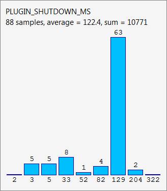

==========
Histograms
==========

In Firefox, the Telemetry system collects various measures of Firefox performance, hardware, usage and customizations and submits it to Mozilla. The Telemetry data collected by a single client can be examined from the integrated ``about:telemetry`` browser page, while the aggregated reports across entire user populations are publicly available at `telemetry.mozilla.org <https://telemetry.mozilla.org>`_.

.. important::

    Every new or changed data collection in Firefox needs a `data collection review <https://wiki.mozilla.org/Firefox/Data_Collection>`__ from a Data Steward.

The following sections explain how to add a new measurement to Telemetry.

Overview
========

Telemetry histograms are an efficient way to collect numeric measurements like multiple counts or timings.
They are collected through a common API and automatically submitted with the :doc:`main ping <../data/main-ping>`.

.. hint::

    Before adding a new histogram, you should consider using other collection mechanisms. For example, if the need is to track a single scalar value (e.g. number, boolean or string), you should use :doc:`scalars`.

The histogram below is taken from Firefox's ``about:telemetry`` page. It shows a histogram used for tracking plugin shutdown times and the data collected over a single Firefox session. The timing data is grouped into buckets where the height of the blue bars represents the number of items in each bucket. The tallest bar, for example, indicates that there were 63 plugin shutdowns lasting between 129ms and 204ms.

The histograms on the ``about:telemetry`` page only show the non-empty buckets in a histogram, except for the bucket to the left of the first non-empty bucket and the bucket to the right of the last non-empty bucket.

.. _choosing-histogram-type:

Choosing a Histogram Type
=========================

The first step to adding a new histogram is to choose the histogram type that best represents the data being measured. The sample histogram used above is an "exponential" histogram.

.. note::

    Only ``flag`` and ``count`` histograms have default values. All other histograms start out empty and are only submitted if a value is recorded.

``boolean``
-----------
These histograms only record boolean values. Multiple boolean entries can be recorded in the same histogram during a single browsing session, e.g. if a histogram is measuring user choices in a dialog box with options "Yes" or "No", a new boolean value is added every time the dialog is displayed.

``linear``
----------
Linear histograms are similar to enumerated histograms, except each bucket is associated with a range of values instead of a single enum value. The range of values covered by each bucket increases linearly from the previous bucket, e.g. one bucket might count the number of occurrences of values between 0 to 9, the next bucket would cover values 10-19, the next 20-29, etc. This bucket type is useful if there aren't orders of magnitude differences between the minimum and maximum values stored in the histogram, e.g. if the values you are storing are percentages 0-100%.

.. note::

    If you need a linear histogram with buckets < 0, 1, 2 ... N >, then you should declare an enumerated histogram. This restriction was added to prevent developers from making a common off-by-one mistake when specifying the number of buckets in a linear histogram.

``exponential``
---------------
Exponential histograms are similar to linear histograms but the range of values covered by each bucket increases exponentially. As an example of its use, consider the timings of an I/O operation whose duration might normally fall in the range of 0ms-50ms but extreme cases might have durations in seconds or minutes. For such measurements, you would want finer-grained bucketing in the normal range but coarser-grained bucketing for the extremely large values. An exponential histogram fits this requirement since it has "narrow" buckets near the minimum value and significantly "wider" buckets near the maximum value.

``categorical``
---------------
Categorical histograms are similar to enumerated histograms. However, instead of specifying ``n_buckets``, you specify an array of strings in the ``labels`` field. From JavaScript, the label values or their indices can be passed as strings to ``histogram.add()``. From C++ you can use ``AccumulateCategorical`` with passing a value from the corresponding ``Telemetry::LABEL_*`` enum, or, in exceptional cases the string values.

.. note::

    You can add new labels to a categorical histogram later on,
    up to the configured maximum.
    Categorical histograms by default support up to 50 labels,
    but you can set it higher using the ``n_values`` property.
    If you need to add labels beyond the maximum later,
    you need to use a new histogram name.
    See `Changing a Histogram`_ for details.

``enumerated``
--------------
This histogram type is intended for storing "enum" values, when you can't specify labels and thus cannot use ``categorical`` histograms. An enumerated histogram consists of a fixed number of *buckets* (specified by ``n_values``), each of which is associated with a consecutive integer value (the bucket's *label*), `0` to `n_values`. Each bucket corresponds to an enum value and counts the number of times its particular enum value was recorded; except for the `n_values` bucket, which counts all values greater than or equal to n_values.

You might use this type of histogram if, for example, you wanted to track the relative popularity of SSL handshake types. Whenever the browser started an SSL handshake, it would record one of a limited number of enum values which uniquely identifies the handshake type.

.. note::

    Set ``n_values`` to a slightly larger value than needed to allow for new enum values in the future. See `Changing a histogram`_ if you need to add more enums later.

``flag``
--------
*Deprecated* (please use boolean :doc:`scalars`).

This histogram type allows you to record a single value (`0` or `1`, default `0`). This type is useful if you need to track whether a feature was ever used during a Firefox session. You only need to add a single line of code which sets the flag when the feature is used because the histogram is initialized with a default value of `0`/`false` (flag not set). Thus, recording a value of `0` is not allowed and asserts.

Flag histograms will ignore any changes after the flag is set, so once the flag is set, it cannot be unset.

``count``
---------
*Deprecated* (please use uint :doc:`scalars`).

This histogram type is used when you want to record a count of something. It only stores a single value and defaults to `0`.

.. _histogram-type-keyed:

Keyed Histograms
----------------

Keyed histograms are collections of one of the histogram types above, indexed by a string key. This is for example useful when you want to break down certain counts by a name, like how often searches happen with which search engine.
Note that when you need to record for a small set of known keys, using separate plain histograms is more efficient.

.. warning::

    Keyed histograms are currently not supported in the `histogram change detector <https://alerts.telemetry.mozilla.org/index.html>`_.

Declaring a Histogram
=====================

Histograms should be declared in the `Histograms.json <https://dxr.mozilla.org/mozilla-central/source/toolkit/components/telemetry/Histograms.json>`_ file. These declarations are checked for correctness at `compile time <https://dxr.mozilla.org/mozilla-central/source/toolkit/components/telemetry/gen_histogram_data.py>`_ and used to generate C++ code.

The following is a sample histogram declaration from ``Histograms.json`` for a histogram named ``MEMORY_RESIDENT`` which tracks the amount of resident memory used by a process:

.. code-block:: json

  {
    "MEMORY_RESIDENT": {
      "record_in_processes": ["main", "content"],
      "alert_emails": ["team@mozilla.xyz"],
      "expires_in_version": "never",
      "kind": "exponential",
      "low": 32768,
      "high": 1048576,
      "n_buckets": 50,
      "bug_numbers": [12345],
      "description": "Resident memory size (KB)"
    }
  }

Histograms which track timings in milliseconds or microseconds should suffix their names with ``"_MS"`` and ``"_US"`` respectively. Flag-type histograms should have the suffix ``"_FLAG"`` in their name.

The possible fields in a histogram declaration are listed below.

``record_in_processes``
-----------------------
Required. This field is a list of processes this histogram can be recorded in. Currently-supported values are:

- ``main``
- ``content``
- ``gpu``
- ``all_childs`` (record in all child processes)
- ``all`` (record in all processes)

``alert_emails``
----------------
Required. This field is a list of e-mail addresses that should be notified when the distribution of the histogram changes significantly from one build-id to the other. This can be useful to detect regressions. Note that all alerts will be sent automatically to mozilla.dev.telemetry-alerts.

``expires_in_version``
----------------------
Required. The version number in which the histogram expires; e.g. a value of `"30"` will mean that the histogram stops recording from Firefox 30 on. A version number of type ``"N"`` is automatically converted to ``"N.0a1"`` in order to expire the histogram also in the development channels. For histograms that never expire the value ``"never"`` can be used as in the example above. Accumulating data into an expired histogram is effectively a non-op and will not record anything.

``kind``
--------
Required. One of the histogram types described in the previous section. Different histogram types require different fields to be present in the declaration.

``keyed``
---------
Optional, boolean, defaults to ``false``. Determines whether this is a *keyed histogram*.

``keys``
---------
Optional, list of strings. Only valid for *keyed histograms*. Defines a case sensitive list of allowed keys that can be used for this histogram. The list is limited to 30 keys with a maximum length of 20 characters. When using a key that is not in the list, the accumulation is discarded and a warning is printed to the browser console.

``low``
-------
Optional, the default value is ``1``. This field represents the minimum value expected in the histogram. Note that all histograms automatically get a bucket with label ``0`` for counting values below the ``low`` value. If a histogram does not specify a ``low`` value, it will always have a ``"0"`` bucket (for negative or zero values) and a ``"1"`` bucket (for values between ``1`` and the next bucket).

``high``
--------
Required for linear and exponential histograms. The maximum value to be stored in a linear or exponential histogram. Any recorded values greater than this maximum will be counted in the last bucket.

``n_buckets``
-------------
Required for linear and exponential histograms. The number of buckets in a linear or exponential histogram.

.. note::

    The maximum value for ``n_buckets`` is 100. The more buckets, the larger the storage and transfer costs borne by our users and our pipeline.

``n_values``
------------
Required for enumerated histograms. Similar to n_buckets, it represent the number of elements in the enum.

.. note::

    The maximum value for ``n_values`` is 100. The more values, the larger the storage and transfer costs borne by our users and our pipeline.

``labels``
----------
Required for categorical histograms. This is an array of strings which are the labels for different values in this histograms. The labels are restricted to a C++-friendly subset of characters (``^[a-z][a-z0-9_]+[a-z0-9]$``). This field is limited to 100 strings, each with a maximum length of 20 characters.

``bug_numbers``
---------------
Required for all new histograms. This is an array of integers and should at least contain the bug number that added the probe and additionally other bug numbers that affected its behavior.

``description``
---------------
Required. A description of the data tracked by the histogram, e.g. _"Resident memory size"_

``cpp_guard`` (obsolete, use ``operating_systems``)
---------------------------------------------------
Optional. This field inserts an #ifdef directive around the histogram's C++ declaration. This is typically used for platform-specific histograms, e.g. ``"cpp_guard": "ANDROID"``

``operating_systems``
---------------------
Optional. This field restricts recording to certain operating systems only. Use that in-place of previous ``cpp_guards`` to avoid inclusion on not-specified operating systems.
Currently supported values are:

- ``mac``
- ``linux``
- ``windows``
- ``android``
- ``unix``
- ``all`` (record on all operating systems)

If this field is left out it defaults to ``all``.

``releaseChannelCollection``
----------------------------
Optional. This is one of:

* ``"opt-in"``: (default value) This histogram is submitted by default on pre-release channels, unless the user opts out.
* ``"opt-out"``: This histogram is submitted by default on release and pre-release channels, unless the user opts out.

.. warning::

    Because they are collected by default, opt-out probes need to meet a higher "user benefit" threshold than opt-in probes during data collection review.

    Every new or changed data collection in Firefox needs a `data collection review <https://wiki.mozilla.org/Firefox/Data_Collection>`__ from a Data Steward.

``products``
-------------
Required. This field is a list of products this histogram can be recorded on. Currently-supported values are:

- ``firefox`` - Collected in Firefox Desktop for submission via Firefox Telemetry.
- ``fennec`` - Collected in Firefox for Android for submission via Firefox Mobile Telemetry.
- ``geckoview`` - Collected in GeckoView-based Android products and surfaced via `GeckoViewTelemetryController.jsm <https://hg.mozilla.org/mozilla-central/raw-file/tip/toolkit/components/telemetry/geckoview/GeckoViewTelemetryController.jsm>`__.

``record_into_store``
---------------------

Optional. This field is a list of stores this histogram should be recorded into.
If this field is left out it defaults to ``[main]``.

Changing a histogram
====================

Changing a histogram declaration after the histogram has been released is tricky.
Many tools
(like `the aggregator <https://github.com/mozilla/python_mozaggregator>`_)
assume histograms don't change.
The current recommended procedure is to change the name of the histogram.

* When changing existing histograms, the recommended pattern is to use a versioned name (``PROBE``, ``PROBE_2``, ``PROBE_3``, ...).
* For enum histograms, it's recommended to set "n_buckets" to a slightly larger value than needed since new elements may be added to the enum in the future.

The one exception is `Categorical`_ histograms.
They can be changed by adding labels until it reaches the configured maximum
(default of 50, or the value of ``n_values``).
If you need to change the configured maximum,
then you must change the histogram name as mentioned above.

Histogram values
================

The values you can accumulate to Histograms are limited by their internal representation.

Telemetry Histograms do not record negative values, instead clamping them to 0 before recording.

Telemetry Histograms do not record values greater than 2^31, instead clamping them to INT_MAX before recording.

Adding a JavaScript Probe
=========================

A Telemetry probe is the code that measures and stores values in a histogram. Probes in privileged JavaScript code can make use of the `nsITelemetry <https://dxr.mozilla.org/mozilla-central/source/toolkit/components/telemetry/nsITelemetry.idl>`_ interface to get references to histogram objects. A new value is recorded in the histogram by calling ``add`` on the histogram object:

.. code-block:: js

  let histogram = Services.telemetry.getHistogramById("PLACES_AUTOCOMPLETE_1ST_RESULT_TIME_MS");
  histogram.add(measuredDuration);

  let keyed = Services.telemetry.getKeyedHistogramById("TAG_SEEN_COUNTS");
  keyed.add("blink");

Note that ``nsITelemetry.getHistogramById()`` will throw an ``NS_ERROR_FAILURE`` JavaScript exception if it is called with an invalid histogram ID. The ``add()`` function will not throw if it fails, instead it prints an error in the browser console.

.. warning::

  Adding a new Telemetry probe is not possible with Artifact builds. A full build is needed.

For histograms measuring time, TelemetryStopwatch can be used to avoid working with Dates manually:

.. code-block:: js

  TelemetryStopwatch.start("SEARCH_SERVICE_INIT_MS");
  TelemetryStopwatch.finish("SEARCH_SERVICE_INIT_MS");

  TelemetryStopwatch.start("FX_TAB_SWITCH_TOTAL_MS");
  TelemetryStopwatch.cancel("FX_TAB_SWITCH_TOTAL_MS");

Adding a C++ Probe
==================

Probes in native code can also use the `nsITelemetry <https://dxr.mozilla.org/mozilla-central/source/toolkit/components/telemetry/nsITelemetry.idl>`_ interface, but the helper functions declared in `Telemetry.h <https://dxr.mozilla.org/mozilla-central/source/toolkit/components/telemetry/Telemetry.h>`_ are more convenient:

.. code-block:: cpp

  #include "mozilla/Telemetry.h"

  /**
   * Adds sample to a histogram defined in Histograms.json
   *
   * @param id - histogram id
   * @param sample - value to record.
   */
  void Accumulate(HistogramID id, uint32_t sample);

  /**
   * Adds samples to a histogram defined in Histograms.json
   *
   * @param id - histogram id
   * @param samples - values to record.
   */
  void Accumulate(HistogramID id, const nsTArray<uint32_t>& samples);

  /**
   * Adds sample to a keyed histogram defined in Histograms.h
   *
   * @param id - keyed histogram id
   * @param key - the string key
   * @param sample - (optional) value to record, defaults to 1.
   */
  void Accumulate(HistogramID id, const nsCString& key, uint32_t sample = 1);

  /**
   * Adds time delta in milliseconds to a histogram defined in Histograms.json
   *
   * @param id - histogram id
   * @param start - start time
   * @param end - (optional) end time, defaults to TimeStamp::Now().
   */
  void AccumulateTimeDelta(HistogramID id, TimeStamp start, TimeStamp end = TimeStamp::Now());

  /**
   * Adds time delta in milliseconds to a keyed histogram defined in Histograms.json
   *
   * @param id - histogram id
   * @param key - the string key
   * @param start - start time
   * @param end - (optional) end time, defaults to TimeStamp::Now().
   */
  void AccumulateTimeDelta(HistogramID id, const cs TimeStamp start, TimeStamp end = TimeStamp::Now());

  /** Adds time delta in milliseconds to a histogram defined in TelemetryHistogramEnums.h
   *
   * @param id - histogram id
   * @param key - the string key
   * @param start - start time
   * @param end - (optional) end time, defaults to TimeStamp::Now().
   */
  void AccumulateTimeDelta(HistogramID id, const nsCString& key, TimeStamp start, TimeStamp end = TimeStamp::Now());

The histogram names declared in ``Histograms.json`` are translated into constants in the ``mozilla::Telemetry`` namespace:

.. code-block:: cpp

  mozilla::Telemetry::Accumulate(mozilla::Telemetry::STARTUP_CRASH_DETECTED, true);

.. warning::

  Telemetry accumulations are designed to be cheap, not free. If you wish to accumulate values in a performance-sensitive piece of code, store the accumualtions locally and accumulate after the performance-sensitive piece ("hot path") has completed.

The ``Telemetry.h`` header also declares the helper classes ``AutoTimer`` and ``AutoCounter``. Objects of these types automatically record a histogram value when they go out of scope:

.. code-block:: cpp

  nsresult
  nsPluginHost::StopPluginInstance(nsNPAPIPluginInstance* aInstance)
  {
    Telemetry::AutoTimer<Telemetry::PLUGIN_SHUTDOWN_MS> timer;
    ...
    return NS_OK;
  }

If the HistogramID is not known at compile time, one can use the ``RuntimeAutoTimer`` and ``RuntimeAutoCounter`` classes, which behave like the template parameterized ``AutoTimer`` and ``AutoCounter`` ones.

.. code-block:: cpp

  void
  FunctionWithTiming(Telemetry::HistogramID aTelemetryID)
  {
    ...
    Telemetry::RuntimeAutoTimer timer(aTelemetryID);
    ...
  }

  int32_t
  FunctionWithCounter(Telemetry::HistogramID aTelemetryID)
  {
    ...
    Telemetry::RuntimeAutoCounter myCounter(aTelemetryID);
    ++myCounter;
    myCounter += 42;
    ...
  }

Prefer using the template parameterized ``AutoTimer`` and ``AutoCounter`` on hot paths, if possible.
