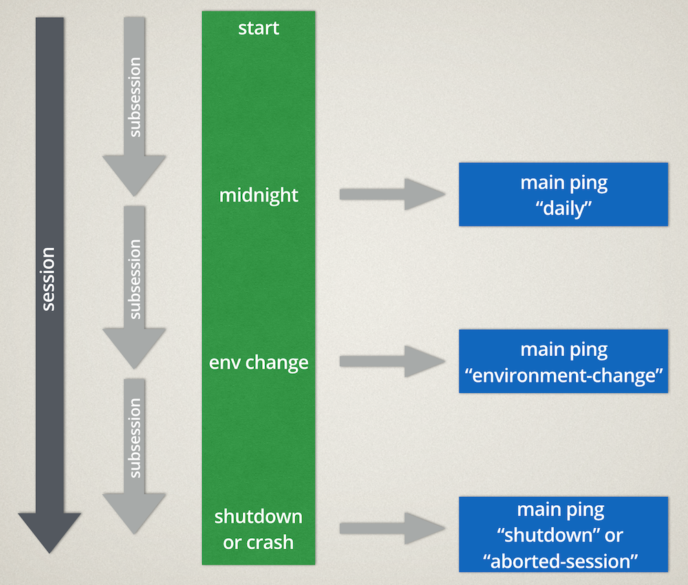

========
Sessions
========

A *session* is the time from when Firefox starts until it shuts down.
A session can be very long-running. E.g. for users that always put their computers into sleep-mode, Firefox may run for weeks.
We slice the sessions into smaller logical units called *subsessions*.

Subsessions
===========

The first subsession starts when the browser starts. After that, we split the subsession for different reasons:

* ``daily``, when crossing local midnight. This keeps latency acceptable by triggering a ping at least daily for most active users.
* ``environment-change``, when a change to the *environment* happens. This happens for important changes to the Firefox settings and when add-ons activate or deactivate.

On a subsession split, a :doc:`main ping <../data/main-ping>` with that reason will be submitted. We store the reason in the pings payload, to see what triggered it.

A session always ends with a subsession with one of two reason:

* ``shutdown``, when the browser was cleanly shut down. To avoid delaying shutdown, we only save this ping to disk and send it at the next opportunity (typically the next browsing session).
* ``aborted-session``, when the browser crashed. While Firefox is active, we write the current ``main`` ping data to disk every 5 minutes. If the browser crashes, we find this data on disk on the next start and send it with this reason.

Subsession data
===============

A subsessions data consists of:

* general information: the date the subsession started, how long it lasted, etc.
* specific measurements: histogram & scalar data, etc.

This has some advantages:

* Latency - Sending a ping with all the data of a subsession immediately after it ends means we get the data from installs faster. For ``main`` pings, we aim to send a ping at least daily by starting a new subsession at local midnight.
* Correlation - By starting new subsessions when fundamental settings change (i.e. changes to the *environment*), we can better correlate a subsession's data to those settings.
