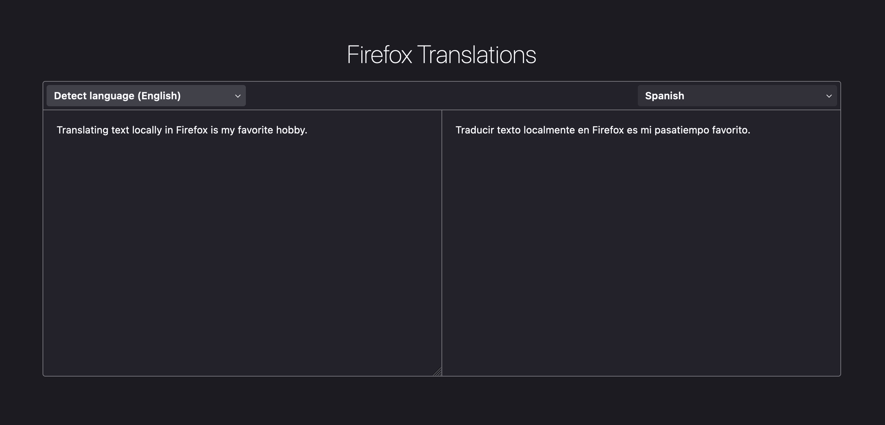

# Overview

The following is a high-level overview of the technologies associated with Firefox Translations.

- [Supported Platforms](#supported-platforms)
- [Language Translations](#language-translation)
    - [Technology](#technology)
    - [Models](#models)
    - [Pivot Translations](#pivot-translations)
- [Language Identification](#language-identification)
    - [Technology](#technology-1)
    - [Models](#models-1)
- [Remote Settings](#remote-settings)
    - [Enabling Firefox Translations](#enabling-firefox-translations)
    - [Translating Web Pages](#translating-web-pages)
    - [about:translations](#abouttranslations)

---
## Supported Platforms

<input type="checkbox" style="pointer-events: none;" checked><b>Desktop</b><br>
<input type="checkbox" style="pointer-events: none;" checked><b>Android</b><br>
<input type="checkbox" style="pointer-events: none;"><b>iOS</b><br>

```{note}
- Firefox Translations is available only on devices support [SSE4.1] due to required [SIMD] calculations in [WASM].
```


---
## Language Translation

Firefox Translations utilizes trained machine-learning models that run locally on client
architecture to translate web content from one language to another.

### Technology

Firefox Translations utilizes a [WASM] version of the [Bergamot] library to translate from
one language to another. [Bergamot] is powered by [Marian].

### Models

[Bergamot] translation models are single-direction, one-to-one models trained to translate from one language
to one other language (e.g. **`en ⟶ es`**). When Firefox Translations determines a source language and a target language
it utilizes a model specific to this language pair to translate from one to the other.

### Pivot Translations

In the event that there is no model to translate directly from a source language and a target language,
Firefox Translations will attempt to satisfy a transitive translation path and will perform a multi-step
translation from the source language to the target language.


```{admonition} Example
> **_No direct translation model exists_**<br>
> <input type="checkbox" style="pointer-events: none;"><b>`es ⟶ fr`</b><br>
>
> **_Transitive dependency satisfied_**<br>
> <input type="checkbox" style="pointer-events: none;" checked><b>`es ⟶ en`</b><br>
> <input type="checkbox" style="pointer-events: none;" checked><b>`en ⟶ fr`</b><br>
>
> **_Pivot translation_**<br>
> <input type="checkbox" style="pointer-events: none;" checked><b>`es ⟶ en ⟶ fr`</b><br>

In this example, no direct model exists for **`es ⟶ fr`**, but a transitive dependency is satisfied by the two
models for **`es ⟶ en`** and **`en ⟶ fr`**. Firefox Translations will pivot on the **`en`** language by first
translating from **`es`** to **`en`** and then from **`en`** to **`fr`**.
```
```{note}
- Firefox Translations will not pivot more than once.
- At present, only **`en`** is used as a pivot language.
```

---
## Language Identification

Firefox Translations utilizes trained machine-learning models that run locally on client
architecture to identify content as being written in a detected language.

### Technology

Firefox Translations utilizes a [CLD2] language detector to identify in which language content is written.

### Models

No models are currently used for language identification, since [CLD2] exists in the Firefox source tree.

---
## Remote Settings

Remote Settings is not currently used for language identification, since [CLD2] exists in the Firefox source tree.

---
## Using Firefox Translations

The following documentation describes a high-level overview of using Firefox Translations.

```{note}
- Firefox Translations is actively under development and is currently available only in [Firefox Nightly].
```

### Enabling Firefox Translations

Firefox Translations functionality can be enabled by modifying the [translations preferences] in **`about:config`**.

These configurations are likely to change as the project develops which is why this documentation links to them
in the source code rather than defining them.

At a time when the preferences are more stable, they can be documented here more clearly.

### Translating Web Pages

Once Firefox Translations is enabled, Firefox will analyze each web page to determine if it is translatable
via the available translations models.

If the web page is translatable, then a translations icon will appear in the URL bar of the browser, allowing
the user to initiate the available translation process.

### about:translations

When Firefox Translations is enabled, a page called **`about:translations`** becomes available in the browser.

This is a test page where there user can select a source language and a target language by typing content into
the source-language text box and seeing the translated text in the target-language text box.

```{note}
**`about:translations`** is a developer-focused UI that is useful for testing the state, performance, and quality of the language models in an interactive environment. It is fairly unpolished and not intended to be shipped as a product at this time.

It is, however, useful and fun, so it is documented here.
```




<!-- Hyperlinks -->
[Bergamot]: https://browser.mt/
[CLD2]: https://github.com/CLD2Owners/cld2
[Firefox Nightly]: https://www.mozilla.org/en-US/firefox/channel/desktop/
[Marian]: https://aclanthology.org/P18-4020/
[Remote Settings]: https://remote-settings.readthedocs.io/en/latest/
[SIMD]: https://en.wikipedia.org/wiki/Single_instruction,_multiple_data
[SSE4.1]: https://en.wikipedia.org/wiki/SSE4#SSE4.1
[translations preferences]: https://searchfox.org/mozilla-central/search?q=browser.translations&path=all.js&case=true&regexp=false
[WASM]: https://webassembly.org/
