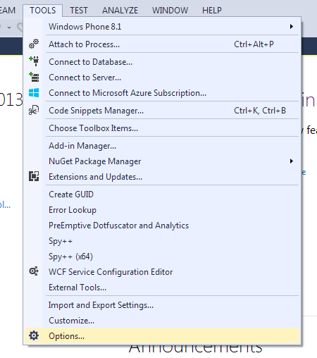
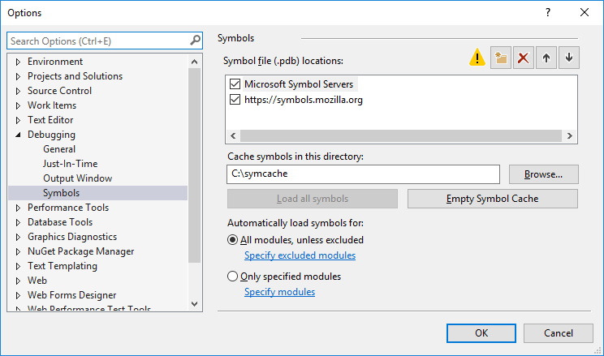
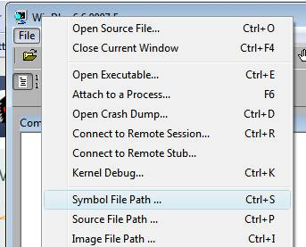
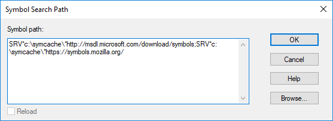

Using the Mozilla symbol server
===============================

The Mozilla project runs a symbol server for trunk Firefox nightly and
release builds on Windows. Symbols are available for at least 30
previous days worth of nightly builds, and Firefox releases from
2.0.0.4. This allows debugging of those builds without forcing all users
to download large debugging files. The server functions like
`Microsoft's symbol server <https://docs.microsoft.com/windows/win32/dxtecharts/debugging-with-symbols>`__
so the documentation there can be useful.

Note that because Mozilla release builds are heavily optimized,
debugging is not always easy. The debugger will not be able to show you
the content of all variables and the execution path can seem strange
because of inlining, tail calls, and other compiler optimizations. The
only workaround is to build an unoptimized local build.

The official symbol server URL for Firefox is ``https://symbols.mozilla.org/``.
You cannot visit this URL directly: you must add it to the symbol path of your
debugging tool. In the examples below, a local cache directory is used to avoid
repeatedly fetching the PDB from the server. Replace
``C:\Users\myname\symbols`` with an appropriate cache directory on your
machine.

Using the symbol server in Microsoft Visual C++
~~~~~~~~~~~~~~~~~~~~~~~~~~~~~~~~~~~~~~~~~~~~~~~

|The Tools menu of Visual C++ with the Options item selected| |The
Visual C++ 2017 Symbols pane of the Options dialog with the Mozilla
symbol server configured|

Using the symbol server in Windbg
~~~~~~~~~~~~~~~~~~~~~~~~~~~~~~~~~

The Windbg symbol path is configured with a string value delimited with
asterisk characters. To use only the Mozilla symbol server, add the
following entry to your symbol path (**note:** you can replace ``C:\symcache\``
with any writable directory on your computer, if you'd prefer a different
location for downloaded symbols):

.. code::

    SRV*c:\symcache\*https://symbols.mozilla.org/

Set this string as ``_NT_SYMBOL_PATH`` in the environment, using
the Windbg menus, or by typing the ``.sympath`` command. If you
would like to get symbols from Microsoft's symbol server as well, you
should list that first (**note:** you can replace ``C:\symcache\``
with any writable directory on your computer, if you'd prefer a different
location for downloaded symbols):

.. code::

    SRV*c:\symcache\*http://msdl.microsoft.com/download/symbols;SRV*c:\symcache\*https://symbols.mozilla.org/

|Image:symbol-server-windbg-menu.jpg| |The WinDbg Symbol Search Path
dialog with the Mozilla symbol server configured|

The default symbol server only contains debug information for release builds.
In case you need to debug a minidump which was generated by a try build you'll
need to add the symbol server's `try` URL instead:

.. code::

    SRV*c:\symcache\*https://symbols.mozilla.org/try/

Note that you do not need _both_ URLs; despite its name, the `try`
endpoint-family will return symbols from both release and try builds
(in that order).

Downloading symbols using symchk.exe
~~~~~~~~~~~~~~~~~~~~~~~~~~~~~~~~~~~~

You can also download the symbols using symchk.exe, part of Microsoft's
Debugging Tools for Windows. The command should look like this (again,
you can replace ``C:\symcache\`` with any writable directory on
your computer, if you'd prefer a different location for downloaded
symbols):

::

    "C:\Program Files (x86)\Windows Kits\10\Debuggers\x64\symchk.exe" /r "C:\Program Files\Mozilla Firefox/*" /s SRV*C:\symcache\*https://symbols.mozilla.org/

Note the ``\*`` after the Mozilla directory. The output of this command should
be similar to:

::

    SYMCHK: api-ms-win-core-file-l1-2-0.dll FAILED  - api-ms-win-core-file-l1-2-0.pdb mismatched or not found
    SYMCHK: api-ms-win-core-file-l2-1-0.dll FAILED  - api-ms-win-core-file-l2-1-0.pdb mismatched or not found
    SYMCHK: api-ms-win-core-localization-l1-2-0.dll FAILED  - api-ms-win-core-localization-l1-2-0.pdb mismatched or not found
    SYMCHK: api-ms-win-core-processthreads-l1-1-1.dll FAILED  - api-ms-win-core-processthreads-l1-1-1.pdb mismatched or not found
    SYMCHK: api-ms-win-core-synch-l1-2-0.dll FAILED  - api-ms-win-core-synch-l1-2-0.pdb mismatched or not found
    SYMCHK: api-ms-win-core-timezone-l1-1-0.dll FAILED  - api-ms-win-core-timezone-l1-1-0.pdb mismatched or not found
    SYMCHK: api-ms-win-crt-conio-l1-1-0.dll FAILED  - api-ms-win-crt-conio-l1-1-0.pdb mismatched or not found
    SYMCHK: api-ms-win-crt-convert-l1-1-0.dll FAILED  - api-ms-win-crt-convert-l1-1-0.pdb mismatched or not found
    SYMCHK: api-ms-win-crt-environment-l1-1-0.dll FAILED  - api-ms-win-crt-environment-l1-1-0.pdb mismatched or not found
    SYMCHK: api-ms-win-crt-filesystem-l1-1-0.dll FAILED  - api-ms-win-crt-filesystem-l1-1-0.pdb mismatched or not found
    SYMCHK: api-ms-win-crt-heap-l1-1-0.dll FAILED  - api-ms-win-crt-heap-l1-1-0.pdb mismatched or not found
    SYMCHK: api-ms-win-crt-locale-l1-1-0.dll FAILED  - api-ms-win-crt-locale-l1-1-0.pdb mismatched or not found
    SYMCHK: api-ms-win-crt-math-l1-1-0.dll FAILED  - api-ms-win-crt-math-l1-1-0.pdb mismatched or not found
    SYMCHK: api-ms-win-crt-multibyte-l1-1-0.dll FAILED  - api-ms-win-crt-multibyte-l1-1-0.pdb mismatched or not found
    SYMCHK: api-ms-win-crt-private-l1-1-0.dll FAILED  - api-ms-win-crt-private-l1-1-0.pdb mismatched or not found
    SYMCHK: api-ms-win-crt-process-l1-1-0.dll FAILED  - api-ms-win-crt-process-l1-1-0.pdb mismatched or not found
    SYMCHK: api-ms-win-crt-runtime-l1-1-0.dll FAILED  - api-ms-win-crt-runtime-l1-1-0.pdb mismatched or not found
    SYMCHK: api-ms-win-crt-stdio-l1-1-0.dll FAILED  - api-ms-win-crt-stdio-l1-1-0.pdb mismatched or not found
    SYMCHK: api-ms-win-crt-string-l1-1-0.dll FAILED  - api-ms-win-crt-string-l1-1-0.pdb mismatched or not found
    SYMCHK: api-ms-win-crt-time-l1-1-0.dll FAILED  - api-ms-win-crt-time-l1-1-0.pdb mismatched or not found
    SYMCHK: api-ms-win-crt-utility-l1-1-0.dll FAILED  - api-ms-win-crt-utility-l1-1-0.pdb mismatched or not found
    SYMCHK: d3dcompiler_47.dll   FAILED  - D3DCompiler_47.pdb mismatched or not found
    SYMCHK: maintenanceservice_installer.exe FAILED  - Built without debugging information.
    SYMCHK: msvcp140.dll         FAILED  - msvcp140.amd64.pdb mismatched or not found
    SYMCHK: ucrtbase.dll         FAILED  - ucrtbase.pdb mismatched or not found
    SYMCHK: vcruntime140.dll     FAILED  - vcruntime140.amd64.pdb mismatched or not found
    SYMCHK: helper.exe           FAILED  - Built without debugging information.

    SYMCHK: FAILED files = 27
    SYMCHK: PASSED + IGNORED files = 60

.. _Downloading symbols on Linux / Mac OS X:

Downloading symbols on Linux / Mac OS X
~~~~~~~~~~~~~~~~~~~~~~~~~~~~~~~~~~~~~~~

If you are on Linux and running GDB 7.9 or newer, you can use `this GDB
Python script <https://gist.github.com/luser/193572147c401c8a965c>`__ to
automatically fetch symbols. You will need to source this script before
loading symbols (the part where it spends a few seconds loading each .so
when you attach gdb). If you want to reload symbols, you can try:

::

    nosharedlibrary
    sharedlibrary lib

On older GDB and Mac OS X there is a `Python script to download symbols
from the Mozilla symbol
server <http://hg.mozilla.org/users/jwatt_jwatt.org/fetch-symbols>`__
for :ref:`gdb <Debugging Firefox with GDB>`, Shark and other software
that uses symbols. Note that the symbol file for the XUL library is very
large and takes some time to download. This may make it appear as if the
script has gotten stuck, but it will continue.

Symbol indices are named like so:
symbols.mozilla.org/{lowercased:Name}/{lowercased:Name}-{Version}-{Platform}-{BuildID}-symbols.txt.
The Platform is either 'Darwin' (for Mac) or 'Linux'. The rest of values
are based on the contents of the application.ini file under the [App]
heading: For example, the Thunderbird 3.1b2 release with
Name=Thunderbird, Version=3.1b2, BuildID=20100430125415 would have a
filename of "thunderbird-3.1b2-Linux-20100430125415-symbols.txt" under
the thunderbird directory at symbols.mozilla.org. Its contents are a
list of paths to files, all relative to the directory the
BLAH-symbols.txt file is found in.

The source server
~~~~~~~~~~~~~~~~~

In addition to symbols, Mozilla also has a
:ref:`source server <Using The Mozilla Source Server>`, letting you do
source-level debugging and inspection on demand.

Troubleshooting: Symbols will not download
~~~~~~~~~~~~~~~~~~~~~~~~~~~~~~~~~~~~~~~~~~

If symbols will not download no matter what you do, the problem may be
that Internet Explorer has been set to the **Work Offline** mode. You
will not receive any warnings of this in Windbg, Visual C++ or Visual
Studio. Even using the command line with symchk.exe to download symbols
will fail. This is because Microsoft uses Internet Explorer's internet &
proxy settings to download the symbol files. Check the File menu of
Internet Explorer to ensure "Work Offline" is unchecked.

