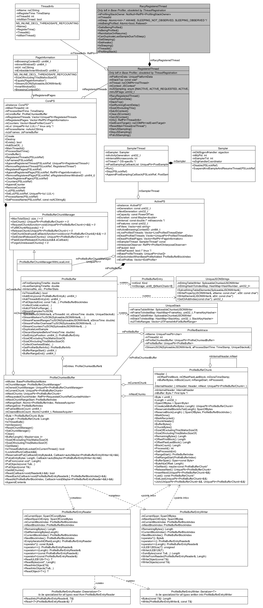
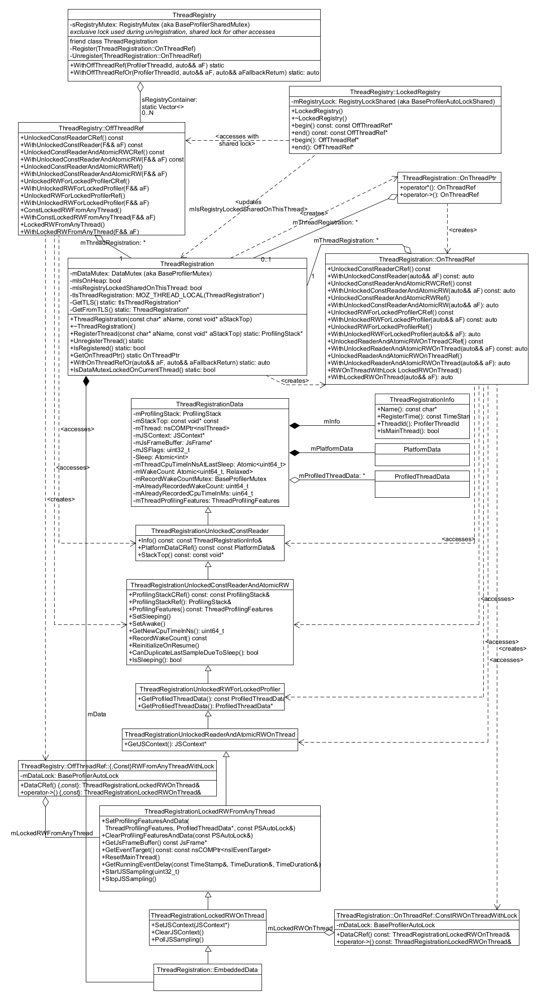
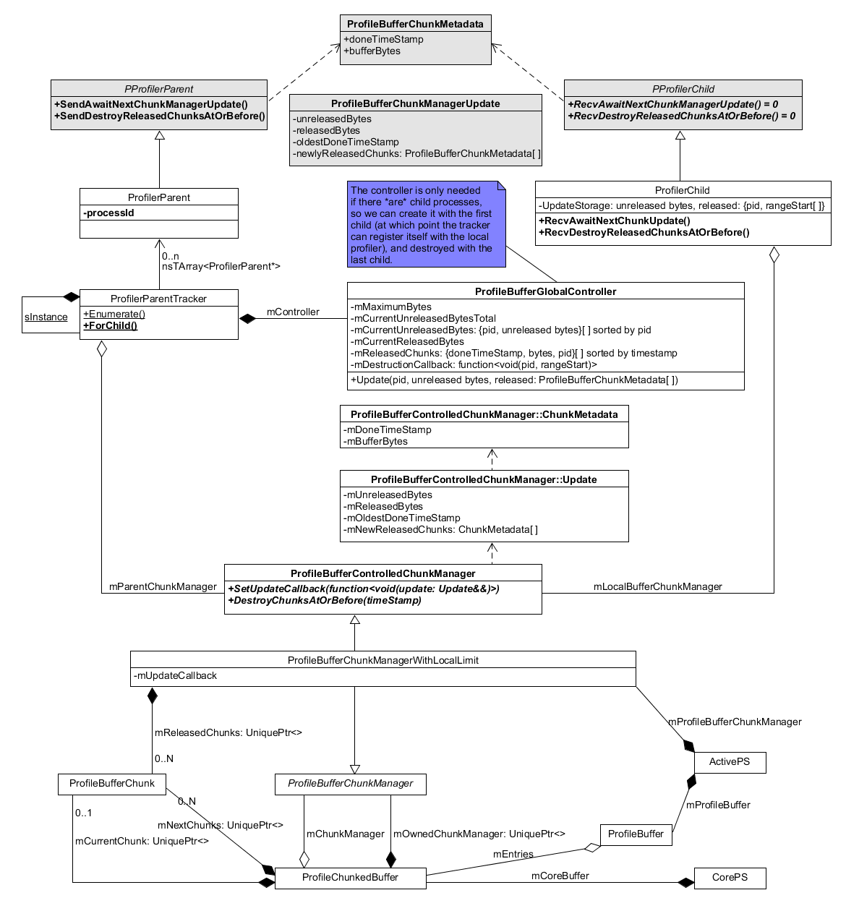

Profiler Code Overview
######################

This is an overview of the code that implements the Profiler inside Firefox
with dome details around tricky subjects, or pointers to more detailed
documentation and/or source code.

It assumes familiarity with Firefox development, including Mercurial (hg), mach,
moz.build files, Try, Phabricator, etc.

It also assumes knowledge of the user-visible part of the Firefox Profiler, that
is: How to use the Firefox Profiler, and what profiles contain that is shown
when capturing a profile. See the main website https://profiler.firefox.com, and
its `documentation <https://profiler.firefox.com/docs/>`_.

For just an "overview", it may look like a huge amount of information, but the
Profiler code is indeed quite expansive, so it takes a lot of words to explain
even just a high-level view of it! For on-the-spot needs, it should be possible
to search for some terms here and follow the clues. But for long-term
maintainers, it would be worth skimming this whole document to get a grasp of
the domain, and return to get some more detailed information before diving into
the code.

WIP note: This document should be correct at the time it is written, but the
profiler code constantly evolves to respond to bugs or to provide new exciting
features, so this document could become obsolete in parts! It should still be
useful as an overview, but its correctness should be verified by looking at the
actual code. If you notice any significant discrepancy or broken links, please
help by
`filing a bug <https://bugzilla.mozilla.org/enter_bug.cgi?product=Core&component=Gecko+Profiler>`_.

*****
Terms
*****

This is the common usage for some frequently-used terms, as understood by the
Dev Tools team. But incorrect usage can sometimes happen, context is key!

* **profiler** (a): Generic name for software that enables the profiling of
  code. (`"Profiling" on Wikipedia <https://en.wikipedia.org/wiki/Profiling_(computer_programming)>`_)
* **Profiler** (the): All parts of the profiler code inside Firefox.
* **Base Profiler** (the): Parts of the Profiler that live in
  mozglue/baseprofiler, and can be used from anywhere, but has limited
  functionality.
* **Gecko Profiler** (the): Parts of the Profiler that live in tools/profiler,
  and can only be used from other code in the XUL library.
* **Profilers** (the): Both the Base Profiler and the Gecko Profiler.
* **profiling session**: This is the time during which the profiler is running
  and collecting data.
* **profile** (a): The output from a profiling session, either as a file, or a
  shared viewable profile on https://profiler.firefox.com
* **Profiler back-end** (the): Other name for the Profiler code inside Firefox,
  to distinguish it from...
* **Profiler front-end** (the): The website https://profiler.firefox.com that
  displays profiles captured by the back-end.
* **Firefox Profiler** (the): The whole suite comprised of the back-end and front-end.

******************
Guiding Principles
******************

When working on the profiler, here are some guiding principles to keep in mind:

* Low profiling overhead in cpu and memory. For the Profiler to provide the best
  value, it should stay out of the way and consume as few resources (in time and
  memory) as possible, so as not to skew the actual Firefox code too much.

* Common data structures and code should be in the Base Profiler when possible.

  WIP note: Deduplication is slowly happening, see
  `meta bug 1557566 <https://bugzilla.mozilla.org/show_bug.cgi?id=1557566>`_.
  This document focuses on the Profiler back-end, and mainly the Gecko Profiler
  (because this is where most of the code lives, the Base Profiler is mostly a
  subset, originally just a cut-down version of the Gecko Profiler); so unless
  specified, descriptions below are about the Gecko Profiler, but know that
  there may be some equivalent code in the Base Profiler as well.

* Use appropriate programming-language features where possible to reduce coding
  errors in both our code, and our users' usage of it. In C++, this can be done
  by using a specific class/struct types for a given usage, to avoid misuse
  (e.g., an generic integer representing a **process** could be incorrectly
  given to a function expecting a **thread**; we have specific types for these
  instead, more below.)

* Follow the
  `Coding Style <https://firefox-source-docs.mozilla.org/code-quality/coding-style/index.html>`_.

* Whenever possible, write tests (if not present already) for code you add or
  modify -- but this may be too difficult in some case, use good judgement and
  at least test manually instead.

******************
Profiler Lifecycle
******************

Here is a high-level view of the Base **or** Gecko Profiler lifecycle, as part
of a Firefox run. The following sections will go into much more details.

* Profiler initialization, preparing some common data.
* Threads de/register themselves as they start and stop.
* During each User/test-controlled profiling session:

  * Profiler start, preparing data structures that will store the profiling data.
  * Periodic sampling from a separate thread, happening at a user-selected
    frequency (usually once every 1-2 ms), and recording snapshots of what
    Firefox is doing:

    * CPU sampling, measuring how much time each thread has spent actually
      running on the CPU.
    * Stack sampling, capturing a stack of functions calls from whichever leaf
      function the program is in at this point in time, up to the top-most
      caller (i.e., at least the ``main()`` function, or its callers if any).
      Note that unlike most external profilers, the Firefox Profiler back-end
      is capable or getting more useful information than just native functions
      calls (compiled from C++ or Rust):

      * Labels added by Firefox developers along the stack, usually to identify
        regions of code that perform "interesting" operations (like layout, file
        I/Os, etc.).
      * JavaScript function calls, including the level of optimization applied.
      * Java function calls.
  * At any time, Markers may record more specific details of what is happening,
    e.g.: User operations, page rendering steps, garbage collection, etc.
  * Optional profiler pause, which stops most recording, usually near the end of
    a session so that no data gets recorded past this point.
  * Profile JSON output, generated from all the recorded profiling data.
  * Profiler stop, tearing down profiling session objects.
* Profiler shutdown.

Note that the Base Profiler can start earlier, and then the data collected so
far, as well as the responsibility for periodic sampling, is handed over to the
Gecko Profiler:

#. (Firefox starts)
#. Base Profiler init
#. Base Profiler start
#. (Firefox loads the libxul library and initializes XPCOM)
#. Gecko Profiler init
#. Gecko Profiler start
#. Handover from Base to Gecko
#. Base Profiler stop
#. (Bulk of the profiling session)
#. JSON generation
#. Gecko Profiler stop
#. Gecko Profiler shutdown
#. (Firefox ends XPCOM)
#. Base Profiler shutdown
#. (Firefox exits)

Base Profiler functions that add data (mostly markers and labels) may be called
from anywhere, and will be recorded by either Profiler. The corresponding
functions in Gecko Profiler can only be called from other libxul code, and can
only be recorded by the Gecko Profiler.

Whenever possible, Gecko Profiler functions should be preferred if accessible,
as they may provide extended functionality (e.g., better stacks with JS in
markers). Otherwise fallback on Base Profiler functions.

***********
Directories
***********

* Non-Profiler supporting code

  * `mfbt <https://searchfox.org/mozilla-central/source/mfbt>`_ - Mostly
    replacements for C++ std library facilities.

  * `mozglue/misc <https://searchfox.org/mozilla-central/source/mozglue/misc>`_

    * `PlatformMutex.h <https://searchfox.org/mozilla-central/source/mozglue/misc/PlatformMutex.h>`_ -
      Mutex base classes.
    * `StackWalk.h <https://searchfox.org/mozilla-central/source/mozglue/misc/StackWalk.h>`_ -
      Stack-walking functions.
    * `TimeStamp.h <https://searchfox.org/mozilla-central/source/mozglue/misc/TimeStamp.h>`_ -
      Timestamps and time durations.

  * `xpcom <https://searchfox.org/mozilla-central/source/xpcom>`_

    * `ds <https://searchfox.org/mozilla-central/source/xpcom/ds>`_ -
      Data structures like arrays, strings.

    * `threads <https://searchfox.org/mozilla-central/source/xpcom/threads>`_ -
      Threading functions.

* Profiler back-end

  * `mozglue/baseprofiler <https://searchfox.org/mozilla-central/source/mozglue/baseprofiler>`_ -
    Base Profiler code, usable from anywhere in Firefox. Because it lives in
    mozglue, it's loaded right at the beginning, so it's possible to start the
    profiler very early, even before Firefox loads its big&heavy "xul" library.

    * `baseprofiler's public <https://searchfox.org/mozilla-central/source/mozglue/baseprofiler/public>`_ -
      Public headers, may be #included from anywhere.
    * `baseprofiler's core <https://searchfox.org/mozilla-central/source/mozglue/baseprofiler/core>`_ -
      Main implementation code.
    * `baseprofiler's lul <https://searchfox.org/mozilla-central/source/mozglue/baseprofiler/lul>`_ -
      Special stack-walking code for Linux.
    * `../tests/TestBaseProfiler.cpp <https://searchfox.org/mozilla-central/source/mozglue/tests/TestBaseProfiler.cpp>`_ -
      Unit tests.

  * `tools/profiler <https://searchfox.org/mozilla-central/source/tools/profiler>`_ -
    Gecko Profiler code, only usable from the xul library. That library is
    loaded a short time after Firefox starts, so the Gecko Profiler is not able
    to profile the early phase of the application, Base Profiler handles that,
    and can pass its collected data to the Gecko Profiler when the latter
    starts.

    * `public <https://searchfox.org/mozilla-central/source/tools/profiler/public>`_ -
      Public headers, may be #included from most libxul code.
    * `core <https://searchfox.org/mozilla-central/source/tools/profiler/core>`_ -
      Main implementation code.
    * `gecko <https://searchfox.org/mozilla-central/source/tools/profiler/gecko>`_ -
      Control from JS, and multi-process/IPC code.
    * `lul <https://searchfox.org/mozilla-central/source/tools/profiler/lul>`_ -
      Special stack-walking code for Linux.
    * `rust-api <https://searchfox.org/mozilla-central/source/tools/profiler/rust-api>`_,
      `rust-helper <https://searchfox.org/mozilla-central/source/tools/profiler/rust-helper>`_
    * `tests <https://searchfox.org/mozilla-central/source/tools/profiler/tests>`_

  * `devtools/client/performance-new <https://searchfox.org/mozilla-central/source/devtools/client/performance-new>`_,
    `devtools/shared/performance-new <https://searchfox.org/mozilla-central/source/devtools/shared/performance-new>`_ -
    Middleware code for about:profiling and devtools panel functionality.

  * js, starting with
    `js/src/vm/GeckoProfiler.h <https://searchfox.org/mozilla-central/source/js/src/vm/GeckoProfiler.h>`_ -
    JavaScript engine support, mostly to capture JS stacks.

  * `toolkit/components/extensions/schemas/geckoProfiler.json <https://searchfox.org/mozilla-central/source/toolkit/components/extensions/schemas/geckoProfiler.json>`_ -
    File that needs to be updated when Profiler features change.

* Profiler front-end

  * Out of scope for this document, but its code and bug repository can be found at:
    https://github.com/firefox-devtools/profiler . Sometimes work needs to be
    done on both the back-end of the front-end, especially when modifying the
    back-end's JSON output format.

*******
Headers
*******

The most central public header is
`GeckoProfiler.h <https://searchfox.org/mozilla-central/source/tools/profiler/public/GeckoProfiler.h>`_,
from which almost everything else can be found, it can be a good starting point
for exploration.
It includes other headers, which together contain important top-level macros and
functions.

WIP note: GeckoProfiler.h used to be the header that contained everything!
To better separate areas of functionality, and to hopefully reduce compilation
times, parts of it have been split into smaller headers, and this work will
continue, see `bug 1681416 <https://bugzilla.mozilla.org/show_bug.cgi?id=1681416>`_.

MOZ_GECKO_PROFILER and Macros
=============================

Mozilla officially supports the Profiler on `tier-1 platforms
<https://firefox-source-docs.mozilla.org/contributing/build/supported.html>`_:
Windows, macos, Linux and Android.
There is also some code running on tier 2-3 platforms (e.g., for FreeBSD), but
the team at Mozilla is not obligated to maintain it; we do try to keep it
running, and some external contributors are keeping an eye on it and provide
patches when things do break.

To reduce the burden on unsupported platforms, a lot of the Profilers code is
only compiled when ``MOZ_GECKO_PROFILER`` is #defined. This means that some
public functions may not always be declared or implemented, and should be
surrounded by guards like ``#ifdef MOZ_GECKO_PROFILER``.

Some commonly-used functions offer an empty definition in the
non-``MOZ_GECKO_PROFILER`` case, so these functions may be called from anywhere
without guard.

Other functions have associated macros that can always be used, and resolve to
nothing on unsupported platforms. E.g.,
``PROFILER_REGISTER_THREAD`` calls ``profiler_register_thread`` where supported,
otherwise does nothing.

WIP note: There is an effort to eventually get rid of ``MOZ_GECKO_PROFILER`` and
its associated macros, see
`bug 1635350 <https://bugzilla.mozilla.org/show_bug.cgi?id=1635350>`_.

RAII "Auto" macros and classes
==============================
A number of functions are intended to be called in pairs, usually to start and
then end some operation. To ease their use, and ensure that both functions are
always called together, they usually have an associated class and/or macro that
may be called only once. This pattern of using an object's destructor to ensure
that some action always eventually happens, is called
`RAII <https://en.cppreference.com/w/cpp/language/raii>`_ in C++, with the
common prefix "auto".

E.g.: In ``MOZ_GECKO_PROFILER`` builds,
`AUTO_PROFILER_INIT <https://searchfox.org/mozilla-central/search?q=AUTO_PROFILER_INIT>`_
instantiates an
`AutoProfilerInit <https://searchfox.org/mozilla-central/search?q=symbol:T_mozilla%3A%3AAutoProfilerInit>`_
object, which calls ``profiler_init`` when constructed, and
``profiler_shutdown`` when destroyed.

*********************
Platform Abstractions
*********************

This section describes some platform abstractions that are used throughout the
Profilers. (Other platform abstractions will be described where they are used.)

Process and Thread IDs
======================

The Profiler back-end often uses process and thread IDs (aka "pid" and "tid"),
which are commonly just a number.
For better code correctness, and to hide specific platform details, they are
encapsulated in opaque types
`BaseProfilerProcessId <https://searchfox.org/mozilla-central/search?q=BaseProfilerProcessId>`_
and
`BaseProfilerThreadId <https://searchfox.org/mozilla-central/search?q=BaseProfilerThreadId>`_.
These types should be used wherever possible.
When interfacing with other code, they may be converted using the member
functions ``FromNumber`` and ``ToNumber``.

To find the current process or thread ID, use
`profiler_current_process_id <https://searchfox.org/mozilla-central/search?q=profiler_current_process_id>`_
or
`profiler_current_thread_id <https://searchfox.org/mozilla-central/search?q=profiler_current_thread_id>`_.

The main thread ID is available through
`profiler_main_thread_id <https://searchfox.org/mozilla-central/search?q=profiler_main_thread_id>`_
(assuming
`profiler_init_main_thread_id <https://searchfox.org/mozilla-central/search?q=profiler_init_main_thread_id>`_
was called when the application started -- especially important in stand-alone
test programs.)
And
`profiler_is_main_thread <https://searchfox.org/mozilla-central/search?q=profiler_is_main_thread>`_
is a quick way to find out if the current thread is the main thread.

Locking
=======
The locking primitives in PlatformMutex.h are not supposed to be used as-is, but
through a user-accessible implementation. For the Profilers, this is in
`BaseProfilerDetail.h <https://searchfox.org/mozilla-central/source/mozglue/baseprofiler/public/BaseProfilerDetail.h>`_.

In addition to the usual ``Lock``, ``TryLock``, and ``Unlock`` functions,
`BaseProfilerMutex <https://searchfox.org/mozilla-central/search?q=BaseProfilerMutex>`_
objects have a name (which may be helpful when debugging),
they record the thread on which they are locked (making it possible to know if
the mutex is locked on the current thread), and in ``DEBUG`` builds there are
assertions verifying that the mutex is not incorrectly used recursively, to
verify the correct ordering of different Profiler mutexes, and that it is
unlocked before destruction.

Mutexes should preferably be locked within C++ block scopes, or as class
members, by using
`BaseProfilerAutoLock <https://searchfox.org/mozilla-central/search?q=BaseProfilerAutoLock>`_.

Some classes give the option to use a mutex or not (so that single-threaded code
can more efficiently bypass locking operations), for these we have
`BaseProfilerMaybeMutex <https://searchfox.org/mozilla-central/search?q=BaseProfilerMaybeMutex>`_
and
`BaseProfilerMaybeAutoLock <https://searchfox.org/mozilla-central/search?q=BaseProfilerMaybeAutoLock>`_.

There is also a special type of shared lock (aka RWLock, see
`RWLock on wikipedia <https://en.wikipedia.org/wiki/Readers%E2%80%93writer_lock>`_),
which may be locked in multiple threads (through ``LockShared`` or preferably
`BaseProfilerAutoLockShared <https://searchfox.org/mozilla-central/search?q=BaseProfilerAutoLockShared>`_),
or locked exclusively, preventing any other locking (through ``LockExclusive`` or preferably
`BaseProfilerAutoLockExclusive <https://searchfox.org/mozilla-central/search?q=BaseProfilerAutoLockExclusive>`_).

*********************
Main Profiler Classes
*********************

Diagram showing the most important Profiler classes, see details in the
following sections:

(As noted, the "RegisteredThread" classes are now obsolete in the Gecko
Profiler, see the "Thread Registration" section below for an updated diagram and
description.)



***********************
Profiler Initialization
***********************

`profiler_init <https://searchfox.org/mozilla-central/search?q=symbol:_Z13profiler_initPv>`_
and
`baseprofiler::profiler_init <https://searchfox.org/mozilla-central/search?q=symbol:_ZN7mozilla12baseprofiler13profiler_initEPv>`_
must be called from the main thread, and are used to prepare important aspects
of the profiler, including:

* Making sure the main thread ID is recorded.
* Handling ``MOZ_PROFILER_HELP=1 ./mach run`` to display the command-line help.
* Creating the ``CorePS`` instance -- more details below.
* Registering the main thread.
* Initializing some platform-specific code.
* Handling other environment variables that are used to immediately start the
  profiler, with optional settings provided in other env-vars.

CorePS
======

The `CorePS class <https://searchfox.org/mozilla-central/search?q=symbol:T_CorePS>`_
has a single instance that should live for the duration of the Firefox
application, and contains important information that could be needed even when
the Profiler is not running.

It includes:

* A static pointer to its single instance.
* The process start time.
* JavaScript-specific data structures.
* A list of registered
  `PageInformations <https://searchfox.org/mozilla-central/search?q=symbol:T_PageInformation>`_,
  used to keep track of the tabs that this process handles.
* A list of
  `BaseProfilerCounts <https://searchfox.org/mozilla-central/search?q=symbol:T_BaseProfilerCount>`_,
  used to record things like the process memory usage.
* The process name, and optionally the "eTLD+1" (roughly sub-domain) that this
  process handles.
* In the Base Profiler only, a list of
  `RegisteredThreads <https://searchfox.org/mozilla-central/search?q=symbol:T_mozilla%253A%253Abaseprofiler%253A%253ARegisteredThread>`_.
  WIP note: This storage has been reworked in the Gecko Profiler (more below),
  and in practice the Base Profiler only registers the main thread. This should
  eventually disappear as part of the de-duplication work
  (`bug 1557566 <https://bugzilla.mozilla.org/show_bug.cgi?id=1557566>`_).

*******************
Thread Registration
*******************

Threads need to register themselves in order to get fully profiled.
This section describes the main data structures that record the list of
registered threads and their data.

WIP note: There is some work happening to add limited profiling of unregistered
threads, with the hope that more and more functionality could be added to
eventually use the same registration data structures.

Diagram showing the relevant classes, see details in the following sub-sections:



ProfilerThreadRegistry
======================

The
`static ProfilerThreadRegistry object <https://searchfox.org/mozilla-central/search?q=symbol:T_mozilla%3A%3Aprofiler%3A%3AThreadRegistry>`_
contains a list of ``OffThreadRef`` objects.

Each ``OffThreadRef`` points to a ``ProfilerThreadRegistration``, and restricts
access to a safe subset of the thread data, and forces a mutex lock if necessary
(more information under ProfilerThreadRegistrationData below).

ProfilerThreadRegistration
==========================

A
`ProfilerThreadRegistration object <https://searchfox.org/mozilla-central/search?q=symbol:T_mozilla%3A%3Aprofiler%3A%3AThreadRegistration>`_
contains a lot of information relevant to its thread, to help with profiling it.

This data is accessible from the thread itself through an ``OnThreadRef``
object, which points to the ``ThreadRegistration``, and restricts access to a
safe subset of thread data, and forces a mutex lock if necessary (more
information under ProfilerThreadRegistrationData below).

ThreadRegistrationData and accessors
====================================

`The ProfilerThreadRegistrationData.h header <https://searchfox.org/mozilla-central/source/tools/profiler/public/ProfilerThreadRegistrationData.h>`_
contains a hierarchy of classes that encapsulate all the thread-related data.

``ThreadRegistrationData`` contains all the actual data members, including:

* Some long-lived
  `ThreadRegistrationInfo <https://searchfox.org/mozilla-central/search?q=symbol:T_mozilla%253A%253Aprofiler%253A%253AThreadRegistrationInfo>`_,
  containing the thread name, its registration time, the thread ID, and whether
  it's the main thread.
* A ``ProfilingStack`` that gathers developer-provided pseudo-frames, and JS
  frames.
* Some platform-specific ``PlatformData`` (usually required to actually record
  profiling measurements for that thread).
* A pointer to the top of the stack.
* A shared pointer to the thread's ``nsIThread``.
* A pointer to the ``JSContext``.
* An optional pre-allocated ``JsFrame`` buffer used during stack-sampling.
* Some JS flags.
* Sleep-related data (to avoid costly sampling while the thread is known to not
  be doing anything).
* The current ``ThreadProfilingFeatures``, to know what kind of data to record.
* When profiling, a pointer to a ``ProfiledThreadData``, which contains some
  more data needed during and just after profiling.

As described in their respective code comments, each data member is supposed to
be accessed in certain ways, e.g., the ``JSContext`` should only be "written
from thread, read from thread and suspended thread". To enforce these rules,
data members can only be accessed through certain classes, which themselves can
only be instantiated in the correct conditions.

The accessor classes are, from base to most-derived:

* ``ThreadRegistrationData``, not an accessor itself, but it's the base class
  with all the ``protected`` data.
* ``ThreadRegistrationUnlockedConstReader``, giving unlocked ``const`` access to
   the ``ThreadRegistrationInfo``, ``PlatformData``, and stack top.
* ``ThreadRegistrationUnlockedConstReaderAndAtomicRW``, giving unlocked
  access to the atomic data members: ``ProfilingStack``, sleep-related data,
  ``ThreadProfilingFeatures``.
* ``ThreadRegistrationUnlockedRWForLockedProfiler``, giving access that's
  protected by the Profiler's main lock, but doesn't require a
  ``ThreadRegistration`` lock, to the ``ProfiledThreadData``
* ``ThreadRegistrationUnlockedReaderAndAtomicRWOnThread``, giving unlocked
  mutable access, but only on the thread itself, to the ``JSContext``.
* ``ThreadRegistrationLockedRWFromAnyThread``, giving locked access from any
  thread to mutex-protected data: ``ThreadProfilingFeatures``, ``JsFrame``,
  ``nsIThread``, and the JS flags.
* ``ThreadRegistrationLockedRWOnThread``, giving locked access, but only from
  the thread itself, to the ``JSContext`` and a JS flag-related operation.
* ``ThreadRegistration::EmbeddedData``, containing all of the above, and stored
  as a data member in each ``ThreadRegistration``.

To recapitulate, if some code needs some data on the thread, it can use
``ThreadRegistration`` functions to request access (with the required rights,
like a mutex lock).
To access data about another thread, use similar functions from
``ThreadRegistry`` instead.
You may find some examples in the implementations of the functions in
ProfilerThreadState.h (see the following section).

ProfilerThreadState.h functions
===============================

The
`ProfilerThreadState.h <https://searchfox.org/mozilla-central/source/tools/profiler/public/ProfilerThreadState.h>`_
header provides a few helpful functions related to threads, including:

* ``profiler_is_active_and_thread_is_registered``
* ``profiler_thread_is_being_profiled`` (for the current thread or another
  thread, and for a given set of features)
* ``profiler_thread_is_sleeping``

**************
Profiler Start
**************

There are multiple ways to start the profiler, through command line env-vars,
and programmatically in C++ and JS.

The main public C++ function is
`profiler_start <https://searchfox.org/mozilla-central/search?q=symbol:_Z14profiler_startN7mozilla10PowerOfTwoIjEEdjPPKcjyRKNS_5MaybeIdEE%2C_Z14profiler_startN7mozilla10PowerOfTwoIjEEdjPPKcjmRKNS_5MaybeIdEE>`_.
It takes all the features specifications, and returns a promise that gets
resolved when the Profiler has fully started in all processes (multi-process
profiling is described later in this document, for now the focus will be on each
process running its instance of the Profiler). It first calls ``profiler_init``
if needed, and also ``profiler_stop`` if the profiler was already running.

The main implementation, which can be called from multiple sources, is
`locked_profiler_start <https://searchfox.org/mozilla-central/search?q=locked_profiler_start>`_.
It performs a number of operations to start the profiling session, including:

* Record the session start time.
* Pre-allocate some work buffer to capture stacks for markers on the main thread.
* In the Gecko Profiler only: If the Base Profiler was running, take ownership
  of the data collected so far, and stop the Base Profiler (we don't want both
  trying to collect the same data at the same time!)
* Create the ActivePS, which keeps track of most of the profiling session
  information, more about it below.
* For each registered thread found in the ``ThreadRegistry``, check if it's one
  of the threads to profile, and if yes set the appropriate data into the
  corresponding ``ThreadRegistrationData`` (including informing the JS engine to
  start recording profiling data).
* On Android, start the Java sampler.
* If native allocations are to be profiled, setup the appropriate hooks.
* Start the audio callback tracing if requested.
* Set the public shared "active" state, used by many functions to quickly assess
  whether to actually record profiling data.

ActivePS
========

The `ActivePS class <https://searchfox.org/mozilla-central/search?q=symbol:T_ActivePS>`_
has a single instance at a time, that should live for the length of the
profiling session.

It includes:

* The session start time.
* A way to track "generations" (in case an old ActivePS still lives when the
  next one starts, so that in-flight data goes to the correct place.)
* Requested features: Buffer capacity, periodic sampling interval, feature set,
  list of threads to profile, optional: specific tab to profile.
* The profile data storage buffer and its chunk manager (see "Storage" section
  below for details.)
* More data about live and dead profiled threads.
* Optional counters for per-process CPU usage, and power usage.
* A pointer to the ``SamplerThread`` object (see "Periodic Sampling" section
  below for details.)

*******
Storage
*******

During a session, the profiling data is serialized into a buffer, which is made
of "chunks", each of which contains "blocks", which have a size and the "entry"
data.

During a profiling session, there is one main profile buffer, which may be
started by the Base Profiler, and then handed over to the Gecko Profiler when
the latter starts.

The buffer is divided in chunks of equal size, which are allocated before they
are needed. When the data reaches a user-set limit, the oldest chunk is
recycled. This means that for long-enough profiling sessions, only the most
recent data (that could fit under the limit) is kept.

Each chunk stores a sequence of blocks of variable length. The chunk itself
only knows where the first full block starts, and where the last block ends,
which is where the next block will be reserved.

To add an entry to the buffer, a block is reserved, the size is written first
(so that readers can find the start of the next block), and then the entry bytes
are written.

The following sessions give more technical details.

leb128iterator.h
================

`This utility header <https://searchfox.org/mozilla-central/source/mozglue/baseprofiler/public/leb128iterator.h>`_
contains some functions to read and write unsigned "LEB128" numbers
(`LEB128 on wikipedia <https://en.wikipedia.org/wiki/LEB128>`_).

They are an efficient way to serialize numbers that are usually small, e.g.,
numbers up to 127 only take one byte, two bytes up to 16,383, etc.

ProfileBufferBlockIndex
=======================

`A ProfileBufferBlockIndex object <https://searchfox.org/mozilla-central/search?q=symbol:T_mozilla%3A%3AProfileBufferBlockIndex>`_
encapsulates a block index that is known to be the valid start of a block. It is
created when a block is reserved, or when trusted code computes the start of a
block in a chunk.

The more generic
`ProfileBufferIndex <https://searchfox.org/mozilla-central/search?q=symbol:T_mozilla%3A%3AProfileBufferIndex>`_
type is used when working inside blocks.

ProfileBufferChunk
==================

`A ProfileBufferChunk <https://searchfox.org/mozilla-central/search?q=symbol:T_mozilla%3A%3AProfileBufferChunk>`_
is a variable-sized object. It contains:

* A public copyable header, itself containing:

  * The local offset to the first full block (a chunk may start with the end of
    a block that was started at the end of the previous chunk). That offset in
    the very first chunk is the natural start to read all the data in the
    buffer.
  * The local offset past the last reserved block. This is where the next block
    should be reserved, unless it points past the end of this chunk size.
  * The timestamp when the chunk was first used.
  * The timestamp when the chunk became full.
  * The number of bytes that may be stored in this chunk.
  * The number of reserved blocks.
  * The global index where this chunk starts.
  * The process ID writing into this chunk.

* An owning unique pointer to the next chunk. It may be null for the last chunk
  in a chain.

* In ``DEBUG`` builds, a state variable, which is used to ensure that the chunk
  goes through a known sequence of states (e.g., Created, then InUse, then
  Done, etc.) See the sequence diagram
  `where the member variable is defined <https://searchfox.org/mozilla-central/search?q=symbol:F_%3CT_mozilla%3A%3AProfileBufferChunk%3A%3AInternalHeader%3E_mState>`_.

* The actual buffer data.

Because a ProfileBufferChunk is variable-size, it must be created through its
static ``Create`` function, which takes care of allocating the correct amount
of bytes, at the correct alignment.

Chunk Managers
==============

ProfilerBufferChunkManager
--------------------------

`The ProfileBufferChunkManager abstract class <https://searchfox.org/mozilla-central/search?q=symbol:T_mozilla%3A%3AProfileBufferChunkManager>`_
defines the interface of classes that manage chunks.

Concrete implementations are responsible for:
* Creating chunks for their user, with a mechanism to pre-allocate chunks before they are actually needed.
* Taking back and owning chunks when they are "released" (usually when full).
* Automatically destroying or recycling the oldest released chunks.
* Giving temporary access to extant released chunks.

ProfileBufferChunkManagerSingle
-------------------------------

`A ProfileBufferChunkManagerSingle object <https://searchfox.org/mozilla-central/search?q=symbol:T_mozilla%3A%3AProfileBufferChunkManagerSingle>`_
manages a single chunk.

That chunk is always the same, it is never destroyed. The user may use it and
optionally release it. The manager can then be reset, and that one chunk will
be available again for use.

A request for a second chunk would always fail.

This manager is short-lived and not thread-safe. It is useful when there is some
limited data that needs to be captured without blocking the global profiling
buffer, usually one stack sample. This data may then be extracted and quickly
added to the global buffer.

ProfileBufferChunkManagerWithLocalLimit
---------------------------------------

`A ProfileBufferChunkManagerWithLocalLimit object <https://searchfox.org/mozilla-central/search?q=symbol:T_mozilla%3A%3AProfileBufferChunkManagerSingle>`_
implements the ``ProfileBufferChunkManager`` interface fully, managing a number
of chunks, and making sure their total combined size stays under a given limit.
This is the main chunk manager user during a profiling session.

Note: It also implements the ``ProfileBufferControlledChunkManager`` interface,
this is explained in the later section "Multi-Process Profiling".

It is thread-safe, and one instance is shared by both Profilers.

ProfileChunkedBuffer
====================

`A ProfileChunkedBuffer object <https://searchfox.org/mozilla-central/search?q=symbol:T_mozilla%3A%3AProfileChunkedBuffer>`_
uses a ``ProfilerBufferChunkManager`` to store data, and handles the different
C++ types of data that the Profilers want to read/write as entries in buffer
chunks.

Its main function is ``ReserveAndPut``:

* It takes an invocable object (like a lambda) that should return the size of
  the entry to store, this is to potentially avoid costly operations just to
  compute a size, when the profiler may not be running.
* It attempts to reserve the space in its chunks, requesting a new chunk if
  necessary.
* It then calls a provided invocable object with a
  `ProfileBufferEntryWriter <https://searchfox.org/mozilla-central/search?q=symbol:T_mozilla%3A%3AProfileBufferEntryWriter>`_,
  which offers a range of functions to help serialize C++ objects. The
  de/serialization functions are found in specializations of
  `ProfileBufferEntryWriter::Serializer <https://searchfox.org/mozilla-central/search?q=symbol:T_mozilla%3A%3AProfileBufferEntryWriter%3A%3ASerializer>`_
  and
  `ProfileBufferEntryReader::Deserializer <https://searchfox.org/mozilla-central/search?q=symbol:T_mozilla%3A%3AProfileBufferEntryReader%3A%3ADeserializer>`_.

More "put" functions use ``ReserveAndPut`` to more easily serialize blocks of
memory, or C++ objects.

``ProfileChunkedBuffer`` is optionally thread-safe, using a
``BaseProfilerMaybeMutex``.

WIP note: Using a mutex makes this storage too noisy for profiling some
real-time (like audio processing).
`Bug 1697953 <https://bugzilla.mozilla.org/show_bug.cgi?id=1697953>`_ will look
at switching to using atomic variables instead.
An alternative would be to use a totally separate non-thread-safe buffers for
each real-time thread that requires it (see
`bug 1754889 <https://bugzilla.mozilla.org/show_bug.cgi?id=1754889>`_).

ProfileBuffer
=============

`A ProfileBuffer object <https://searchfox.org/mozilla-central/search?q=symbol:T_ProfileBuffer>`_
uses a ``ProfileChunkedBuffer`` to store data, and handles the different kinds
of entries that the Profilers want to read/write.

Each entry starts with a tag identifying a kind. These kinds can be found in
`ProfileBufferEntryKinds.h <https://searchfox.org/mozilla-central/source/mozglue/baseprofiler/public/ProfileBufferEntryKinds.h>`_.

There are "legacy" kinds, which are small fixed-length entries, such as:
Categories, labels, frame information, counters, etc. These can be stored in
`ProfileBufferEntry objects <https://searchfox.org/mozilla-central/search?q=symbol:T_ProfileBufferEntry>`_

And there are "modern" kinds, which have variable sizes, such as: Markers, CPU
running times, full stacks, etc. These are more directly handled by code that
can access the underlying ``ProfileChunkedBuffer``.

The other major responsibility of a ``ProfileChunkedBuffer`` is to read back all
this data, sometimes during profiling (e.g., to duplicate a stack), but mainly
at the end of a session when generating the output JSON profile.

*****************
Periodic Sampling
*****************

Probably the most important job of the Profiler is to sample stacks of a number
of running threads, to help developers know which functions get used a lot when
performing some operation on Firefox.

This is accomplished from a special thread, which regularly springs into action
and captures all this data.

SamplerThread
=============

`The SamplerThread object <https://searchfox.org/mozilla-central/search?q=symbol:T_SamplerThread>`_
manages the information needed during sampling. It is created when the profiler
starts, and is stored inside the ``ActivePS``, see above for details.

It includes:

* A ``Sampler`` object that contains platform-specific details, which are
  implemented in separate files like platform-win32.cpp, etc.
* The same generation index as its owning ``ActivePS``.
* The requested interval between samples.
* A handle to the thread where the sampling happens, its main function is
  `Run() function <https://searchfox.org/mozilla-central/search?q=symbol:_ZN13SamplerThread3RunEv>`_.
* A list of callbacks to invoke after the next sampling. These may be used by
  tests to wait for sampling to actually happen.
* The unregistered-thread-spy data, and an optional handle on another thread
  that takes care of "spying" on unregistered thread (on platforms where that
  operation is too expensive to run directly on the sampling thread).

The ``Run()`` function takes care of performing the periodic sampling work:
(more details in the following sections)

* Retrieve the sampling parameters.
* Instantiate a ``ProfileBuffer`` on the stack, to capture samples from other threads.
* Loop until a ``break``:

  * Lock the main profiler mutex, and do:

    * Check if sampling should stop, and break from the loop.
    * Clean-up exit profiles (these are profiles sent from dying sub-processes,
      and are kept for as long as they overlap with this process' own buffer range).
    * Record the CPU utilization of the whole process.
    * Record the power consumption.
    * Sample each registered counter, including the memory counter.
    * For each registered thread to be profiled:

      * Record the CPU utilization.
      * If the thread is marked as "still sleeping", record a "same as before"
        sample, otherwise suspend the thread and take a full stack sample.
      * On some threads, record the event delay to compute the
        (un)responsiveness. WIP note: This implementation may change.

    * Record profiling overhead durations.

  * Unlock the main profiler mutex.
  * Invoke registered post-sampling callbacks.
  * Spy on unregistered threads.
  * Based on the requested sampling interval, and how much time this loop took,
    compute when the next sampling loop should start, and make the thread sleep
    for the appropriate amount of time. The goal is to be as regular as
    possible, but if some/all loops take too much time, don't try too hard to
    catch up, because the system is probably under stress already.
  * Go back to the top of the loop.

* If we're here, we hit a loop ``break`` above.
* Invoke registered post-sampling callbacks, to let them know that sampling
  stopped.

CPU Utilization
===============

CPU Utilization is stored as a number of milliseconds that a thread or process
has spent running on the CPU since the previous sampling.

Implementations are platform-dependent, and can be found in
`the GetThreadRunningTimesDiff function <https://searchfox.org/mozilla-central/search?q=symbol:_ZL25GetThreadRunningTimesDiffRK10PSAutoLockRN7mozilla8profiler45ThreadRegistrationUnlockedRWForLockedProfilerE>`_
and
`the GetProcessRunningTimesDiff function <https://searchfox.org/mozilla-central/search?q=symbol:_ZL26GetProcessRunningTimesDiffRK10PSAutoLockR12RunningTimes>`_.

Power Consumption
=================

Energy probes added in 2022.

Stacks
======

Stacks are the sequence of calls going from the entry point in the program
(generally ``main()`` and some OS-specific functions above), down to the
function where code is currently being executed.

Native Frames
-------------

Compiled code, from C++ and Rust source.

Label Frames
------------

Pseudo-frames with arbitrary text, added from any language, mostly C++.

JS, Wasm Frames
---------------

Frames corresponding to JavaScript functions.

Java Frames
-----------

Recorded by the JavaSampler.

Stack Merging
-------------

The above types of frames are all captured in different ways, and when finally
taking an actual stack sample (apart from Java), they get merged into one stack.

All frames have an associated address in the call stack, and can therefore be
merged mostly by ordering them by this stack address. See
`MergeStacks <https://searchfox.org/mozilla-central/search?q=symbol:_ZL11MergeStacksjbRKN7mozilla8profiler51ThreadRegistrationUnlockedReaderAndAtomicRWOnThreadERK9RegistersRK11NativeStackR22ProfilerStackCollectorPN2JS22ProfilingFrameIterator5FrameEj>`_
for the implementation details.

Counters
========

Counters are a special kind of probe, which can be continuously updated during
profiling, and the ``SamplerThread`` will sample their value at every loop.

Memory Counter
--------------

This is the main counter. During a profiling session, hooks into the memory
manager keep track of each de/allocation, so at each sampling we know how many
operations were performed, and what is the current memory usage compared to the
previous sampling.

Profiling Overhead
==================

The ``SamplerThread`` records timestamps between parts of its sampling loop, and
records this as the sampling overhead. This may be useful to determine if the
profiler itself may have used too much of the computer resources, which could
skew the profile and give wrong impressions.

Unregistered Thread Profiling
=============================

At some intervals (not necessarily every sampling loop, depending on the OS),
the profiler may attempt to find unregistered threads, and record some
information about them.

WIP note: This feature is experimental, and data is captured in markers on the
main thread. More work is needed to put this data in tracks like regular
registered threads, and capture more data like stack samples and markers.

*******
Markers
*******

Markers are events with a precise timestamp or time range, they have a name, a
category, options (out of a few choices), and optional marker-type-specific
payload data.

Before describing the implementation, it is useful to be familiar with how
markers are natively added from C++, because this drives how the implementation
takes all this information and eventually outputs it in the final JSON profile.

Adding Markers from C++
=======================

See https://firefox-source-docs.mozilla.org/tools/profiler/markers-guide.html

Implementation
==============

The main function that records markers is
`profiler_add_marker <https://searchfox.org/mozilla-central/search?q=symbol:_Z19profiler_add_markerRKN7mozilla18ProfilerStringViewIcEERKNS_14MarkerCategoryEONS_13MarkerOptionsET_DpRKT0_>`_.
It's a variadic templated function that takes the different the expected
arguments, first checks if the marker should actually be recorded (the profiler
should be running, and the target thread should be profiled), and then calls
into the deeper implementation function ``AddMarkerToBuffer`` with a reference
to the main profiler buffer.

`AddMarkerToBuffer <https://searchfox.org/mozilla-central/search?q=symbol:_Z17AddMarkerToBufferRN7mozilla20ProfileChunkedBufferERKNS_18ProfilerStringViewIcEERKNS_14MarkerCategoryEONS_13MarkerOptionsET_DpRKT0_>`_
takes the marker type as an object, removes it from the function parameter list,
and calls the next function with the marker type as an explicit template
parameter, and also a pointer to the function that can capture the stack
(because it is different between Base and Gecko Profilers, in particular the
latter one knows about JS).

From here, we enter the land of
`BaseProfilerMarkersDetail.h <https://searchfox.org/mozilla-central/source/mozglue/baseprofiler/public/BaseProfilerMarkersDetail.h>`_,
which employs some heavy template techniques, in order to most efficiently
serialize the given marker payload arguments, in order to make them
deserializable when outputting the final JSON. In previous implementations, for
each new marker type, a new C++ class derived from a payload abstract class was
required, that had to implement all the constructors and virtual functions to:

* Create the payload object.
* Serialize the payload into the profile buffer.
* Deserialize from the profile buffer to a new payload object.
* Convert the payload into the final output JSON.

Now, the templated functions automatically take care of serializing all given
function call arguments directly (instead of storing them somewhere first), and
preparing a deserialization function that will recreate them on the stack and
directly call the user-provided JSONification function with these arguments.

Continuing from the public ``AddMarkerToBuffer``,
`mozilla::base_profiler_markers_detail::AddMarkerToBuffer <https://searchfox.org/mozilla-central/search?q=symbol:_ZN7mozilla28base_profiler_markers_detail17AddMarkerToBufferERNS_20ProfileChunkedBufferERKNS_18ProfilerStringViewIcEERKNS_14MarkerCategoryEONS_13MarkerOptionsEPFbS2_NS_19StackCaptureOptionsEEDpRKT0_>`_
sets some defaults if not specified by the caller: Target the current thread,
use the current time.

Then if a stack capture was requested, attempt to do it in
the most efficient way, using a pre-allocated buffer if possible.

WIP note: This potential allocation should be avoided in time-critical thread.
There is already a buffer for the main thread (because it's the busiest thread),
but there could be more pre-allocated threads, for specific real-time thread
that need it, or picked from a pool of pre-allocated buffers. See
`bug 1578792 <https://bugzilla.mozilla.org/show_bug.cgi?id=1578792>`_.

From there, `AddMarkerWithOptionalStackToBuffer <https://searchfox.org/mozilla-central/search?q=AddMarkerWithOptionalStackToBuffer>`_
handles ``NoPayload`` markers (usually added with ``PROFILER_MARKER_UNTYPED``)
in a special way, mostly to avoid the extra work associated with handling
payloads. Otherwise it continues with the following function.

`MarkerTypeSerialization<MarkerType>::Serialize <symbol:_ZN7mozilla28base_profiler_markers_detail23MarkerTypeSerialization9SerializeERNS_20ProfileChunkedBufferERKNS_18ProfilerStringViewIcEERKNS_14MarkerCategoryEONS_13MarkerOptionsEDpRKTL0__>`_
retrieves the deserialization tag associated with the marker type. If it's the
first time this marker type is used,
`Streaming::TagForMarkerTypeFunctions <symbol:_ZN7mozilla28base_profiler_markers_detail9Streaming25TagForMarkerTypeFunctionsEPFvRNS_24ProfileBufferEntryReaderERNS_12baseprofiler20SpliceableJSONWriterEEPFNS_4SpanIKcLy18446744073709551615EEEvEPFNS_12MarkerSchemaEvE,_ZN7mozilla28base_profiler_markers_detail9Streaming25TagForMarkerTypeFunctionsEPFvRNS_24ProfileBufferEntryReaderERNS_12baseprofiler20SpliceableJSONWriterEEPFNS_4SpanIKcLm18446744073709551615EEEvEPFNS_12MarkerSchemaEvE,_ZN7mozilla28base_profiler_markers_detail9Streaming25TagForMarkerTypeFunctionsEPFvRNS_24ProfileBufferEntryReaderERNS_12baseprofiler20SpliceableJSONWriterEEPFNS_4SpanIKcLj4294967295EEEvEPFNS_12MarkerSchemaEvE>`_
adds it to the global list (which stores some function pointers used during
deserialization).

Then the main serialization happens in
`StreamFunctionTypeHelper<decltype(MarkerType::StreamJSONMarkerData)>::Serialize <symbol:_ZN7mozilla28base_profiler_markers_detail24StreamFunctionTypeHelperIFT_RNS_12baseprofiler20SpliceableJSONWriterEDpT0_EE9SerializeERNS_20ProfileChunkedBufferERKNS_18ProfilerStringViewIcEERKNS_14MarkerCategoryEONS_13MarkerOptionsEhDpRKS6_>`_.
Deconstructing this mouthful of an template:

* ``MarkerType::StreamJSONMarkerData`` is the user-provided function that will
  eventually produce the final JSON, but here it's only used to know the
  parameter types that it expects.
* ``StreamFunctionTypeHelper`` takes that function prototype, and can extract
  its argument by specializing on ```R(SpliceableJSONWriter&, As...)``, now
  ``As...`` is a parameter pack matching the function parameters.
* Note that ``Serialize`` also takes a parameter pack, which contains all the
  referenced arguments given to the top ``AddBufferToMarker`` call. These two
  packs are supposed to match, at least the given arguments should be
  convertible to the target pack parameter types.
* That specialization's ``Serialize`` function calls the buffer's ``PutObjects``
  variadic function to write all the marker data, that is:

  * The entry kind that must be at the beginning of every buffer entry, in this
    case `ProfileBufferEntryKind::Marker <https://searchfox.org/mozilla-central/source/mozglue/baseprofiler/public/ProfileBufferEntryKinds.h#78>`_.
  * The common marker data (options first, name, category, deserialization tag).
  * Then all the marker-type-specific arguments. Note that the C++ types
    are those extracted from the deserialization function, so we know that
    whatever is serialized here can be later deserialized using those same
    types.

The deserialization side is described in the later section "JSON output of
Markers".

Adding Markers from Rust
========================

See https://firefox-source-docs.mozilla.org/tools/profiler/instrumenting-rust.html#adding-markers

Adding Markers from JS
======================

See https://firefox-source-docs.mozilla.org/tools/profiler/instrumenting-javascript.html

Adding Markers from Java
========================

See https://searchfox.org/mozilla-central/source/mobile/android/geckoview/src/main/java/org/mozilla/geckoview/ProfilerController.java

*************
Profiling Log
*************

During a profiling session, some profiler-related events may be recorded using
`ProfilingLog::Access <https://searchfox.org/mozilla-central/search?q=symbol:_ZN12ProfilingLog6AccessEOT_>`_.

The resulting JSON object is added near the end of the process' JSON generation,
in a top-level property named "profilingLog". This object is free-form, and is
not intended to be displayed, or even read by most people. But it may include
interesting information for advanced users, or could be an early temporary
prototyping ground for new features.

See "profileGatheringLog" for another log related to late events.

WIP note: This was introduced shortly before this documentation, so at this time
it doesn't do much at all.

***************
Profile Capture
***************

Usually at the end of a profiling session, a profile is "captured", and either
saved to disk, or sent to the front-end https://profiler.firefox.com for
analysis. This section describes how the captured data is converted to the
Gecko Profiler JSON format.

FailureLatch
============

`The FailureLatch interface <https://searchfox.org/mozilla-central/search?q=symbol:T_mozilla%3A%3AFailureLatch>`_
is used during the JSON generation, in order to catch any unrecoverable error
(such as running Out Of Memory), to exit the process early, and to forward the
error to callers.

There are two main implementations, suffixed "source" as they are the one source
of failure-handling, which is passed as ``FailureLatch&`` throughout the code:

* `FailureLatchInfallibleSource <https://searchfox.org/mozilla-central/search?q=symbol:T_mozilla%3A%3AFailureLatchInfallibleSource>`_
  is an "infallible" latch, meaning that it doesn't expect any failure. So if
  a failure actually happened, the program would immediately terminate! (This
  was the default behavior prior to introducing these latches.)
* `FailureLatchSource <https://searchfox.org/mozilla-central/search?q=symbol:T_mozilla%3A%3AFailureLatchSource>`_
  is a "fallible" latch, it will record the first failure that happens, and
  "latch" into the failure state. The code should regularly examine this state,
  and return early when possible. Eventually this failure state may be exposed
  to end users.

ProgressLogger, ProportionValue
===============================

`A ProgressLogger object <https://searchfox.org/mozilla-central/search?q=symbol:T_mozilla%3A%3AProgressLogger>`_
is used to track the progress of a long operation, in this case the JSON
generation process.

To match how the JSON generation code works (as a tree of C++ functions calls),
each ``ProgressLogger`` in a function usually records progress from 0 to 100%
locally inside that function. If that function calls a sub-function, it gives it
a sub-logger, which in the caller function is set to represent a local sub-range
(like 20% to 40%), but to the called function it will look like its own local
``ProgressLogger`` that goes from 0 to 100%. The very top ``ProgressLogger``
converts the deepest local progress value to the corresponding global progress.

Progress values are recorded in
`ProportionValue objects <https://searchfox.org/mozilla-central/search?q=symbol:T_mozilla%3A%3AProportionValue>`_,
which effectively record fractional value with no loss of precision.

This progress is most useful when the parent process is waiting for child
processes to do their work, to make sure progress does happen, otherwise to stop
waiting for frozen processes. More about that in the "Multi-Process Profiling"
section below.

JSONWriter
==========

`A JSONWriter object <https://searchfox.org/mozilla-central/search?q=symbol:T_mozilla%3A%3AJSONWriter>`_
offers a simple way to create a JSON stream (start/end collections, add
elements, etc.), and calls back into a provided
`JSONWriteFunc interface <https://searchfox.org/mozilla-central/search?q=symbol:T_mozilla%3A%3AJSONWriteFunc>`_
to output characters.

While these clases live outside of the Profiler directories, it may sometimes be
worth maintaining and/or modifying them to better serve the Profiler's needs.
But there are other users, so be careful not to break other things!

SpliceableJSONWriter and SpliceableChunkedJSONWriter
====================================================

Because the Profiler deals with large amounts of data (big profiles can take
tens to hundreds of megabytes!), some specialized wrappers add better handling
of these large JSON streams.

`SpliceableJSONWriter <https://searchfox.org/mozilla-central/search?q=symbol:T_mozilla%3A%3Abaseprofiler%3A%3ASpliceableJSONWriter>`_
is a subclass of ``JSONWriter``, and allows the "splicing" of JSON strings,
i.e., being able to take a whole well-formed JSON string, and directly inserting
it as a JSON object in the target JSON being streamed.

It also offers some functions that are often useful for the Profiler, such as:
* Converting a timestamp into a JSON object in the stream, taking care of keeping a nanosecond precision, without unwanted zeroes or nines at the end.
* Adding a number of null elements.
* Adding a unique string index, and add that string to a provided unique-string list if necessary. (More about UniqueStrings below.)

`SpliceableChunkedJSONWriter <https://searchfox.org/mozilla-central/search?q=symbol:T_mozilla%3A%3Abaseprofiler%3A%3ASpliceableChunkedJSONWriter>`_
is a subclass of ``SpliceableJSONWriter``. Its main attribute is that it provides its own writer
(`ChunkedJSONWriteFunc <https://searchfox.org/mozilla-central/search?q=symbol:T_mozilla%3A%3Abaseprofiler%3A%3AChunkedJSONWriteFunc>`_),
which stores the stream as a sequence of "chunks" (heap-allocated buffers).
It starts with a chunk of a default size, and writes incoming data into it,
later allocating more chunks as needed. This avoids having massive buffers being
resized all the time.

It also offers the same splicing abilities as its parent class, but in case an
incoming JSON string comes from another ``SpliceableChunkedJSONWriter``, it's
able to just steal the chunks and add them to its list, thereby avoiding
expensive allocations and copies and destructions.

UniqueStrings
=============

Because a lot of strings would be repeated in profiles (e.g., frequent marker
names), such strings are stored in a separate JSON array of strings, and an
index into this list is used instead of that full string object.

Note that these unique-string indices are currently only located in specific
spots in the JSON tree, they cannot be used just anywhere strings are accepted.

`The UniqueJSONStrings class <https://searchfox.org/mozilla-central/search?q=symbol:T_mozilla%3A%3Abaseprofiler%3A%3AUniqueJSONStrings>`_
stores this list of unique strings in a ``SpliceableChunkedJSONWriter``.
Given a string, it takes care of storing it if encountered for the first time,
and inserts the index into a target ``SpliceableJSONWriter``.

JSON Generation
===============

The "Gecko Profile Format" can be found at
https://github.com/firefox-devtools/profiler/blob/main/docs-developer/gecko-profile-format.md .

The implementation in the back-end is
`locked_profiler_stream_json_for_this_process <https://searchfox.org/mozilla-central/search?q=locked_profiler_stream_json_for_this_process>`_.
It outputs each JSON top-level JSON object, mostly in sequence. See the code for
how each object is output. Note that there is special handling for samples and
markers, as explained in the following section.

ProcessStreamingContext and ThreadStreamingContext
--------------------------------------------------

In JSON profiles, samples and markers are separated by thread and by
samples/markers. Because there are potentially tens to a hundred threads, it
would be very costly to read the full profile buffer once for each of these
groups. So instead the buffer is read once, and all samples and markers are
handled as they are read, and their JSON output is sent to separate JSON
writers.

`A ProcessStreamingContext object <https://searchfox.org/mozilla-central/search?q=symbol:T_ProcessStreamingContext>`_
contains all the information to facilitate this output, including a list of
`ThreadStreamingContext's <https://searchfox.org/mozilla-central/search?q=symbol:T_ThreadStreamingContext>`_,
which each contain one ``SpliceableChunkedJSONWriter`` for the samples, and one
for the markers in this thread.

When reading entries from the profile buffer, samples and markers are found by
their ``ProfileBufferEntryKind``, and as part of deserializing either kind (more
about each below), the thread ID is read, and determines which
``ThreadStreamingContext`` will receive the JSON output.

At the end of this process, all ``SpliceableChunkedJSONWriters`` are efficiently
spliced (mainly a pointer move) into the final JSON output.

JSON output of Samples
----------------------

This work is done in
`ProfileBuffer::DoStreamSamplesAndMarkersToJSON <https://searchfox.org/mozilla-central/search?q=DoStreamSamplesAndMarkersToJSON>`_.

From the main ``ProfileChunkedBuffer``, each entry is visited, its
``ProfileBufferEntryKind`` is read first, and for samples all frames from
captured stack are converted to the appropriate JSON.

`A UniqueStacks object <https://searchfox.org/mozilla-central/search?q=symbol:T_UniqueStacks>`_
is used to de-duplicate frames and even sub-stacks:

* Each unique frame string is written into a JSON array inside a
  ``SpliceableChunkedJSONWriter``, and its index is the frame identifier.
* Each stack level is also de-duplicated, and identifies the associated frame
  string, and points at the calling stack level (i.e., closer to the root).
* Finally, the identifier for the top of the stack is stored, along with a
  timestamp (and potentially some more information) as the sample.

For example, if we have collected the following samples:

#. A -> B -> C
#. A -> B
#. A -> B -> D

The frame table would contain each frame name, something like:
``["A", "B", "C", "D"]``. So the frame containing "A" has index 0, "B" is at 1,
etc.

The stack table would contain each stack level, something like:
``[[0, null], [1, 0], [2, 1], [3, 1]]``. ``[0, null]`` means the frame is 0
("A"), and it has no caller, it's the root frame. ``[1, 0]`` means the frame is
1 ("B"), and its caller is stack 0, which is just the previous one in this
example.

And the three samples stored in the thread data would be therefore be: 2, 1, 3
(E.g.: "2" points in the stack table at the frame [2,1] with "C", and from them
down to "B", then "A").

All this contains all the information needed to reconstruct all full stack
samples.

JSON output of Markers
----------------------

This also happens
`inside ProfileBuffer::DoStreamSamplesAndMarkersToJSON <https://searchfox.org/mozilla-central/search?q=DoStreamSamplesAndMarkersToJSON>`_.

When a ``ProfileBufferEntryKind::Marker`` is encountered,
`the DeserializeAfterKindAndStream function <https://searchfox.org/mozilla-central/search?q=DeserializeAfterKindAndStream>`_
reads the ``MarkerOptions`` (stored as explained above), which include the
thread ID, identifying which ``ThreadStreamingContext``'s
``SpliceableChunkedJSONWriter`` to use.

After that, the common marker data (timing, category, etc.) is output.

Then the ``Streaming::DeserializerTag`` identifies which type of marker this is.
The special case of ``0`` (no payload) means nothing more is output.

Otherwise some more common data is output as part of the payload if present, in
particular the "inner window id" (used to match markers with specific html
frames), and stack.

WIP note: Some of these may move around in the future, see
`bug 1774326 <https://bugzilla.mozilla.org/show_bug.cgi?id=1774326>`_,
`bug 1774328 <https://bugzilla.mozilla.org/show_bug.cgi?id=1774328>`_, and
others.

In case of a C++-written payload, the ``DeserializerTag`` identifies the
``MarkerDataDeserializer`` function to use. This is part of the heavy templated
code in BaseProfilerMarkersDetail.h, the function is defined as
`MarkerTypeSerialization<MarkerType>::Deserialize <https://searchfox.org/mozilla-central/search?q=symbol:_ZN7mozilla28base_profiler_markers_detail23MarkerTypeSerialization11DeserializeERNS_24ProfileBufferEntryReaderERNS_12baseprofiler20SpliceableJSONWriterE>`_,
which outputs the marker type name, and then each marker payload argument. The
latter is done by using the user-defined ``MarkerType::StreamJSONMarkerData``
parameter list, and recursively deserializing each parameter from the profile
buffer into an on-stack variable of a corresponding type, at the end of which
``MarkerType::StreamJSONMarkerData`` can be called with all of these arguments
at it expects, and that function does the actual JSON streaming as the user
programmed.

*************
Profiler Stop
*************

See "Profiler Start" and do the reverse!

There is some special handling of the ``SampleThread`` object, just to ensure
that it gets deleted outside of the main profiler mutex being locked, otherwise
this could result in a deadlock (because it needs to take the lock before being
able to check the state variable indicating that the sampling loop and thread
should end).

*****************
Profiler Shutdown
*****************

See "Profiler Initialization" and do the reverse!

One additional action is handling the optional ``MOZ_PROFILER_SHUTDOWN``
environment variable, to output a profile if the profiler was running.

***********************
Multi-Process Profiling
***********************

All of the above explanations focused on what the profiler is doing is each
process: Starting, running and collecting samples, markers, and more data,
outputting JSON profiles, and stopping.

But Firefox is a multi-process program, since
`Electrolysis aka e10s <https://wiki.mozilla.org/Electrolysis>`_ introduce child
processes to handle web content and extensions, and especially since
`Fission <https://wiki.mozilla.org/Project_Fission>`_ forced even parts of the
same webpage to run in separate processes, mainly for added security. Since then
Firefox can spawn many processes, sometimes 10 to 20 when visiting busy sites.

The following sections explains how profiling Firefox as a whole works.

IPC (Inter-Process Communication)
=================================

See https://firefox-source-docs.mozilla.org/ipc/.

As a quick summary, some message-passing function-like declarations live in
`PProfiler.ipdl <https://searchfox.org/mozilla-central/source/tools/profiler/gecko/PProfiler.ipdl>`_,
and corresponding ``SendX`` and ``RecvX`` C++ functions are respectively
generated in
`PProfilerParent.h <https://searchfox.org/mozilla-central/source/__GENERATED__/ipc/ipdl/_ipdlheaders/mozilla/PProfilerParent.h>`_,
and virtually declared (for user implementation) in
`PProfilerChild.h <https://searchfox.org/mozilla-central/source/__GENERATED__/ipc/ipdl/_ipdlheaders/mozilla/PProfilerChild.h>`_.

During Profiling
================

Exit profiles
-------------

One IPC message that is not in PProfiler.ipdl, is
`ShutdownProfile <https://searchfox.org/mozilla-central/search?q=ShutdownProfile%28&path=&case=false&regexp=false>`_
in
`PContent.ipdl <https://searchfox.org/mozilla-central/source/dom/ipc/PContent.ipdl>`_.

It's called from
`ContentChild::ShutdownInternal <https://searchfox.org/mozilla-central/search?q=symbol:_ZN7mozilla3dom12ContentChild16ShutdownInternalEv>`_,
just before a child process ends, and if the profiler was running, to ensure
that the profile data is collected and sent to the parent, for storage in its
``ActivePS``.

See
`ActivePS::AddExitProfile <https://searchfox.org/mozilla-central/search?q=symbol:_ZN8ActivePS14AddExitProfileERK10PSAutoLockRK12nsTSubstringIcE>`_
for details. Note that the current "buffer position at gathering time" (which is
effectively the largest ``ProfileBufferBlockIndex`` that is present in the
global profile buffer) is recorded. Later,
`ClearExpiredExitProfiles <https://searchfox.org/mozilla-central/search?q=ClearExpiredExitProfiles>`_
looks at the **smallest** ``ProfileBufferBlockIndex`` still present in the
buffer (because early chunks may have been discarded to limit memory usage), and
discards exit profiles that were recorded before, because their data is now
older than anything stored in the parent.

Profile Buffer Global Memory Control
------------------------------------

Each process runs its own profiler, with each its own profile chunked buffer. To
keep the overall memory usage of all these buffers under the user-picked limit,
processes work together, with the parent process overseeing things.

Diagram showing the relevant classes, see details in the following sub-sections:



ProfileBufferControlledChunkManager
^^^^^^^^^^^^^^^^^^^^^^^^^^^^^^^^^^^

`The ProfileBufferControlledChunkManager interface <https://searchfox.org/mozilla-central/search?q=symbol:T_mozilla%3A%3AProfileBufferControlledChunkManager>`_
allows a controller to get notified about all chunk updates, and to force the
destruction/recycling of old chunks.
`The ProfileBufferChunkManagerWithLocalLimit class <https://searchfox.org/mozilla-central/search?q=symbol:T_mozilla%3A%3AProfileBufferChunkManagerWithLocalLimit>`_
implements it.

`An Update object <https://searchfox.org/mozilla-central/search?q=symbol:T_mozilla%3A%3AProfileBufferControlledChunkManager%3A%3AUpdate>`_
contains all information related to chunk changes: How much memory is currently
used by the local chunk manager, how much has been "released" (and therefore
could be destroyed/recycled), and a list of all chunks that were released since
the previous update; it also has a special state meaning that the child is
shutting down so there won't be updates anymore. An ``Update`` may be "folded"
into a previous one, to create a combined update equivalent to the two separate
ones one after the other.

Update Handling in the ProfilerChild
^^^^^^^^^^^^^^^^^^^^^^^^^^^^^^^^^^^^

When the profiler starts in a child process, the ``ProfilerChild``
`starts to listen for updates <https://searchfox.org/mozilla-central/search?q=symbol:_ZN7mozilla13ProfilerChild17SetupChunkManagerEv>`_.

These updates are stored and folded into previous ones (if any). At some point,
`an AwaitNextChunkManagerUpdate message <https://searchfox.org/mozilla-central/search?q=RecvAwaitNextChunkManagerUpdate>`_
will be received, and any update can be forwarded to the parent. The local
update is cleared, ready to store future updates.

Update Handling in the ProfilerParent
^^^^^^^^^^^^^^^^^^^^^^^^^^^^^^^^^^^^^

When the profiler starts AND when there are child processes, the
`ProfilerParent's ProfilerParentTracker <https://searchfox.org/mozilla-central/search?q=ProfilerParentTracker>`_
creates
`a ProfileBufferGlobalController <https://searchfox.org/mozilla-central/search?q=ProfileBufferGlobalController>`_,
which starts to listen for updates from the local chunk manager.

The ``ProfilerParentTracker`` is also responsible for keeping track of child
processes, and to regularly
`send them AwaitNextChunkManagerUpdate messages <https://searchfox.org/mozilla-central/search?q=SendAwaitNextChunkManagerUpdate>`_,
that the child's ``ProfilerChild`` answers to with updates. The update may
indicate that the child is shutting down, in which case the tracker will stop
tracking it.

All these updates (from the local chunk manager, and from child processes' own
chunk managers) are processed in
`ProfileBufferGlobalController::HandleChunkManagerNonFinalUpdate <https://searchfox.org/mozilla-central/search?q=HandleChunkManagerNonFinalUpdate>`_.
Based on this stream of updates, it is possible to calculate the total memory
used by all profile buffers in all processes, and to keep track of all chunks
that have been "released" (i.e., are full, and can be destroyed). When the total
memory usage reaches the user-selected limit, the controller can lookup the
oldest chunk, and get it destroyed (either a local call for parent chunks, or by
sending
`a DestroyReleasedChunksAtOrBefore message <https://searchfox.org/mozilla-central/search?q=DestroyReleasedChunksAtOrBefore>`_
to the owning child).

Historical note: Prior to Fission, the Profiler used to keep one fixed-size
circular buffer in each process, but as Fission made the possible number of
processes unlimited, the memory consumption grew too fast, and required the
implementation of the above system. But there may still be mentions of
"circular buffers" in the code or documents; these have effectively been
replaced by chunked buffers, with centralized chunk control.

Gathering Child Profiles
========================

When it's time to capture a full profile, the parent process performs its own
JSON generation (as described above), and sends
`a GatherProfile message <https://searchfox.org/mozilla-central/search?q=GatherProfile%28>`_
to all child processes, which will make them generate their JSON profile and
send it back to the parent.

All child profiles, including the exit profiles collected during profiling, are
stored as elements of a top-level array with property name "processes".

During the gathering phase, while the parent is waiting for child responses, it
regularly sends
`GetGatherProfileProgress messages <https://searchfox.org/mozilla-central/search?q=GetGatherProfileProgress>`_
to all child processes that have not sent their profile yet, and the parent
expects responses within a short timeframe. The response carries a progress
value. If at some point two messages went with no progress was made anywhere
(either there was no response, or the progress value didn't change), the parent
assumes that remaining child processes may be frozen indefinitely, stops the
gathering and considers the JSON generation complete.

During all of the above work, events are logged (especially issues with child
processes), and are added at the end of the JSON profile, in a top-level object
with property name "profileGatheringLog". This object is free-form, and is not
intended to be displayed, or even read by most people. But it may include
interesting information for advanced users regarding the profile-gathering
phase.
