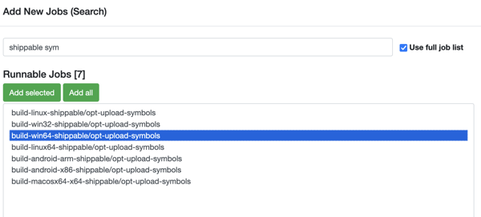

Pushing to Try
==============

"Pushing to Try" allows developers to build and test their changes on Mozilla's automation servers
without requiring their code to be reviewed and landed.

First, :doc:`ensure that you can push to Try <configuration>`.
Try knows how to run tasks that are defined in-tree,
such as ``build-linux64/opt`` (build Firefox for Linux). To manually select some tasks for
Try to process, run the following command:

.. code-block:: shell

    ./mach try fuzzy

After submitting your requested tasks, you'll be given a link to your "push" in Treeherder.
It may take a few minutes for your push to appear in Treeherder! Be patient, and it will automatically
update when Try begins processing your work.

Another very useful Try command is ``./mach try auto``, which will automatically select the tasks
that are mostly likely to be affected by your changes.
See the :doc:`selectors page <selectors/index>` to view all the other ways to select which tasks to push.

It is possible to set environment variables, notably :doc:`MOZ_LOG </xpcom/logging>`, when pushing to
try:

.. code-block:: shell

   ./mach try fuzzy --env MOZ_LOG=cubeb:4

Resolving "<Try build> is damaged and can't be opened" error
------------------------------------------------------------

To run a try build on macOS, you need to get around Apple's restrictions on downloaded applications.

These restrictions differ based on your hardware: Apple Silicon machines (M1 etc.) are much stricter.

For Apple Silicon machines, you will need to download the target.dmg artifact from the
"repackage-macosx64-shippable/opt" job.
This is a universal build (i.e. it contains both x86_64 and arm64 code), and it is signed but not notarized.
You can trigger this job using ``./mach try fuzzy --full``.

On Intel Macs, you can run unsigned builds, once you get around the quarantining (see below),
so you can just download the "target.dmg" from a regular opt build.

Regardless of hardware, you need to make sure that there is no quarantining attribute on
the downloaded dmg file before you attempt to run it:
Apple automatically quarantines apps that are downloaded with a browser from an untrusted
location. This "quarantine status" can be cleared by doing ``xattr -c <Try build>`` after
downloading. You can avoid this "quarantine status" by downloading the build from the command
line instead, such as by using ``curl``:

.. code-block:: shell

    curl -L <artifact-url> -o <file-name>

.. _attach-job-review:

Profiler symbols for try builds
-------------------------------

When profiling a tryserver build, you don't get symbols by default. You have to trigger
an additional `upload-symbols` job on your try push so that the symbols are available
on the symbol server.

You can trigger this job manually in the Treeherder UI, using "Add new jobs (Search)...".

Assuming you want to profile a "shippable" build (recommended), follow these steps:

 1. On the treeherder push, click the dropdown triangle in the top right corner.
 2. Select "Add new jobs (Search)..."
 3. Enter "shippable sym" in the search box and press enter.
 4. Important: Check the "Use full job list" checkbox.
 5. Pick the job for your try build. For Windows 64 bit builds, the job name is ``build-win64-shippable/opt-upload-symbols`` (this was written in February 2024).
 6. Click "Add selected", scroll down, and click "Trigger (1) Selected Jobs".

Around ten minutes later, the symbols will be available on the symbol server, and profile symbolication will succeed.

For other build types, choose the corresponding job for your build type. The job names all
end in ``-upload-symbols``, and share a prefix with the build job.

If you've already captured a profile from a try build before the symbols were available, you can
fix up the collected profile once the symbols are available. To do so, in the Firefox Profiler UI,
click the "Profile Info" button in the top right corner, and then click the "Re-symbolicate profile"
button in the panel.

If you want to trigger the upload-symbol job when pushing to try, you can pick it in the list
when running ``./mach try fuzzy --full`` - the ``--full`` part is necessary.
The ``-upload-symbols`` task has a dependency on the build task, so you don't have to trigger
the build task separately if you do this.

Adding Try jobs to a Phabricator patch
--------------------------------------

For every patch submitted for review in Phabricator, a new Try run is automatically created.
A link called ``Treeherder Jobs`` can be found in the ``Diff Detail`` section of the review in
Phabricator.

.. image:: img/phab-treeherder-link.png

This run is created for static analysis, linting and other tasks. Attaching new jobs to the run is
easy and doesn't require more actions from the developer.
Click on the down-arrow to access the actions menu, select the relevant jobs
and, click on ``Trigger X new jobs`` (located on the top of the job).

.. image:: img/add-new-jobs.png

Table of Contents
-----------------

.. toctree::
  :maxdepth: 2

  configuration
  selectors/index
  presets
  tasks

Indices and tables
------------------

* :ref:`genindex`
* :ref:`modindex`
* :ref:`search`
