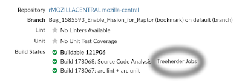
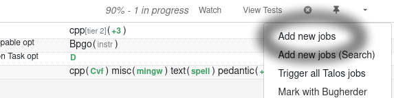

Pushing to Try
==============

"Pushing to Try" allows developers to build and test their changes on Mozilla's automation servers
without requiring their code to be reviewed and landed.

First, :doc:`ensure that you can push to Try <configuration>`.
Try knows how to run tasks that are defined in-tree,
such as ``build-linux64/opt`` (build Firefox for Linux). To manually select some tasks for
Try to process, run the following command:

.. code-block:: shell

    ./mach try fuzzy

After submitting your requested tasks, you'll be given a link to your "push" in Treeherder.
It may take a few minutes for your push to appear in Treeherder! Be patient, and it will automatically
update when Try begins processing your work.

Another very useful Try command is ``./mach try auto``, which will automatically select the tasks
that are mostly likely to be affected by your changes.
See the :doc:`selectors page <selectors/index>` to view all the other ways to select which tasks to push.

Resolving signature issues when downloading a Try build
~~~~~~~~~~~~~~~~~~~~~~~~~~~~~~~~~~~~~~~~~~~~~~~~~~~~~~~

Try builds aren't signed the same way as release builds, so on modern platforms you may
run into errors when you try run them. For example, on macOS, you'll see an error like "<app>
is damaged and can't be opened."

This is because, when the app is downloaded, your browser adds an attribute noting that it
originated from the internet and isn't as trustworthy.
You can resolve this by clearing the attribute after downloading (``xattr -c <app>`` on Mac)
or by downloading the app using `curl <https://curl.se/>`_ instead.

Adding Try jobs to Phabricator patch
------------------------------------

For every patch submitted for review in Phabricator, a new Try run is automatically created.
A link called ``Treeherder Jobs`` can be found in the ``Diff Detail`` section of the review in
Phabricator.

This run is created for static analysis, linting and other tasks. Attaching new jobs to the run is
easy and doesn't require more actions from the developer.
Click on the down-arrow to access the actions menu, select the relevant jobs
and, click on ``Trigger X new jobs`` (located on the top of the job).

Table of Contents
-----------------

.. toctree::
  :maxdepth: 2

  configuration
  selectors/index
  presets
  tasks

Indices and tables
------------------

* :ref:`genindex`
* :ref:`modindex`
* :ref:`search`

