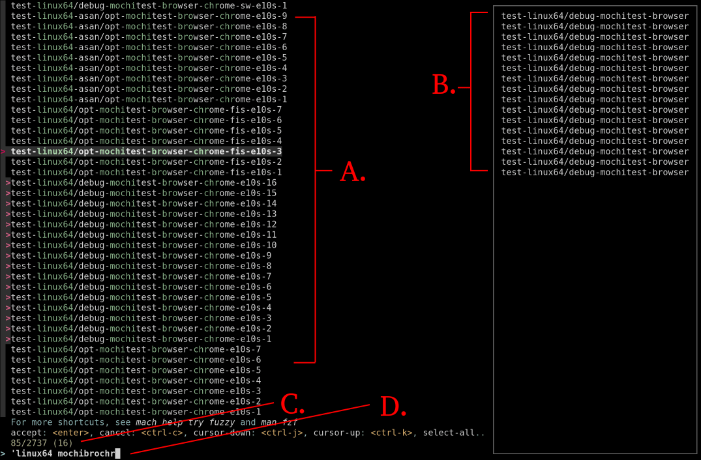

Fuzzy Selector
==============

The fuzzy selector uses a tool called `fzf`_. It allows you to filter down all of the task labels
from a terminal based UI and an intelligent fuzzy finding algorithm. If the ``fzf`` binary is not
installed, you'll be prompted to bootstrap it on first run.

Understanding the Interface
---------------------------

When you run ``mach try fuzzy`` an interface similar to the one below will open. This is `fzf`_.

There's a lot to unpack here, so let's examine each component a bit more closely.

   A. The set of tasks that match the currently typed-out query. In the above image only tasks that
   match the query ``'linux64 mochibrochr`` are displayed.

   B. The set of selected tasks. These are the tasks that will be scheduled once you hit ``Enter``.
   In other words, if the task you want does not appear here, *it won't be scheduled*.

   C. Count information of the form ``x/y (z)``, where ``x`` is the number of tasks that match the
   current query, ``y`` is the total number of tasks and ``z`` is the number of tasks you have
   selected.

   D. The input bar for entering queries. As you type you'll notice the list of tasks in ``A``
   starts to update immediately. In the image above, the query ``'linux64 mochibrochr`` is entered.
   Correspondingly only tasks matching that query are displayed.

In general terms, you first find tasks on the left. Then you move them over to the right by
selecting them. Once you are satisfied with your selection, press ``Enter`` to push to try.

Selecting Tasks
---------------

There are few ways you can select tasks. If you are feeling a bit overwhelmed, it might be best to
stick with the mouse to start:

   1. Enter a query (e.g ``mochitest``) to reduce the task list a little.
   2. Scroll up and look for the task(s) you want.
   3. ``Right-Click`` as many tasks as desired to select them.
   4. Optionally delete your query, go back to step 1) and repeat.
   5. Press ``Enter`` to push (or ``Esc`` to cancel).

.. note::

   Dependencies are automatically filled in, so you can select a test task without needing
   to select the build it depends on.

As you ``Right-Click``, notice that a little arrow appears to the left of the task label. This
indicates that the task is selected and exists in the preview pane to the right.

Once you are a bit more comfortable with the interface, using the keyboard is much better at quickly
selecting tasks. Here are the main shortcuts you'll need:

.. code-block:: text

    Ctrl-K / Up    => Move cursor up
    Ctrl-J / Down  => Move cursor down
    Tab            => Select task + move cursor down
    Shift-Tab      => Select task + move cursor up
    Ctrl-A         => Select all currently filtered tasks
    Ctrl-T         => Toggle select all currently filtered tasks
    Ctrl-D         => De-select all selected tasks (both filtered and not)
    Alt-Bspace     => Clear query from input bar
    Enter          => Accept selection and exit
    Ctrl-C / Esc   => Cancel selection and exit
    ?              => Toggle preview pane

The process for selecting tasks is otherwise the same as for a mouse. A particularly fast and
powerful way to select tasks is to:

.. code-block:: text

    Write a precise query => Ctrl-A => Alt-Bspace => Repeat

As before, when you are satisfied with your selection press ``Enter`` and all the tasks in the
preview pane will be pushed to try. If you change your mind you can press ``Esc`` or ``Ctrl-C`` to
exit the interface without pushing anything.

.. note::

   Initially ``fzf`` will automatically select whichever task is under your cursor. This is a
   convenience feature for the case where you are only selecting a single task. This feature will be
   turned off as soon as you *lock in* a selection with ``Right-Click``, ``Tab`` or ``Ctrl-A``.

Writing Queries
---------------

Queries are built from a series of terms, each separated by a space. Terms are logically joined by
the AND operator. For example:

.. code-block:: text

    'windows 'mochitest

This query has two terms, and is the equivalent of saying: Give me all the tasks that match both the
term ``'windows'`` and the term ``'mochitest'``. In other words, this query matches all Windows
mochitest tasks.

The single quote prefix before each term tells ``fzf`` to use exact substring matches, so only tasks
that contain both the literal string ``windows`` AND the literal string ``mochitest`` will be
matched.

Another thing to note is that the order of the terms makes no difference, so ``'windows 'mochitest``
and ``'mochitest 'windows`` are equivalent.

Fuzzy terms
~~~~~~~~~~~

If a term is *not* prefixed with a single quote, that makes it a fuzzy term. This means the
characters in the term need to show up in order, but not in sequence. E.g the fuzzy term ``max``
would match the string ``mozilla firefox`` (as first there is an ``m``, then an ``a`` and finally an
``x``), but not the string ``firefox by mozilla`` (since the ``x`` is now out of order). Here's a
less contrived example:

.. code-block:: text

    wndws mchtst

Like the query above, this one would also select all Windows mochitest tasks. But it will
additionally select:

.. code-block:: text

    test-macosx1014-64-shippable/opt-talos-sessionrestore-many-windows-e10s

This is because both sequences of letters (``wndws`` and ``mchtst``) independently appear in order
somewhere in this string (remember the order of the terms makes no difference).

At first fuzzy terms may not seem very useful, but they are actually extremely powerful! Let's use
the term from the interface image above, ``'linux64 mochibrochr``, as an example. First, just notice
how in the image ``fzf`` highlights the characters that constitute the match in green. Next, notice
how typing ``mochibrochr`` can quickly get us all mochitest browser-chrome tasks. The power of fuzzy
terms is that you don't need to memorize the exact task labels you are looking for. Just start
typing something you think is vaguely correct and chances are you'll see the task you're looking for.

Term Modifiers
~~~~~~~~~~~~~~

The following modifiers can be applied to a search term:

.. code-block:: text

    'word    => exact match (line must contain the literal string "word")
    ^word    => exact prefix match (line must start with literal "word")
    word$    => exact suffix match (line must end with literal "word")
    !word    => exact negation match (line must not contain literal "word")
    'a | 'b  => OR operator (joins two exact match operators together)

For example:

.. code-block:: text

    ^start 'exact | 'other !ignore fuzzy end$

would match the string:

.. code-block:: text

    starting to bake isn't exactly fun, but pizza is yummy in the end

.. note::

    The best way to learn how to write queries is to run ``mach try fuzzy --no-push`` and play
    around with all of these modifiers!

Specifying Queries on the Command Line
--------------------------------------

Sometimes it's more convenient to skip the interactive interface and specify a query on the command
line with ``-q/--query``. This is equivalent to opening the interface then typing:
``<query><ctrl-a><enter>``.

For example:

.. code-block:: shell

    # selects all mochitest tasks
    $ mach try fuzzy --query "mochitest"

You can pass in multiple queries at once and the results of each will be joined together:

.. code-block:: shell

    # selects all mochitest and reftest tasks
    $ mach try fuzzy -q "mochitest" -q "reftest"

If instead you want the intersection of queries, you can pass in ``-x/--and``:

.. code-block:: shell

    # selects all windows mochitest tasks
    $ mach try fuzzy --and -q "mochitest" -q "windows"

Modifying Presets
~~~~~~~~~~~~~~~~~

:doc:`Presets <../presets>` make it easy to run a pre-determined set of tasks. But sometimes you
might not want to run that set exactly as is, you may only want to use the preset as a starting
point then add or remove tasks as needed. This can be accomplished with ``-q/--query`` or
``-i/--interactive``.

Here are some examples of adding tasks to a preset:

.. code-block:: shell

    # selects all perf tasks plus all mochitest-chrome tasks
    $ mach try fuzzy --preset perf -q "mochitest-chrome"

    # adds tasks to the perf preset interactively
    $ mach try fuzzy --preset perf -i

Similarly, ``-x/--and`` can be used to filter down a preset by taking the intersection of the two
sets:

.. code-block:: shell

    # limits perf tasks to windows only
    $ mach try fuzzy --preset perf -xq "windows"

    # limits perf tasks interactively
    $ mach try fuzzy --preset perf -xi

Shell Conflicts
~~~~~~~~~~~~~~~

Unfortunately ``fzf``'s query language uses some characters (namely ``'``, ``!`` and ``$``) that can
interfere with your shell when using ``-q/--query``. Below are some tips for how to type out a query
on the command line.

The ``!`` character is typically used for history expansion. If you don't use this feature, the
easiest way to specify queries on the command line is to disable it:

.. code-block:: shell

    # bash
    $ set +H
    $ ./mach try fuzzy -q "'foo !bar"

    # zsh
    $ setopt no_banghist
    $ ./mach try fuzzy -q "'foo !bar"

If using ``bash``, add ``set +H`` to your ``~/.bashrc``, ``~/.bash_profile`` or equivalent. If using
``zsh``, add ``setopt no_banghist`` to your ``~/.zshrc`` or equivalent.

If you don't want to disable history expansion, you can escape your queries like this:

.. code-block:: shell

    # bash
    $ ./mach try fuzzy -q $'\'foo !bar'

    # zsh
    $ ./mach try fuzzy -q "'foo \!bar"

The third option is to use ``-e/--exact`` which reverses the behaviour of the ``'`` character (see
:ref:`additional-arguments` for more details). Using this flag means you won't need to escape the
``'`` character as often and allows you to run your queries like this:

.. code-block:: shell

    # bash and zsh
    $ ./mach try fuzzy -eq 'foo !bar'

This method is only useful if you find you almost always prefix terms with ``'`` (and rarely use
fuzzy terms). Otherwise as soon as you want to use a fuzzy match you'll run into the same problem as
before.

.. note:: All the examples in these three approaches will select the same set of tasks.

If you use ``fish`` shell, you won't need to escape ``!``, however you will need to escape ``$``:

.. code-block:: shell

    # fish
    $ ./mach try fuzzy -q "'foo !bar baz\$"

Test Paths
----------

One or more paths to a file or directory may be specified as positional arguments. When
specifying paths, the list of available tasks to choose from is filtered down such that
only suites that have tests in a specified path can be selected. Notably, only the first
chunk of each suite/platform appears. When the tasks are scheduled, only tests that live
under one of the specified paths will be run.

.. note::

    When using paths, be aware that all tests under the specified paths will run in the
    same chunk. This might produce a different ordering from what gets run on production
    branches, and may yield different results.

    For suites that restart the browser between each manifest (like mochitest), this
    shouldn't be as big of a concern.

Paths can be used with the interactive ``fzf`` window, or using the ``-q/--query`` argument.
For example, running:

.. code-block:: shell

    $ mach try fuzzy layout/reftests/reftest-sanity -q "!pgo !cov !asan 'linux64"

Would produce the following ``try_task_config.json``:

.. code-block:: json

    {
      "env":{
        "MOZHARNESS_TEST_PATHS":"{\"reftest\":\"layout/reftests/reftest-sanity\"}"
      },
      "tasks":[
        "test-linux64-qr/debug-reftest-e10s-1",
        "test-linux64-qr/opt-reftest-e10s-1",
        "test-linux64/debug-reftest-e10s-1",
        "test-linux64/debug-reftest-no-accel-e10s-1",
        "test-linux64/opt-reftest-e10s-1",
        "test-linux64/opt-reftest-no-accel-e10s-1",
      ]
    }

Inside of these tasks, the reftest harness will only run tests that live under
``layout/reftests/reftest-sanity``.

Test Tags
----------

Adding a test tag may be specified as positional arguments. When
specifying a tag, the list of available tasks to choose from is filtered down such that
only suites that have tests annotated with the specific tag. Notably, only the first
chunk of each suite/platform appears. When the tasks are scheduled, only tests that have
a matching tag in the manifest will be run.

.. note::

    When using tags, be aware that all tests matching the tag will run in the
    same chunk. This might produce a different ordering from what gets run on production
    branches, and may yield different results.

    For suites that restart the browser between each manifest (like mochitest), this
    shouldn't be as big of a concern.

The behavior with using a Tag with Paths is that a logical OR is used so all Paths that match
and all tests within those paths which have a Tag will match.
Tags can be used with the interactive ``fzf`` window, or using the ``-q/--query`` argument.
For example, running:

.. code-block:: shell

    $ mach try fuzzy --tag indexedDB -q "!pgo !cov !asan 'linux64"

Would produce the following ``try_task_config.json``:

.. code-block:: json

    {
      "env":{
        "MOZHARNESS_TEST_PATHS":"{\"mochitest\":\"dom/indeedDB/test\"}"
      },
      "tasks":[
        "test-linux64-qr/debug-mochitest-e10s-1",
        "test-linux64-qr/opt-mochitest-e10s-1",
        "test-linux64/debug-mochitest-e10s-1",
        "test-linux64/opt-mochitest-e10s-1",
      ]
    }

.. _additional-arguments:

Additional Arguments
--------------------

There are a few additional command line arguments you may wish to use:

``-e/--exact``
By default, ``fzf`` treats terms as a fuzzy match and prefixing a term with ``'`` turns it into an exact
match. If passing in ``--exact``, this behaviour is reversed. Non-prefixed terms become exact, and a
``'`` prefix makes a term fuzzy.

``--full``
By default, only target tasks (e.g tasks that would normally run on mozilla-central)
are generated. Passing in ``--full`` allows you to select from all tasks. This is useful for
things like nightly or release tasks.

``-u/--update``
Update the bootstrapped ``fzf`` binary to the latest version.

For a full list of command line arguments, run:

.. code-block:: shell

    $ mach try fuzzy --help

For more information on using ``fzf``, run:

.. code-block:: shell

    $ man fzf

.. _fzf: https://github.com/junegunn/fzf
