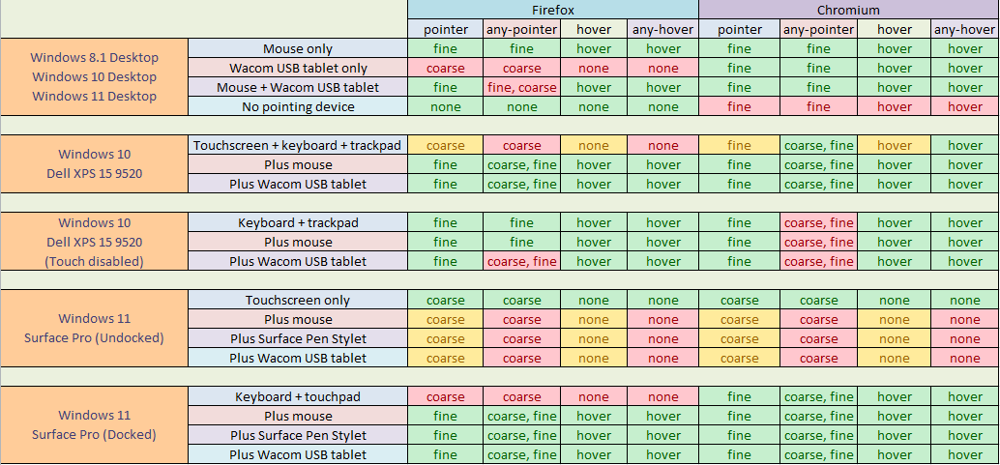

################################################################################
Windows Pointing Device Support in Firefox
################################################################################

.. contents:: Table of Contents
    :depth: 4

================================================================================
Introduction
================================================================================

This document is intended to provide the reader with a quick primer and/or
refresher on pointing devices and the various operating system APIs, user
experience guidelines, and Web standards that contribute to the way Firefox
handles input devices on Microsoft Windows.

The documentation for these things is scattered across the web and has varying
levels of detail and completeness; some of it is missing or ambiguous and was
only determined experimentally or by reading about other people's experiences
through forum posts. An explicit goal of this document is to gather this
information into a cohesive picture.

We will then discuss the ways in which Firefox currently (as of early 2023)
produces incorrect or suboptimal behavior when implementing those standards
and guidelines.

Finally, we will raise some thoughts and questions to spark discussion on how
we might improve the situation and handle corner cases. Some of
these issues are intrinsically "opinion based" or "policy based", so clear
direction on these is desirable before engineering effort is invested into
reimplementation.

================================================================================
Motivation
================================================================================

A quick look at the `pile of defects  <https://bugzilla.mozilla.orgbuglist.cgi?query_format=advanced&status_whiteboard=%5Bwin%3Atouch%5D&list_id=16586149&status_whiteboard_type=allwordssubstr>`__
on *bugzilla.mozilla.org* marked with *[win:touch]* will show anyone that
Firefox's input stack for pointer devices has issues, but the bugs recorded
there don't begin to capture the full range of unreported glitches and
difficult-to-reproduce hiccups that users run into while using touchscreen
hardware and pen digitizers on Firefox, nor does it capture the ways that
Firefox misbehaves according to various W3C standards that are (luckily) either
rarely used or worked around in web apps (and thus go undetected or
unreported).

These bugs primarily manifest in a few ways that will each be discussed in
their own section:

1.  Firefox failing to return the proper values for the ``pointer``,
    ``any-pointer``, ``hover``, and ``any-hover`` CSS Media Queries

2.  Firefox failing to fire the correct pointer-related DOM events at the
    correct time (or at all)

3.  Firefox's inconsistent handling of touch-related gestures like scrolling,
    where certain machines (like the Surface Pro) fail to meet the expected
    behavior of scrolling inertia and overscroll. This leads to a weird touch
    experience where the page comes to a choppy, dead-stop when using
    single-finger scrolling

It's worth noting that Firefox is not alone in having these types of issues,
and that handling input devices is a notoriously difficult task for many
applications; even a substantial amount of Microsoft's own software has trouble
navigating this minefield on their own Microsoft Surface devices. Defects are
instigated by a combination of the *intrinsic complexity* of the problem domain
and the *accidential complexity* introduced by device vendors and Windows
itself.

The *intrinsic complexity* comes from the simple fact that human-machine
interaction is difficult. A person must attempt to convey complex
and abstract goals through a series of simple movements involving a few pieces
of physical hardware. The devices can send signals that are unclear
or even contradictory, and the software must decide how to handle
this.

As a trivial example, every software engineer that's ever written
page scrolling logic has to answer the question, "What should my
program do if the user hits 'Page Up' and 'Page Down' at the same time?".
While it may seem obvious that the answer is "Do nothing.", naively-written
keyboard input logic might assume the two are mutually-exclusive and only
process whichever key is handled first in program order.

Occasionally, a new device will be invented that doesn't obviously map to
existing abstractions and input pipelines. There will be a period of time where
applications will want to support the new device, but it won't be well
understood by either the application developers nor the device vendor
themselves what ideal integration would look like. The new Apple Vision VR
headset is such a device; traditional VR headsets have used controllers to
point at things, but Apple insists that the entire thing should be done using
only hand tracking and eye tracking. Developers of VR video games and other
apps (like Firefox) will inevitably make many mistakes on the road to
supporting this new headset.

A major source of defect-causing *accidental complexity* is the lack of clear
expectations and documentation from Microsoft for apps (like Firefox) that are
not using their Universal Windows Platform (UWP). The Microsoft Developer
Network (MSDN) mentions concepts like inertia, overscroll, elastic bounce,
single-finger panning, etc., but the solution is presented in the context
of UWP, and the solution for non-UWP apps is either unclear or undocumented.

Adding to this complexity is the fact that Windows itself has gone through
several iterations of input APIs for different classes of devices, and
these APIs interact with each other in ways that are surprising or
unintuitive. Again, the advice given on MSDN pertains to UWP apps, and the
documentation about the newer "pointer" based window messages is
a mix of incomplete and inaccurate.

Finally, individual input devices have bugs in their driver software that
would disrupt even applications that are using the Windows input APIs perfectly.
Handling all of these deviations is impossible and would result in fragile,
unmaintainable code, but Firefox inevitably has to work around common ones to
avoid alienating large portions of the userbase.

================================================================================
Technical Background
================================================================================

A Quick Primer on Pointing Devices
======================================

Traditionally, web browsers were designed to accommodate computer mice and
devices that behave in a similar way, like trackballs and touchpads on
laptops. Generally, it was assumed that there would be one such device attached
to the computer, and it would be used to control a hovering "cursor" whose
movements would be changed by relative movement of the physical input device.

However, modern computers can be controlled using a variety of different
pointing devices, all with different characteristics. Many allow
multiple concurrent targets to be pointed at and have multiple sensors,
buttons, and other actuators.

For example, the screen of the Microsoft Surface Pro has dual capabilities
of being a touch sensor and a digitizer for a tablet pen. When being used as a
workstation, it's not uncommon for a user to also connect the "keyboard +
touchpad" cover and a mouse (via USB or Bluetooth) to provide the more
productivity-oriented "keyboard and mouse" setup. In that configuration, there
are 4 pointer devices connected to the machine simultaneously: a touch screen,
a pen digitizer, a touchpad, and a mouse.

The next section will give a quick overview of common pointing devices.
Many will be familiar to the reader, but they are still mentioned to establish
common terminology and to avoid making assumptions about familiarity with every
input device.

Common Pointing Devices
---------------------------

Here are some descriptions of a few pointing device types that demonstrate
the diversity of hardware:

**Touchscreen**

    A touchscreen is a computer display that is able to sense the
    location of (possibly-multiple) fingers (or stylus) making contact with its
    surface. Software can then respond to the touches by changing the displayed
    objects quickly, giving the user a sense of actually physically manipulating
    them on screen with their hands.

    .. image:: touchscreen.jpg
        :width: 25%

**Digitizing Tablet + Pen Stylus**

    These advanced pointing devices tend to
    exist in two forms: as an external sensing "pad" that can be plugged into a
    computer and sits on a desk or in someone's lap, or as a sensor built right
    into a computer display. Both use a "stylus", which is a pen-shaped
    electronic device that is detectable by the surface. Common features
    include the ability to distinguish proximity to the surface ("hovering")
    versus actual contact, pressure sensitivity, angle/tilt detection, multiple
    "ends" such as a tip and an eraser, and one-or-more buttons/switch
    actuators.

    .. image:: wacom_tablet.png
        :width: 25%

**Joystick/Pointer Stick**

    Pointer sticks are most often seen in laptop
    computers made by IBM/Lenovo, where they exist as a little red nub located
    between the G, H, and B keys on a standard QWERTY keyboard. They function
    similarly to the analog sticks on a game controller -- The user displaces
    the stick from its center position, and that is interpreted as a relative
    direction to move the on-screen cursor. A greater displacement from center
    is interpreted as increased velocity of movement.

    .. image:: trackpoint.jpg
        :width: 25%

**Touchpad**

    A touchpad is a rectangular surface (often found on laptop
    computers) that detects touch and motion of a finger and moves an on-screen
    cursor relative to the motion. Modern touchpads often support multiple
    touches simultaneously, and therefore offer functionality that is quite
    similar to a touchscreen, albeit with different movement semantics because
    of their physical separation from the screen (discussed below).

    .. image:: touchpad.jpg
        :width: 25%

**VR Controllers**

    VR controllers (and other similar devices like the
    Wiimote from the Nintendo Wii) allow users to point at objects in a
    three-dimensional virtual world by moving a real-world controller and
    "projecting" the controller's position into the virtual space. They often
    also include sensors to detect the yaw, pitch, and roll of the sensors.
    There are often other inputs in the controller device, like analog sticks
    and buttons.

    .. image:: vrcontroller.jpg
        :width: 25%

**Hand Tracking**

    Devices like the Apple Vision (introduced during the
    time this document was being written) and (to a lesser extent) the Meta
    Quest have the ability to track the wearer's hand and directly interpret
    gestures and movements as input. As the human hand can assume a staggering
    number of orientations and configurations, a finite list of specific shapes
    and movements must be identified and labelled to allow for clear
    software-user interaction.

    .. image:: apple_vision_user.webp
        :width: 25%

    .. image:: apple_vision.jpg
        :width: 25%

**Mouse**

    A pointing device that needs no introduction. Moving a physical
    clam-shaped device across a surface translates to relative movement of a
    cursor on screen.

    .. image:: mouse.jpg
        :width: 25%

The Buxton Three-State Model
-------------------------------

Bill Buxton, an early pioneer in the field of human-computer interaction,
came up with a three-state model for pointing devices; a device can be
"Out of Range", "Tracking", or "Dragging". Not all devices support all three
states, and some devices have multiple actuators that can have the three-state
model individually applied.

.. mermaid::

    stateDiagram-v2
        direction LR
        state "State 0" as s0
        state "State 1" as s1
        state "State 2" as s2
        s0 --> s0 : Out Of Range
        s1 --> s1 : Tracking
        s2 --> s2 : Dragging
        s0 --> s1 : Stylus On
        s1 --> s0 : Stylus Lift
        s1 --> s2 : Tip Switch Close
        s2 --> s1 : Tip Switch Open

For demonstration, here is the model applied to a few devices:

**Computer Mouse**

    A mouse is never in the "Out of Range" state. Even though it can technically
    be lifted off its surface, the mouse does not report this as a separate
    condition; instead, it behaves as-if it is stationary until it can once
    again sense the surface moving underneath.

    The remaining two states apply to each button individually; when a button is
    not being pressed, the mouse is considered in the "tracking" state with
    respect to that button. When a button is held down, the mouse is "dragging"
    with respect to that button. A "click" is simply considered a zero-length
    drag under this model.

    In the case of a two-button mouse, this means that the mouse can be in a
    total of 4 different states: tracking, left button dragging, right button
    dragging, and two-button dragging. In practice, very little software
    actually does anything meaningful with two-button dragging.

**Touch Screen**

    Applying the model to a touch screen, one can observe that current hardware
    has no way to sense that a finger that is "hovering, but not quite making
    contact with the screen". This means that the "Tracking" state can be ruled
    out, leaving only the "Out of Range" and "Dragging" states. Since many touch
    screens can support multiple fingers touching the screen concurrently, and
    each finger can be in one of two states, there are potentially 2^N different
    "states" that a touchscreen can be in. Windows assigns meaning to many two,
    three, and four-finger gestures.

**Tablet Digitizer**

    A tablet digitizer supports all three states: when the stylus is far away
    from the surface, it is considered "out of range"; when it is located
    slightly above the surface, it is "tracking"; and when it is making contact
    with the surface, it is "dragging".

The W3C standards for pointing devices are based on this three-state model, but
applied to each individual web element instead of the entire system. This
makes things like "Out-of-Range" possible for the mouse, since it can be
out of range of a web element.

The W3C uses the terms "over" and "out" to convey the transition between
"out-of-range" and "tracking" (which the W3C calls "hover"), and the terms
"down" and "up" convey the transition between "tracking" and "dragging".

The standard also address some of the known shortcomings of the model to
improve portability and consistency; these improvements will be discussed more
below.

The Windows Pointer API is *supposedly* based around this model,
but unfortunately real-world testing shows that the model is not followed
very consistently with respect to the actual signals sent to the application.

Gestures
=====================================

In contrast to the sort-of "anything goes" UI designs of the past,
modern operating systems like Windows, Mac OS X, iOS, Android, and even
modern Linux DEs have an "opinionated" idea of how user interaction
should behave across all apps on the platform (the so-called "look and feel"
of the operating system).

Users expect gestures like swipes, pinches, and taps to act the same way
across all apps for a given operating system, and they expect things like
on-screen keyboards or handwriting recognition to pop up in certain contexts.
Failing to meet those expectations makes an app look less polished, and
(especially as far as accessibility is concerned) it frustrates the user
and makes it more difficult for them to interact with the app.

Microsoft defines guidelines for various behaviours that Windows applications
should ideally adhere to in the `Input and Interactions <https://learn.microsoft.com/en-us/windows/apps/design/input/>`__
section on MSDN. Some of these are summarized quickly below:

**Drag and Drop**

    Drag and drop allows a user to transfer data from one application to
    another. The gesture begins when a pointer device moves into the "Dragging"
    state over top of a UI element, usually as a result of holding down a mouse
    button or pressing a finger on a touchscreen. The user moves the pointer
    over top of the receiver of the data, and then ends the gesture by releasing
    the mouse button or lifting their finger off the touchscreen. Window
    interprets this transition out of the "Dragging" state as permission to
    initiate the data transfer.

    Firefox has supported Drag and Drop for a very long time, so it will not be
    discussed further.

**Pan and Zoom**

    When using touchscreens (and multi-touch touchpads), users expect to be able
    to cause the viewport to "pan" left/right/up/down by pressing two fingers on
    the screen (creating two pointers in "Dragging" state) and moving their
    fingers in the direction of movement. When they are done, they can release
    both fingers (changing both pointers to "Out of Bounds").

    A zoom can be signalled by moving the two fingers apart or together
    in a "pinch" or "reverse pinch" gesture.

**Single Pointer Panning**

    Applications that are based on a UI model of the user interacting with a
    "page" often allow a single pointer "Dragging" over the viewport to cause
    the viewport to pan, similarly to the two-finger panning discussed in the
    previous section.

    Note that this gesture is not as universal as two-finger panning is -- as a
    counterexample, graphics programs tend to treat one-finger dragging as
    object manipulation and two-finger dragging as viewport panning.

**Inertia**

    When a user is done panning, they may lift their finger/pen off the screen
    while the viewport is still in motion. Users expect that the page will
    continue to move for a little while, as-if the user had "tossed" the page
    when they let go. Effectively, the page behaves as though it has "momentum"
    that needs to be gradually lost before the page comes to a full stop.

    Modern operating systems provide this behavior via their various native
    widget toolkits, and the curve that objects follow as they slow to a stop
    are different across OSes. In that way, they can be considered part of the
    unique "look and feel" of the OS. Users expect the scrolling of pages in
    their web browser to behave this way, and so when Firefox fails to provide
    this behavior it can be jarring.

**Overscroll and Elastic Bounce**

    When a user is panning the page and reaches the outer edges, Microsoft
    recommends that the app should begin an "elastic bounce" animation, where
    the page will allow the user to scroll past the end ("overscroll"),
    show empty space underneath the page, and then sort of "snap back" like a
    rubber band that's been stretched and then released.  You can see a
    demonstration in `this article <https://www.windowslatest.com/2020/05/21/microsoft-is-adding-elastic-scrolling-to-chrome-on-windows-10/>`__,
    which discusses Microsoft adding it to Chromium.

History of Web Standards and Windows APIs
===========================================

The World-Wide Web Consortium (W3C) and the Web Hypertext Application
Technology Working Group (WHATWG) manage the standards that detail the
interface between a user agent (like Firefox) and applications designed to run
on the Web Platform. The user agent, in turn, must rely on the operating system
(Windows, in this case) to provide the necessary APIs to implement the
standards required by the Web Platform.

As a result of that relationship, a Web Standard is unlikely to be created
until all widely-used operating systems provide the required APIs. That allows
us to build a linear timeline with a predictable pattern: a new type of device
becomes popular, the APIs to support it are introduced into operating systems,
and eventually a cross-platform standard is introduced into the Web Platform.

The following sections detail the history of input devices supported by
Windows and the Web Platform:

**1985 - Computer Mouse Support (Windows 1.0)**

    The first version of Windows (1985) supported a computer mouse. Support
    for other input devices is not well-documented, but probably non-existant.

**1991 - Third-Party De-facto Pen Support (Wintab)**

    In the late 80s and early 90s, any tablet pen hardware vendor that wanted
    to support Windows would need to write a device driver and design a
    proprietary user-mode API to expose the device to user applications. In
    turn, application developers would have to write and maintain code to
    support the APIs of every relevant device vendor.

    In 1991, a company named LCS/Telegraphics released an API for Windows
    called "Wintab", which was designed in collaboration with hardware and
    software vendors to define a general API that could be targetted by
    device drivers and applications.

    It would take Microsoft more than a decade to include first-party support
    for tablet pens in Windows, which allowed Wintab to become the de-facto
    standard for pen support on Windows. The Wintab API continues to be
    supported by virtually all artist tablets to this day. Notable companies
    include Wacom, Huion, XP-Pen, etc.

**1992 - Early Windows Pen Support (Windows for Pen Computing)**

    The earliest Windows operating system to support non-mouse pointing devices
    was Windows 3.1 with the "Windows for Pen Computing" add-on (1992).
    (`For the curious <https://socket3.wordpress.com/2019/07/31/windows-for-pen-computing-1-0/>`__,
    and I'm certain `this book <https://www.amazon.com/Microsoft-Windows-Pen-Computing-Programmers/dp/1556154690>`__
    is a must-read!). Pen support was mostly implemented by translating actions
    into the existing ``WM_MOUSExxx`` messages, but also "upgraded" any
    application's ``EDIT`` controls into ``HEDIT`` controls, which looked the
    same but were capable of being handwritten into using a pen. This was not
    very user-friendly, as the controls stayed the same size and the UI was not
    adapted to the input method. This add-on never achieved much popularity.

    It is not documented whether Netscape Navigator (the ancestor of Mozilla
    Firefox) supported this add-on or not, but there is no trace of it in modern
    Firefox code.

**1995 - Introduction of JavaScript and Mouse Events (De-facto Web Standard)**

    The introduction of JavaScript in 1995 by Netscape Communications added a
    programmable, event-driven scripting environment to the Web Platform.
    Browser vendors quickly added the ability for scripts to listen for and
    react to mouse events. These are the well-known events like ``mouseover``,
    ``mouseenter``, ``mousedown``, etc. that are ubiquitous on the web, and are
    known by basically anyone who has ever written front-end JavaScript.

    This ubiquity created a de-facto standard for mouse input, which would
    eventually be formally standardized by the W3C in the HTML Living Standard
    in 2001.

    The Mouse Event APIs assume that the computer has one single pointing device
    which is always present, has a single cursor capable of "hovering" over an
    element, and has between one and three buttons.

    When support for other pointing devices like touchscreen and pen first
    became available in operating systems, it was exposed to the web by
    interpreting user actions into equivalent mouse events. Unfortunately, this
    is unable to handle multiple concurrent pointers (like one would get from
    multitouch screens) or report the kind of rich information a pen digitizer
    can provide, like tilt angle, pressure, etc. This eventually lead the W3C
    to develop the new "Touch Events" standard to expose touch functionality,
    and eventually the "Pointer Events" to expose more of the rich information
    provided by pens.

**2005 - Mainstream Pen Support (Windows XP Tablet PC Edition)**

    It was the release of Windows XP Tablet PC Edition (2005) that allowed
    Windows applications to directly support tablet pens by using the new COM
    "`Windows Tablet PC <https://learn.microsoft.com/en-us/windows/win32/tablet/tablet-pc-development-guide>`__"
    APIs, most of which are provided through the main `InkCollector <https://learn.microsoft.com/en-us/windows/win32/tablet/inkcollector-class>`__
    class. The ``InkCollector`` functionality would eventually be "mainlined"
    into Windows XP Professional Service Pack 2, and continues to exist in
    modern Windows releases.

    The Tablet PC APIs consist of a large group of COM objects that work
    together to facilitate enumerating attached pens, detecting pen movement and
    pen strokes, and analyzing them to provide:

    1.  **Cursor Movement**: translates the movements of the pen into the
        standard mouse events that applications expect from mouse cursor
        movement, namely ``WM_NCHITTEST``, ``WM_SETCURSOR`` and
        ``WM_MOUSEMOVE``.

    2.  **Gesture Recognition**: detects common user actions, like "tap",
        "double-tap", "press-and-hold", and "drag". The `InkCollector` delivers
        these events via COM `SystemGesture <https://learn.microsoft.com/en-us/windows/win32/tablet/inkcollector-systemgesture>`__
        events using the `InkSystemGesture <https://learn.microsoft.com/en-us/windows/win32/api/msinkaut/ne-msinkaut-inksystemgesture>`__
        enumeration. It will also translate them into common Win32 messages; for
        example, a "drag" gesture would be translated into a ``WM_LBUTTONDOWN``
        message, several ``WM_MOUSEMOVE`` messages, and finally a
        ``WM_LBUTTONUP`` message.

        An application that is using ``InkCollector`` will receive both types of
        messages: traditional mouse input through the Win32 message queue, and
        "Tablet PC API" events through COM callbacks. It is up to the
        application to determine which events matter to it in a given context,
        as the two types of events are not guaranteed by Microsoft to correspond
        in any predictable way.

    3.  **Shape and Text Recognition**: allows the app to
        recognize letters, numbers, punctuation, and other `common shapes <https://learn.microsoft.com/en-us/windows/win32/api/msinkaut/ne-msinkaut-inkapplicationgesture>`__
        the user might make using their pen. Supported shapes include circles,
        squares, arrows, and motions like "scratch out" to correct a misspelled
        word. Custom recognizers exist that allow recognition of other symbols,
        like music notes or mathematical notation.

    4.  **Flick Recognition**: allows the user to invoke actions via quick,
        linear motions that are recognized by Windows and sent to the app as
        ``WM_TABLET_FLICK`` messages. The app can choose to handle the window
        message or pass it on to the default window procedure, which will
        translate it to scrolling messages or mouse messages.

        For example, a quick upward 'flick' corresponds to "Page up", and
        a quick sideways flick in a web browser would be "back". Flicks were
        never widely used by Windows apps, and they may have been removed in
        more recent versions of Windows, as the existing Control Panel menus
        for configuring them seem to no longer exist as of Windows 10 22H2.

    Firefox does not appear to have ever used these APIs to allow tablet pen
    input, with the exception of `one piece of code <https://searchfox.org/mozilla-central/rev/e6cb503ac22402421186e7488d4250cc1c5fecab/widget/windows/InkCollector.cpp>`__
    to detect when the pen leaves the Firefox window to solve
    `Bug 1016232 <https://bugzilla.mozilla.org/show_bug.cgi?id=1016232>`__.

**2009 - Touch Support: WM_GESTURE (Windows 7)**

    While attempts were made with the release of Windows Vista (2007) to support
    touchscreens through the existing tablet APIs, it was ultimately the release
    of Windows 7 (2009) that brought first-class support for Touchscreen devices
    to Windows with new Win32 APIs and two main window messages: ``WM_TOUCH``
    and ``WM_GESTURE``.

    These two messages are mutually-exclusive, and all applications are
    initially set to receive only ``WM_GESTURE`` messages. Under this
    configuration, Windows will attempt to recognize specific movements on a
    touch digitizer and post "gesture" messages to the application's message
    queue. These gestures are similar to (but, somewhat-confusingly, not
    identical to) the gestures provided by the "Windows Tablet PC" APIs
    mentioned above. The main gesture messages are: zoom, pan, rotate,
    two-finger-tap, and press-and-tap (one finger presses, another finger
    quickly taps the screen).

    In contrast to the behavior of the ``InkCollector`` APIs, which will send
    both gesture events and translated mouse messages, the ``WM_GESTURE``
    message is truly "upstream" of the translated mouse messages; the translated
    mouse messages will only be generated if the application forwards the
    ``WM_GESTURE`` message to the default window procedure. This makes
    programming against this API simpler than the ``InkCollector`` API, as
    there is no need to state-fully "remember" that an action has already been
    serviced by one codepath and needs to be ignored by the other.

    Firefox current supports the ``WM_GESTURE`` message when Asynchronous Pan
    and Zoom (APZ) is not enabled (although we do not handle inertia in this
    case, so the page comes to a dead-stop immediately when the user stops
    scrolling).

**2009 - Touch Support: WM_TOUCH (Windows 7)**

    Also introduced in Windows 7, an application that needs full control over
    touchscreen events can use `RegisterTouchWindow <https://learn.microsoft.com/en-us/windows/win32/api/winuser/nf-winuser-registertouchwindow>`__
    to change any of its windows to receive ``WM_TOUCH`` messages instead of the
    more high-level ``WM_GESTURE`` messages. These messages explicitly notify
    the application about every finger that contacts or breaks contact with the
    digitizer (as well as each finger's movement over time). This provides
    absolute control over touch interpretation, but also means that the burden
    of handling touch behavior falls completely on the application.

    To help ease this burden, Microsoft provides two COM APIs to interpret
    touch messages, ``IManipulationProcessor`` and ``IInertiaProcessor``.

    ``IManipulationProcessor`` can be considered a superset of the functionality
    available through normal gestures. The application feeds ``WM_TOUCH`` data
    into it (along with other state, such as pivot points and timestamps), and
    it allows for manipulations like: two-finger rotation around a pivot,
    single-finger rotation around a pivot, simultaneous rotation and translation
    (for example, 'dragging' a single corner of a square).
    `These MSDN diagrams <https://learn.microsoft.com/en-us/windows/win32/wintouch/advanced-manipulations-overview>`__
    give a good overview of the kinds of advanced manipulations an app might
    support.

    ``IInertiaProcessor`` works with ``IManipulationProcessor`` to add inertia
    to objects in a standard way across the operating system. It is likely that
    later APIs that provide this (like DirectManipulation) are using these COM
    objects under the hood to accomplish their inertia handling.

    Firefox currently handles the ``WM_TOUCH`` event when Asynchronous Pan and
    Zoom (APZ) is enabled, but we do not use either the ``IInertiaProcessor``
    nor the ``IManipulationProcessor``.

**2012 - Unified Pointer API (Windows 8)**

    Windows 8 (2012) was Microsoft's initial attempt to make a touch-first,
    mobile-first operating system that (ideally) would make it easy for app
    developers to treat touch, pen, and mouse as first-class input devices.

    By this point, the Windows Tablet APIs would allow tablet pens to draw
    text and shapes like squares, triangles, and music notes, and those shapes
    would be recognizable by the Windows Ink subsystem.

    At the same time, Windows Touch allowed touchscreens to have advanced
    manipulation, like rotate + translate, or simultaneous pan and zoom, and it
    allowed objects manipulated by touch to have momentum and angular velocity.

    The shortcomings of having separate input stacks for these various devices
    starts to be become apparent after a while: Why shouldn't a touchscreen be
    able to recognize a circle or a triangle? Why shouldn't a pen be able to
    have complex rotation and zoom functionality? How do we handle these newer
    laptop touchpads that are starting to handle multi-touch gestures like a
    touchscreen, but still cause relative cursor movement like a mouse? Why does
    my program have to have 3 separate codepaths for different pointing devices
    that are all very similar?

    The Windows Pointer Device Input Stack introduces new APIs and window
    messages that generalize the various types of pointing devices under a
    single API while still falling back to the legacy touch and tablet input
    stacks in the event that the API is unused. (Note that the touch and tablet
    stacks themselves fall back to the traditional mouse input stack when they
    are unused.)

    Microsoft based their pointer APIs off the Buxton Three-State Model
    (discussed earlier), where changes between "Out-of-Range" and "Tracking" are
    signalled by ``WM_POINTERENTER`` AND ``WM_POINTERLEAVE`` messages, and
    changes between "Tracking" and "Dragging" are signalled by
    ``WM_POINTERDOWN`` and ``WM_POINTERUP``. Movement is indicated via
    ``WM_POINTERUPDATE`` messages.

    If these messages are unhandled (the message is forwarded to
    ``DefWindowProc``), the Win32 subsystem will translate them
    into touch or gesture messages. If unhandled, those will be further
    translated into mouse and system messages.

    While the Pointer API is not without some unfortunate pitfalls (which will
    be discussed later), it still provides several advantages over the
    previously available APIs: it can allow a mostly-unified codepath for
    handling pointing devices, it circumvents many of the often-complex
    interactions between the previous APIs, and it provides the ability to
    simulate pointing devices to help facilitate end-to-end automated testing.

    Firefox currently uses the Pointer APIs to handle tablet stylus input only,
    while other input methods still use the historical mouse and touch input
    APIs above.

**2013 - DirectManipulation (Windows 8.1)**

    DirectManipulation is a DirectX based API that was added during the release
    of Windows 8.1 (2013). This API allows an app to create a series of
    "viewports" inside a window and have scrollable content within each of these
    viewports. The manipulation engine will then take care of automatically
    reading Pointer API messages from the window's event queue and generating
    pan and zoom events to be consumed by the app.

    In the case that the app is also using DirectComposition to draw its window,
    DirectManipulation can pipe the events directly into it, causing the app
    to essentially get asynchronous pan and zoom with proper handling of inertia
    and overscroll with very little coding.

    DirectManipulation is only used in Firefox to handle data coming from
    Precision Touchpads, as Microsoft provides no other convenient API for
    obtaining data from such devices. Firefox creates fake content inside of
    a fake viewport to capture the incoming events from the touchpad and
    translates them into the standard Asynchronous Pan and Zoom (APZ) events
    that the rest of the input pipeline uses.

**2013 - Touch Events (Web Standard)**

    "`Touch Events <https://www.w3.org/TR/touch-events/>`__" became a W3C
    recommendation in October, 2013.

    At this point, Microsoft's first operating system to include touch support
    (Windows 7) was the most popular desktop operating system, and the ubiquity
    of smart phones brought a huge uptick in users with touchscreen inputs. All
    major browsers included some API that allowed reading touch input,
    prompting the W3C to formalize a new standard to ensure interoperability.

    With the Touch Events API, multiple touch interactions may be reported
    simultaneously, each with their own separate identifier for tracking and
    their own coordinates within the screen, viewport, and client area. A
    touch is reported by: a ``touchstart`` event with a unique ID for each
    contact, zero-or-more ``touchmove`` events with that ID, and finally a
    ``touchend`` event to signal the end of that specific contact.

    The API also has some amount of support for pen styluses, but it lacks
    important features necessary to truly support them: hovering, pressure,
    tilt, or multiple cursors like an erasure. Ultimately, its functionality
    has been superceded by the newer "Pointer Events" API, discussed below.

**2016 - Precision Touchpads (Windows 10)**

    Early touchpads emulated a computer mouse by directly using the same IBM
    PS/2 interface that most computer mice used and translating relative
    movement of the user's finger into equivalent movements of a mouse on a
    surface.

    As touchpad technology advanced and more powerful interface standards like
    USB begun to take over the consumer market, touchpad vendors started adding
    extra features to their hardware, like tap-to-click, tap-and-drag, and
    tap-and-hold (to simulate a right click). These behaviors were implemented
    by touchpad vendors either in hardware drivers and/or user mode "hooks" that
    injected equivalent Win32 messages into the appropriate target.

    As expected, each touchpad vendor's driver had its own subtly-different
    behavior from others, its own bugs, and its own negative interactions with
    other software.

    During the later years of Windows 8, Microsoft and touchpad company
    Synaptics co-developed the "Precision Touchpad" standard, which defines an
    interface for touchpad hardware to report its physical measurements,
    precision, and sensor configuration to Windows and allows it to deliver raw
    touch data. Windows then interprets the data and generates gestures and
    window messages in a standard way, removing the burden of implementing these
    behaviors from the touchpad vendor and providing the OS with rich
    information about the user's movements.

    It wasn't until the 2016 release of Windows 10 14946 that Microsoft would
    support all the standard gestures through the new standard. Although
    adoption by vendors has been a bit slow, the fact that
    `it is a requirement for Windows 11 <https://pocketnow.com/all-windows-11-pcs-will-be-required-to-have-a-precision-touchpad-and-webcam/>`__
    means that vendor support for this standard is imminent.

    Unfortunately, there's a piece of bad news: Microsoft did not
    implement the above "Unified Pointer API" for use with touchpads, as the
    developers of Blender discovered when `they moved to the Pointer API <https://archive.blender.org/developer/D7660>`__.
    Instead, Microsoft expects developers to either use DirectManipulation to
    automatically get pan/zoom enabled for their app, or the RawInput API to
    directly read touchpad data.

**2019 - Pointer Events (Web Standard)**

    "`Pointer Events <https://www.w3.org/TR/pointerevents/>`__" became a level 2
    W3C recommendation in April, 2019. They considered `the work done by Microsoft <https://www.w3.org/Submission/2012/SUBM-pointer-events-20120907/>`__
    as part of the design of their own Pointer API, and in many ways the W3C
    standard resembles an improved, better specified, more consistent, and
    easier-to-use version of the APIs provided by the Win32 subsystem.

    The Pointer Events API generalizes devices like touchscreens, mice, tablet
    pens, VR controllers, etc. into a "thing that points". A pointer has
    (optional) properties: a width and height (big for a finger, 1px for a
    mouse), an amount of pressure, a tilt angle relative to the surface, some
    buttons, etc. This helps applications maximize code reuse for handling
    pointer input by having a common codebase written against these generalized
    traits. If needed, the application may also have smaller, specialized
    sections of code for each concrete pointer type.

    Certain types of pointers (like pens and touchscreens) have a behavior where
    they are always "captured" by the first object that they interact with. For
    example, if a user puts their finger on an empty part of a web page and
    starts to scroll, their finger is now "captured" by the web page itself.
    "Captured" means that even if their finger moves over an element in
    the web page, that element will not receive events from the finger -- the
    page itself will until the entire interaction stops.

    The events themselves very closely follow the Buxton Three-State Model
    (discussed earlier), where  ``pointerover/pointerout`` messages indicate
    transitions from "Out of Range" to "Tracking" and visa-versa, and
    ``pointerdown/pointerup`` messages transition between "Tracking" and
    "Dragging". ``pointermove`` updates the position of the pointer, and a
    special ``pointercancel`` message is sent to inform the page that the
    browser is "cancelling" a ``pointerdown`` event because it has decided to
    consume it for a gesture or because the operating system cancelled the
    pointer for its own reasons.

CSS "interaction" Media Queries
==========================================

(Note that this section is **not** about the `pointer-events <https://developer.mozilla.org/en-US/docs/Web/CSS/pointer-events>`__
CSS property, which defines the circumstances where an element can be the target
of pointer events.)

The W3C defines the interaction-related media queries in the
`Media Queries Level 4 - Interaction Media Features <https://www.w3.org/TR/mediaqueries-4/#mf-interaction>`__
document.

To summarize, the main interaction-related CSS Media Queries that Firefox must
support are ``pointer``,  ``any-pointer``, ``hover`` and ``any-hover``.

``pointer``

    Allows the webpage to query the existence of a pointing device on
    the machine, and (if available) the assumed "pointing accuracy" of the
    "primary" pointing device. The device considered "primary" on a machine with
    multiple input devices is a policy decision that must be made by the web
    browser; Windows simply provides the APIs to query information about
    attached devices.

    The browser is expected to return one of three strings to this media query:

    ``none``

        There is no pointing device attached to the computer.

    ``coarse``

        The primary pointing device is capable of approximately
        pointing at a relatively large target (like a finger on a
        touchscreen).

    ``fine``

        The primary pointing device is capable of near-pixel-level
        accuracy (like a computer mouse or a tablet pen).

``any-pointer``

    Similar to ``pointer``, but represents the union of
    capabilities of all pointers attached to the system, such that the meanings
    become:

    ``none``

        There is no pointing device attached to the computer.

    ``coarse``

        There is at-least one "coarse" pointer attached.

    ``fine``

        There is at-least one "fine" pointer attached.

``hover``

    Allows the webpage to query whether the primary pointer is
    capable of "hovering" over top of elements on the page. Computer mice,
    touchpad cursors, and higher-end pen tablets all support this, whereas
    current touchscreens are "touch" or "no touch", and they cannot detect a
    finger hovering over the screen.

    ``hover``

        The primary pointer is capable of reporting hovering.

    ``none``

        The primary pointer is not capable of reporting hovering.

``any-hover``

    Indicates whether any pointer attached to the system has the
    ``hover`` capability.

Selection of the Primary Pointing Device
--------------------------------------------

To illustrate the complexity of this topic, consider the Microsoft Surface Pro.

The Surface Pro has an advanced screen that is capable of receiving touch
input, but it can also behave like a pen digitizer and receive input from a
stylus with advanced pen capabilities, like hover sensing, pressure
sensitivity, multiple buttons, and even multiple "tips" (a pen and eraser end).

In this case, what should Firefox consider the primary pointing device?

Perhaps the user intends to use their Surface Pro like a touchscreen tablet,
at which point Firefox should report ``pointer: coarse`` and ``hover: none``
capabilities.

But what if, instead, the user wants to sketch art or take notes using a pen on
their Surface Pro? In this case, Firefox should be reporting ``pointer: fine``
and ``hover: hover``.

Imagine that the user then attaches the "keyboard + touchpad" cover attachment
to their Surface Pro; naturally, we will consider that the user's intent is for
the touchpad to become the primary pointing device, and so it is fairly clear
that we should return ``pointer: fine`` and ``hover: hover`` in this state.

However, what if the user tucks the keyboard/touchpad attachment behind the
tablet and begins exclusively operating the device with their finger?

This example shows that complex, multi-input machines can resist classification
and blur the lines between labels like "touch device", "laptop", "drawing
tablet", etc. It also illustrates that identifying the "primary" pointing
device using only machine configuration may yield unintuitive and suboptimal
results.

While we can almost-certainly improve our hardware detection heuristics to
better answer this question (and we should, at the very least), perhaps it
makes more sense for Firefox to incorporate user intentions into the decision.
Intentions could be communicated directly by the user through some sort of
setting or indirectly through the user's actions.

For example, if the user intends to draw on the screen with a pen, perhaps
Firefox provides something like a "drawing mode" that the user can toggle to
change the primary pointing device to the pen. Or perhaps it's better for
Firefox to interpret the mere fact of receiving pen input as evidence of the
user's intent and switch the reported primary pointing device automatically.

If we wanted to switch automatically, there are predictable traps and pitfalls
we need to think about: we need to ensure that we don't create frustrating user
experiences where web pages may "pop" beneath the user suddenly, and
we should likely incorporate some kind of "settling time" so we don't
oscillate between devices.

It's worth noting that Chromium doesn't seem to incorporate anything like
what's being suggested here, so if this is well-designed it may be an
opportunity for Firefox to try something novel.

================================================================================
State of the Browser
================================================================================

Pan and Zoom, Inertia, Overscroll, and Elastic Bounce
=========================================================

As can be seen in the videos below, Firefox's support for inertia, overscroll,
and elastic bounce works well on all platforms when a stylus pen is used
as the input device, and it also works just fine with the touchscreen on the
Dell XPS 15. However, it completely fails when the touchscreen is used on
the Microsoft Surface Pro. While more investigation is needed to completely
understand these issues, the fact that the correctly-behaving digitizing pens
use the Pointer API and the misbehaving input devices do not may be related.

-   `Video 1 <https://drive.google.com/file/d/1Z1QRSf2RluNhJwkKCzPb6-14vRtkqK8s/view?usp=sharing>`__
    showcasing overscroll and bounce not working on Surface Pro with touch, but
    other devices/inputs are working

-   `Video 2 <https://drive.google.com/file/d/1bOgpVGBeZtwelvPJzYdA6uFRpubGtu4W/view?usp=sharing>`__
    showing that everything works just fine with an external Wacom digitizer

Pointer Media Queries
=========================================================

**"any-pointer" Queries**

Unlike the ``pointer`` media queries, which rely on the browser to make a policy
decision about what should be considered the "primary" pointer in a given
system configuration, the ``any-pointer`` queries are much more objective and
binary: the computer either has a type of device attached to it, or it
doesn't.

**any-pointer: coarse**

Firefox reports that there are "coarse" pointing devices present if either of
these two points is true:

1.  ``GetSystemMetrics(SM_DIGITIZER)`` reports that a device that supports
    touch or pen is present.

2.  Based on heuristics, Firefox concludes that it is running on a computer it
    considers a "tablet".

Point #1 is incorrect, as a pen is not a "coarse" pointing device. Note that
this is a recent regression in `Bug 1811303 <https://bugzilla.mozilla.org/show_bug.cgi?id=1811303>`__
that was uplifted to Firefox 112, so this actually regressed as this document
was being written! This is responsible for the incorrect "Windows 10 Desktop +
Wacom USB Tablet" issue in the table.

Point #2 is a clear case of the `XY Problem <https://en.wikipedia.org/wiki/XY_problem>`__,
where Firefox is trying to determine if a coarse pointing device is present
by determining whether it is running on a tablet, when instead it should be
directly testing for coarse pointing devices (since, of course, those can exist
on machines that wouldn't normally be considered a "tablet"). This is
responsible for the incorrect "Windows 10 Dell XPS 15 (Touch Disabled) + Wacom
USB Tablet" issue in the table below.

**any-pointer: fine**

Firefox reports that there are "fine" pointing devices present if and only if
it detects a mouse. This is clearly already wrong. Firefox determines that the
computer has a mouse using the following algorithm:

1.  If ``GetSystemMetrics(SM_MOUSEPRESENT)`` returns false, report no mouse.

2.  If Firefox does not consider the current computer to be a tablet, report a
    mouse if there is at-least one "mouse" device driver running on the
    computer.

3.  If Firefox considers the current computer to be a tablet or a touch system,
    only report a mouse if there are at-least two "mouse" device drivers
    running. This exists because some tablet pens and touch digitizers report
    themselves as computer mice.

This algorithm also suffers from the XY problem -- Firefox is trying to
determine whether a fine pointing device exists by determining if there is
a computer mouse present, when instead it should be directly testing for
fine pointing devices, since mice are not the only fine pointing
devices.

Because of this proxy question, this algorithm is completely dependent on any
attached fine pointing device (like a pen tablet) to report itself as a mouse.
Point #3 makes the problem even worse, because if a computer that resembles a
tablet fails to report its digitizers as mice, the algorithm will completely
ignore an actual computer mouse attached to the system because it expects two
of them to be reported!

Unfortunately, the Surface Pro has both a pen digitizer and a touch digitizer,
and it reports neither as a mouse. As a result, this algorithm completely falls
apart on the Surface Pro, failing to report any "fine" pointing device even
when a computer mouse is plugged in, a pen is plugged in, or even when
the tablet is docked because its touchpad is only one mouse and it expects
at least two.

This is also responsible for failing to report the trackpad on the Dell XPS 15
as "fine", because the Dell XPS 15 has a touchscreen and therefore looks like
a "tablet", but doesn't report 2 mouse drivers.

**any-pointer: hover**

Firefox reports that any device that is a "fine" pointer also supports "hover",
which does generally hold true, but isn't necessarily true for lower-end pens
that only support tapping. It would be better for Firefox to directly
query the operating system instead of just assuming.

**"pointer" media query**

As discussed previously at length, this media query relies on a "primary"
designation made by the browser. Below is the current algorithm used to
determine this:

1.  If the computer is considered a "tablet" (see below), report primary
    pointer as "coarse" (this is clearly already the wrong behavior).

2.  Otherwise, if the computer has a mouse plugged in, report "fine".

3.  Otherwise, if the computer has a touchscreen or pen digitizer, report
    "coarse" (this is wrong in the case of the digitizer).

4.  Otherwise, report "fine" (this is wrong; should report "None").

Firefox uses the following algorithm to determine if the computer is a
"tablet" for point #1 above:

1.  It is not a tablet if it's not at-least running Windows 8.

2.  If Windows "Tablet Mode" is enabled, it is a tablet no matter what.

3.  If no touch-capable digitizers are attached, it is not a tablet.

4.  If the system doesn't support auto-rotation, perhaps because it has
    no rotation sensor, or perhaps because it's docked and operating in
    "laptop mode" where rotation won't happen, it's not a tablet.

5.  If the vendor that made the computer reports to Windows that it supports
    "convertible slate mode" and it is currently operating in "slate mode",
    it's a tablet.

6.  Otherwise, it's not a tablet.

**Table with comparison to Chromium**

The following table shows how Firefox and Chromium respond to various pointer
queries. The "any-pointer" and "any-hover" columns are not subjective and
therefore are always either green or red to indicate "pass" or "fail", but the
"pointer" and "hover" may also be yellow to indicate that it's "open to
interpretation" because of the aforementioned difficulty in determining the
"primary pointer".

**Related Bugs**

-   Bug 1813979 - For Surface Pro media query "any-pointer: fine" is true only
    when both the Type Cover and mouse are connected

-   Bug 1747942 - Incorrect CSS media query matches for pointer, any-pointer,
    hover and any-hover on Surface Laptop

-   Bug 1528441 - @media (hover) and (any-hover) does not work on Firefox 64/65
    where certain dual inputs are present

-   Bug 1697294 - Content processes unable to detect Windows 10 Tablet Mode

-   Bug 1806259 - CSS media queries wrongly detect a Win10 desktop computer
    with a mouse and a touchscreen, as a device with no mouse (hover: none)
    and a touchscreen (pointer: coarse)

Web Events
=====================

The pen stylus worked well on all tested systems -- The correct pointer events
were fired in the correct order, and mouse events were properly simulated in
case the default behavior was allowed.

The touchscreen input was less reliable. On the Dell XPS 15, the
"Pointer Events" were flawless, but the "Touch Events" were missing
an important step: the ``touchstart`` and ``touchmove`` messages were sent just
fine, but Firefox never sends the ``touchend`` message! (Hopefully that isn't
too difficult to fix!)

Unfortunately, everything really falls apart on the Surface Pro using the
touchscreen -- neither the "Pointer Events" nor the "Touch Events" fire at all!
Instead, the touch is completely absorbed by pan and zoom gestures, and nothing
is sent to the web page. The website's request for ``touch-action: none`` is
ignored, and the web page is never given any opportunity to call
``Event.preventDefault()`` to cancel the pan/zoom behavior.

Operating System Interfaces
================================

As was discussed above, Windows has multiple input APIs that were each
introduced in newer version of Windows to handle devices that were not
well-served by existing APIs.

Backward compatibility with applications designed against older APIs is
realized when applications call the default event handler (``DefWindowProc``)
upon receiving an event type that they don't recognize (which is what apps have
always been instructed to do if they receive events they don't recognize).
The unrecognized newer events will be translated by the default event handler
into older events and sent back to the application. A very old application may
have this process repeat through several generations of APIs until it finally
sees events that it recognizes.

Firefox currently uses a mix of the older and newer APIs, which complicates
the input handling logic and may be responsible for some of the
difficult-to-explain bugs that we see reported by users.

Here is an explanation of the codepaths Firefox uses to handle pointer input:

1.  Firefox handles the ``WM_POINTER[LEAVE|DOWN|UP|UPDATE]`` messages if the
    input device is a tablet pen and an Asynchronous Pan and Zoom (APZ)
    compositor is available. Note that this already may not be ideal, as
    Microsoft warns (`here <https://learn.microsoft.com/en-us/windows/win32/inputmsg/wm-pointercapturechanged>`__)
    that handling some pointer messages and passing other pointer messages to
    ``DefWindowProc`` has unspecified behavior (meaning that Win32 may do
    something unexpected or nonsensical).

    If the above criteria aren't met, Firefox will call ``DefWindowProc``, which
    will re-post the pointer messages as either touch messages or mouse
    messages.

2.  If DirectManipulation is being used for APZ, it will output the
    ``WM_POINTERCAPTURECHANGED`` if it detects a pan or zoom gesture it can
    handle. It will then handle the rest of the gesture itself.

    DirectManipulation is used for all top-level and popup windows as long as
    it isn't disabled via the ``apz.allow_zooming``,
    ``apz.windows.use_direct_manipulation``, or
    ``apz.windows.force_disable_direct_manipulation`` prefs.

3.  If the pointing device is touch, the next action depends on
    whether an Asynchronous Pan and Zoom (APZ) compositor is available. If it
    is, the window will have been registered using ``RegisterTouchWindow``, and
    Firefox will receive ``WM_TOUCH`` messages, which will be sent to the
    "Touch Event" API and handled directly by the APZ compositor.

    If there is no APZ compositor, it will instead be received as a
    ``WM_GESTURE`` message or a mouse message, depending on the movement. Note
    that these will be more basic gestures, like tap-and-hold.

4.  If none of the above apply, the message will be converted into standard
    ``WM_MOUSExxx`` messages via a call to ``DefWindowProc``.

================================================================================
Discussion
================================================================================

Here is where some of the outstanding thoughts or questions can be listed.
This can be updated as more questions come about and (hopefully) as answers to
questions become apparent.

CSS "pointer" Media Queries
===============================

-   The logic for the ``any-pointer`` and ``any-hover`` queries are objectively
    incorrect and should be rewritten altogether. That is not as
    big of a job as it sounds, as the code is fairly straightforward and
    self-contained. (Note: Improvements have already been made in
    `Bug 1813979 <https://bugzilla.mozilla.org/show_bug.cgi?id=1813979>`__)

-   There are a few behaviors for ``pointer`` and ``hover`` that are
    objectively wrong (such as reporting a ``coarse`` pointer when the
    Surface Pro is docked with a touchpad). Those should be fixable with a
    code change similar to the previous bullet.

-   Do we want to continue to use only machine configuration to decide what
    the "primary" pointer is, or do we also want to incorporate user intent
    into the algorithm? Or, alternatively:

    1.  Do we create a way for the user to override? For example, a "Drawing
        Mode" button if a tablet digitizer is sensed.

    2.  Do we attempt to change automatically in response to user action?

        -   An example was used above of a docked Surface Pro computer, where
            the user may use the keyboard and touchpad for a while, then perhaps
            tuck that behind and use the device as a touchscreen, and then
            perhaps draw on it with a tablet stylus.

        -   We would need to be careful to avoid careless "popping" or
            "oscillating" if we react too quickly to changing input types.

-   On a separate-but-related note, the `W3C suggested <https://www.w3.org/TR/mediaqueries-5/#descdef-media-pointer>`__
    that it might be beneficial to allow users to at-least disable all
    reporting of ``fine`` pointing devices for users who may have a disability
    that prevents them from being able to click small objects, even with a fine
    pointing device.

Pan-and-Zoom, Inertia, Overscroll, and Elastic Bounce
=========================================================

-   Inertia, overscroll, and elastic bounce are just plain broken on the
    Surface Pro. That should definitely be investigated.

-   We can see from the video below that Microsoft Edge has quite a bit more
    overscroll and a more elastic bounce than Firefox does, and it also
    allows elastic bounce in directions that the page itself doesn't scroll.

    Edge's way seems more similar to the user experience I'd expect from using
    Firefox on an iPhone or Android device. Perhaps we should consider
    following suit?

    (`Link to video <https://drive.google.com/file/d/14XVLT6CNn2RaXcHHCRIrQmRwoMYjj6fu/view?usp=sharing>`__)

Web Events
==============

-   It's worth investigating why the ``touchend`` message never seems
    to be sent by Firefox on any tested devices.

-   It's very disappointing that neither the Pointer Events API nor the
    Touch Events API works at all on Firefox on the Surface Pro. That should
    be investigated very soon!

Operating System Interfaces
================================

-   With the upcoming sun-setting of Windows 7 support, Firefox has an
    opportunity to revisit the implementation of our input handling and try to
    simplify our codepaths and eliminate some of the workarounds that exist to
    handle some of these complex interactions, as well as fix entire classes of
    bugs - both reported and unreported - that currently exist as a result.

-   Does it make sense to combine the touchscreen and pen handling together
    and use the ``WM_POINTERXXX`` messages for both?

    -   This would eliminate the need to handle the ``WM_TOUCH`` and
        ``WM_GESTURE`` messages at all.

    -   Note that there is precedent for this, as  `GTK <https://gitlab.gnome.org/GNOME/gtk/-/merge_requests/1563>`__
        has already done so. It appears that `Blender <https://archive.blender.org/developer/D7660>`__
        has plans to move toward this as well.

    -   Tablet pens seemed to do very well in most of the testing,
        and they are also the part of the code that mainly exercises the
        ``WM_POINTERXXX`` codepaths. That may imply increased reliability in
        that codepath?

    -   The Pointer APIs also have good device simulation for integration
        testing.

    -   Would we also want to roll mouse handling into it using the
        `EnableMouseInPointer <https://learn.microsoft.com/en-us/windows/win32/api/winuser/nf-winuser-enablemouseinpointer>` __
        call? That would allow us to also get rid of handling
        ``WM_MOUSE[MOVE/WHEEL/HWHEEL]`` and ``WM_[LRM]BUTTON[UP|DOWN]``
        messages. Truly one codepath (with a few minor branches) to rule them
        all!

    -   Nick Rishel sent `this link <http://the-witness.net/news/2012/10/wm_touch-is-totally-bananas/>`__
        that details the troubles that the developers of The Witness (a video
        game) ran into when using the ``WM_TOUCH`` API. It argues that the API
        is poorly-designed, and advises that if Windows 7 support is not
        needed, the API should be avoided.

-   Should we exclusively use DirectManipulation for Pan/Zoom?

    -   Multitouch touchpads bypass all of the ``WM_POINTER`` machinery
        for anything gesture-related and directly send their messages to
        DirectManipulation. We then "capture" all the DirectManipulation events
        and pump them into our events pipeline, as explained above.

    -   DirectManipulation also handles "overscroll + elastic bounce" in a way
        that aligns with Windows look-and-feel.

    -   Perhaps it makes sense to just use DirectManipulation for all APZ
        handling and eliminate any attempt at handling this through other
        codepaths.

High-Frequency Input
================================

"High-Frequency Input" refers to the ability for an app to be able to still
perceive input events despite them happening at a rate faster than the app
itself actually handles them.

Consider a mouse that moves through several points: "A->B->C->D->E". If the
application processes input when the mouse is at "A" and doesn't poll again
until the mouse is at point "E", the default behavior of all modern operating
systems is to "coalesce" these events and simply report "A->E". This is fine
for the majority of use cases, but certain workloads (such as digital
handwriting and video games) can benefit from knowing the complete path that
was taken to get from the start point to the end point.

Generally, solutions to this involve the operating system keeping a history of
pointer movements that can be retrieved through an API. For example,
Android provides the `MotionEvent <https://developer.android.com/reference/android/view/MotionEvent.html>`__
API that batches historal movements.

Unfortunately, the APIs to do this in Windows are terribly broken. As
`this blog <https://blog.getpaint.net/2019/11/14/paint-net-4-2-6-alpha-build-7258/>`__
makes clear, `GetMouseMovePointsEx <https://docs.microsoft.com/en-us/windows/win32/api/winuser/nf-winuser-getmousemovepointsex>`__
has so many issues that they had to remove its usage from their program because
of the burden. That same blog entry also details that the newer Pointer API has
the `GetPointerInfoHistory <https://docs.microsoft.com/en-us/windows/win32/api/winuser/nf-winuser-getpointerinfohistory>`__
that is *supposed* to support tracking pointer history, but it only ever tracks
a single entry!

Perhaps luckily, there is currently no web standard for high-frequency input,
although it `has been asked about in the past <https://lists.w3.org/Archives/Public/public-pointer-events/2014AprJun/0057.html>`__.

If such a standard was ever created, it would likely be very difficult for
Firefox on Windows to support it.

DirectManipulation and Pens
=============================

-   This is a todo item, but it needs to be investigated whether or not
    DirectManipulation can directly scoop up pen input, or whether it has
    to be handled by the application (and forwarded to DM if desired).
